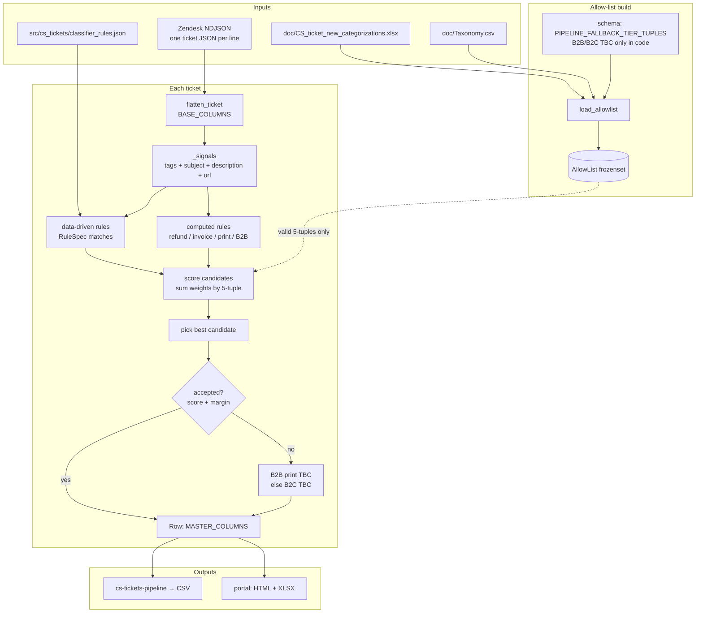

# CS tickets

Zendesk **NDJSON** export → **SCMP master-sheet** rows: flatten ticket fields, assign **Tier1–Tier5** using a weighted rule engine constrained by an **allow-list** (workbook + taxonomy CSV + small pipeline fallbacks). Ship as a **CLI** (`cs-tickets-pipeline`) and optional **local FastAPI portal** (upload, pivot-style stats, **`.xlsx`** download).

---

## Pipeline overview



**Allow-list** = every distinct `(Tier1_Segment … Granular_Tech_UI_Type)` **5-tuple** that may appear on output: from the **workbook** sheet, from **Taxonomy.csv** leaves (granular forced to `N/A` for CSV-derived rows), plus **`PIPELINE_FALLBACK_TIER_TUPLES`** in `schema.py` so B2C/B2B **TBC** fallbacks are valid without listing TBC in the taxonomy CSV.

**Classifier** (`classify.py` + `classifier_rules.json`): builds scores from tags / subject / description / URL using data-driven and computed rules; only adds weight to tuples **in** the allow-list; accepts the best candidate when it passes score and margin thresholds, otherwise applies the B2B-print-hint → **B2B TBC** else **B2C TBC** chain. `classify_row_with_explanation()` exposes matched rules and candidate scores for audit/debug.

### How scoring works

For each flattened ticket, `_signals()` normalizes the usable inputs: JSON tags, `subject`, `raw_subject`, `description`, and `url`. Data-driven rules in `classifier_rules.json` match those signals through `any_tags`, `all_tags`, `any_subject`, `any_blob`, `any_url`, and optional `requires_b2b_print_context`. Multiple condition groups on the same rule are ANDed together; values inside each `any_*` group are ORed. When a rule matches, its `weight` is added to that rule's exact 5-tuple.

Computed rules in `classify.py` then add additional weights for cases that need code logic, such as non-renewal vs renewal disambiguation, refund/cancel combinations, invoice/PO handling, print logistics, and B2B print-support renewal/editorial/sales paths. Every `add()` is gated by the allow-list, so an invalid 5-tuple receives no score.

Rule changes and TBC audit baselines are tracked in `docs/plans/2026-05-14-tier-classifier-improvements.md`.

The classifier sums weights by 5-tuple, picks the highest score, and accepts it only if it passes the confidence gate: score must be at least `SCORE_THRESHOLD` (`5.0`), and either at least `HIGH_CONFIDENCE_SCORE` (`12.0`) or ahead of the runner-up by `MIN_SCORE_MARGIN` (`2.0`). If no candidate passes, the fallback is B2B TBC for print-support context, otherwise B2C TBC.

---

## Key modules

| Module | Role |
|--------|------|
| `src/cs_tickets/flatten.py` | One Zendesk API object → `BASE_COLUMNS` (incl. `tags` as JSON string). |
| `src/cs_tickets/taxonomy.py` | Parse pivot `Taxonomy.csv`; read workbook tier columns; **`load_allowlist()`** builds `AllowList`. |
| `src/cs_tickets/schema.py` | `MASTER_COLUMNS` / `TIER_COLUMNS`; **`PIPELINE_FALLBACK_TIER_TUPLES`** for TBC buckets. |
| `src/cs_tickets/classify.py` | **`classify_row`** + **`classify_row_with_explanation`** + **`attach_tiers`** (scoring, evidence, fallbacks, coercion warnings). |
| `src/cs_tickets/classifier_rules.py` | Loads and validates data-driven `RuleSpec` entries from package data. |
| `src/cs_tickets/classifier_rules.json` | Data-driven high-confidence rule specs for simple tag/text/url matches. |
| `src/cs_tickets/pipeline.py` | **`iter_master_rows`** streams NDJSON → flattened row + tiers. |
| `src/cs_tickets/cli.py` | Typer entry **`cs-tickets-pipeline`** → `run_to_csv`. |
| `src/cs_tickets/portal_app.py` | FastAPI upload, tier stats HTML, **`portal_workbook`** `.xlsx` download. |
| `src/cs_tickets/portal_stats.py` | Pivot-style tier counts for UI + tier sheet in workbook. |
| `src/cs_tickets/portal_workbook.py` | **openpyxl** workbook: **Tickets** + **Tier breakdown** sheets. |
| `src/cs_tickets/tbc_trends.py` | TBC trend snapshots (SQLite), subject clustering, rollups. |
| `src/cs_tickets/portal_trends.py` | Portal **TBC trends dashboard** HTML (`GET /dashboard`). |
| `tools/audit_classifier.py` | Local audit helper for TBC rate, top fallback signals, scored tuples, and unreachable allow-list tuples. |
| `tools/tbc_trend_snapshot.py` | Classify NDJSON exports → append trends SQLite DB. |
| `tools/tbc_trend_report.py` | DB → `summary.md` + rollup CSVs. |
| `tests/` | `pytest` coverage for flatten, taxonomy, pipeline, classify, portal. |

---

## Setup

```bash
cd cs_tickets
python3 -m venv .venv
source .venv/bin/activate   # Windows: .venv\Scripts\activate
pip install -e ".[dev,portal]"
```

---

## CLI

From repo root (defaults: `doc/Taxonomy.csv` + `doc/CS_ticket_new_categorizations.xlsx`):

```bash
cs-tickets-pipeline --input data/export-2026-05-06-0153-10043126-576349730538497a83_1.json --out out/master.csv
```

Quick test on the first 20 rows:

```bash
cs-tickets-pipeline -i data/export-....json -o out/sample.csv --limit 20
```

Only tickets with Zendesk CSAT score **bad** (field `satisfaction_rating.score` on the export):

```bash
cs-tickets-pipeline -i data/export-....json -o out/bad-csat.csv --bad-satisfaction-only
```

Equivalent:

```bash
python -m cs_tickets --input data/export-....json -o out/master.csv
```

---

## Local test portal

```bash
uvicorn cs_tickets.portal_app:app --reload --port 8777
```

Open http://127.0.0.1:8777 — upload NDJSON; the result page shows a **pivot-style tier breakdown** and ticket preview. Optional checkbox **Only categorize tickets with bad CSAT rating** limits the run to tickets whose Zendesk export has `satisfaction_rating.score == "bad"`. **Download** is an **`.xlsx`** with sheets **Run metadata**, **Tickets**, and **Tier breakdown** (when the filter is used, Run metadata records `filter = bad_satisfaction_only`). Static theme CSS is served from `/static/`.

**TBC trends dashboard** (`/dashboard`): weekly manual-review rate, tag/subject hotspots, and reason mix from a SQLite snapshot DB. Ingest via CLI or enable auto-snapshot on upload:

```bash
# Batch ingest
python tools/tbc_trend_snapshot.py --ndjson-dir data/
python tools/tbc_trend_report.py --output-dir reports/tbc-trends/

# Optional: append each portal upload to the trends DB
export TBC_TRENDS_ENABLED=true
```

See `docs/plans/2026-06-11-tbc-trend-dashboard.md` and implementation notes in `docs/plans/2026-06-11-tbc-trend-dashboard-notes.md`.

When `doc/` and the reference workbook are writable (local dev), the index page also links to **Training (update allow-list)** — see below.

### Training / allow-list updates (local only)

The **Training** flow (`/training`) lets analysts upload an already-classified `.xlsx`, review tier combinations that are new relative to the current allow-list, optionally run an NDJSON A/B preview (audit-style TBC metrics), and commit accepted tuples into `doc/CS_ticket_new_categorizations.xlsx`. Step 3 preview has the same optional **bad CSAT only** filter as the main Run page — metrics and changed-ticket samples then apply only to tickets with `satisfaction_rating.score == "bad"`.

- **Local only:** Training is hidden when `doc/` or the reference workbook is not writable (e.g. read-only Azure deploy).
- **Training Commit** writes to disk only — run `git diff doc/` and commit workbook changes to version control separately.
- **Undo last update** restores the pre-commit filesystem snapshot; it does not undo a git commit. If you already committed to git, reconcile disk vs history manually.
- Server restart drops in-progress Training sessions (same as classify runs).

### Runtime live config (`runs/live/`)

The portal **New Upload** (`/run`) and CLI (default paths) load taxonomy, workbook, and rules from **`runs/live/`** after a one-time bootstrap from `doc/` + package `classifier_rules.json` + `doc/training_rules.json`. This matches the production GKE model: live config can later be updated without redeploy (Phase 2 Learn flow).

| Path | Role |
|------|------|
| `runs/live/Taxonomy.csv` | Runtime taxonomy tree |
| `runs/live/CS_ticket_new_categorizations.xlsx` | Runtime workbook 5-tuples |
| `runs/live/classifier_rules.json` | Runtime rules (core + training merged on bootstrap) |
| `runs/live/config_version.json` | Version counter for cache invalidation |

`runs/` is gitignored. Delete `runs/live/` locally to re-bootstrap from `doc/` after Training commits (until Phase 2 writes live config directly).

Optional Drive sync for live config (GKE):

```bash
export RUNTIME_CONFIG_DRIVE_ENABLED=true
export GOOGLE_DRIVE_LIVE_FOLDER_ID=1on88itZr0gOuQtqEcrJo0eDnkFIQptPr
export GOOGLE_APPLICATION_CREDENTIALS=/path/to/ai-daily-job-sa-key.json
export GOOGLE_DRIVE_SUPPORTS_ALL_DRIVES=true
export GOOGLE_DRIVE_USE_FULL_SCOPE=true
# Also set DRIVE_UPLOAD_ENABLED + GOOGLE_DRIVE_RUNS_FOLDER_ID for run uploads
```

### Google Drive upload (optional)

Upload runs when both env vars are set:

```bash
export DRIVE_UPLOAD_ENABLED=true
export GOOGLE_DRIVE_RUNS_FOLDER_ID=15H0su7yspJnDJCbauglYmjPA1FthVPGI
export GOOGLE_APPLICATION_CREDENTIALS=/path/to/ai-daily-job-sa-key.json
```

Use a JSON key for `ai-daily-job-sa@editor-sub-editing-assistant.iam.gserviceaccount.com` (folder must be shared with that SA as **Editor**). For local dev without Drive, omit `DRIVE_UPLOAD_ENABLED` — the portal still works; only download is affected.

On GKE, the deployment mounts secret `editorial-service-account` at `/var/secrets/google/credentials.json` and sets `GOOGLE_APPLICATION_CREDENTIALS` to that path (see `k8s/*/deploy/deployment.yaml`).

---

## Tests

```bash
pytest
```

**Golden classifier set:** `tests/fixtures/golden_export.ndjson` with bounds in `tests/fixtures/golden_baseline.json` guard TBC and zero-candidate regressions. Training probe fixtures (`training_tbc_probe.ndjson`) assert allow-list + rule proposal behavior.

---

## Repo layout (essentials)

| Path | Role |
|------|------|
| `docs/prd.md` | Product requirements, metrics, phases, user stories. |
| `docs/design.md` | Technical architecture, classifier, deployment, limitations. |
| `doc/Taxonomy.csv` | Pivot-style tier paths (CSV → allow-list with granular `N/A`). |
| `doc/CS_ticket_new_categorizations.xlsx` | Reference master + historical tier tuples for allow-list union. |
| `runs/live/` | Runtime config cache (gitignored; bootstrapped from `doc/`). |
| `data/` | Local Zendesk NDJSON exports (gitignored; keep `data/.gitkeep`). Not committed — files are large. |
| `src/cs_tickets/` | Application code. |
| `pyproject.toml` | Package metadata, dependencies, `cs-tickets-pipeline` script. |

Further phased work (Apps Script + Cloud Run) may live under `.cursor/plans/` locally and is not required to run Phase 1.
