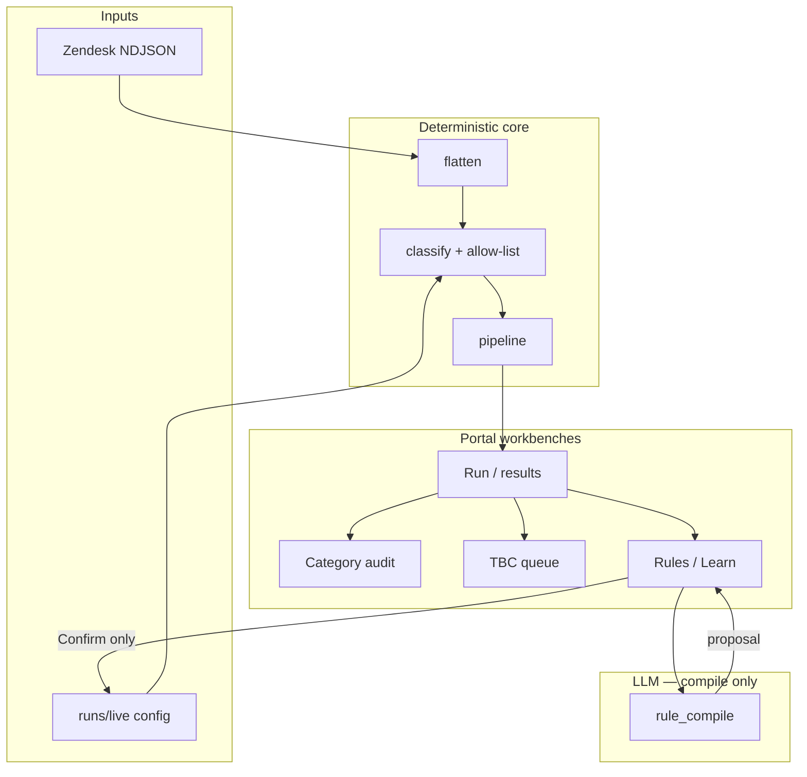
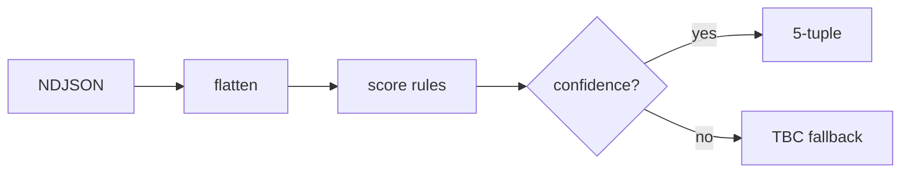
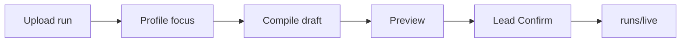

# Project handoff guide

**Project:** CS Ticket Automation (`cs-tickets`)  
**Package:** Zendesk NDJSON → SCMP master-sheet rows with Tier1–Tier5 classification  
**Last updated:** 2026-07-16

This guide is the single entry point for someone taking over development, classifier maintenance, or portal operations. Detailed specs live in linked docs — use [README.md](./README.md) as the documentation map.

---

## 1. What this system does

1. **Ingest** Zendesk ticket exports (NDJSON, one JSON object per line).
2. **Flatten** each ticket into master-sheet columns (`flatten.py`).
3. **Classify** into an allow-listed 5-tuple using weighted JSON rules + computed logic (`classify.py`). No LLM on the classify hot path.
4. **Deliver** via CLI (CSV) or local/GKE portal (HTML stats, Excel download, review workbenches).

Analysts and leads **maintain** the classifier through portal flows (Learn New, Rules chat, Category audit, TBC queue) with human Confirm before anything writes to live config.

Read [CONTEXT.md](../CONTEXT.md) for domain terms (allow-list, TBC, Training, 5-tuple).

---

## 2. Five-minute local setup

```bash
cd cs-ticket-automation-dev   # repo root (adjust to your path)
python -m venv .venv
# Windows: .venv\Scripts\activate
# macOS/Linux: source .venv/bin/activate
pip install -e ".[dev,portal]"
pytest
uvicorn cs_tickets.portal_app:app --reload --port 8777
```

Open http://127.0.0.1:8777 and upload a sample NDJSON from `tests/fixtures/` (or your own export in `data/`).

**With production Drive config** (optional): copy `.env.example` → `.env`, place SA key at `secrets/google/credentials.json`, run `scripts/start-portal-drive.ps1` (Windows) or uvicorn with `--env-file .env`.

Full env reference: [configuration.md](./configuration.md).

---

## 3. Mental model

Full flow set (classify, rule maintenance, TBC, Learn, Drive, deploy): **[flows.md](./flows.md)**.



**Critical invariant:** `/run` classification never calls an LLM. LLMs are used only for rule **drafting** (`POST /rules/compile`, TBC AI suggestions when enabled).

**Write path:** Only Confirm actions (`POST /learn/confirm`, `POST /rules/confirm`, `POST /rules/confirm_batch`) promote to `runs/live/` (and Drive when enabled). See [architecture/agent-skills-framework.md](./architecture/agent-skills-framework.md).

### 3.1 Classify one ticket



### 3.2 Rule change (happy path)



---

## 4. Key directories

| Path | Notes |
|------|-------|
| `src/cs_tickets/` | All application code |
| `doc/` | Git-tracked taxonomy + reference workbook |
| `runs/live/` | **Runtime** taxonomy, workbook, rules, version — gitignored |
| `runs/proposals/` | Draft rule bundles before Confirm — gitignored |
| `data/` | Local NDJSON exports — gitignored |
| `tests/fixtures/` | Golden exports and session packages for CI |
| `.cursor/skills/` | Agent skill docs (same APIs as portal) |
| `docs/plans/` | Design history and implementation notes |
| `k8s/` | Dev/prod Kubernetes manifests |

---

## 5. Daily maintenance tasks

### 5.1 Reduce TBC rate

1. Run classifier audit: `PYTHONPATH=src python tools/audit_classifier.py --input data/your-export.json`
2. Identify top TBC tags/subjects and reason buckets (`zero_candidate`, `below_threshold`, `lost_margin`, etc.).
3. Add **data-driven** rules in `classifier_rules.json` (or via Rules chat → Confirm) for simple tag/text patterns.
4. Add **computed** logic in `classify.py` only when disambiguation requires code (renewal vs cancel, B2B print stacks).
5. If rules fire but tuple is missing from allow-list, use **Learn New** or Training to add the 5-tuple.
6. Run `pytest` and compare TBC % against `tests/fixtures/golden_baseline.json`.

Plan reference: [plans/2026-05-14-tier-classifier-improvements.md](./plans/2026-05-14-tier-classifier-improvements.md).

### 5.2 Rule change via portal (recommended)

Diagram: [flows.md §4](./flows.md#4-rule-maintenance-christine--review-chat-loop).

1. Upload export → note `run_id` from results URL.
2. Open Category audit or Review chat (`/run/{id}/review_chat` or `/rules/new?mode=orch&run_id=…`).
3. Profile focus (“review B2C Sales Leads”) → draft rule → preview impact.
4. **Lead** Confirm (`PORTAL_ALLOW_CONFIRM=1` required in prod-like envs).
5. Reclassify run if needed; optional version-guarded revert via `POST /learn/revert`.

Taxonomy edge cases: [taxonomy-requirements.md](./taxonomy-requirements.md).

### 5.3 Allow-list expansion (Learn New)

Diagram: [flows.md §7](./flows.md#7-learn-new-allow-list--rules-from-workbook).

Flow: `/learn` → upload classified xlsx → preview NDJSON impact → Confirm.

Undo: `POST /learn/revert` only when live `config_version` matches the session’s recorded version.

Manual test plan: [testcase.md](../testcase.md).

---

## 6. Portal route map

Ephemeral runs live in process memory — **restart clears in-progress uploads and run stores**.

| Area | Routes |
|------|--------|
| **Classify** | `GET /`, `POST /run`, `GET /run/{id}/results`, `GET /download/{id}` |
| **Category audit** | `GET /run/{id}/category_audit`, sweeps, export CSV, parse focus |
| **TBC** | `GET /run/{id}/tbc`, `GET /run/{id}/tbc_queue`, draft rule, chunk ack |
| **Ticket drill-down** | `GET /run/{id}/ticket/{ticket_id}`, `GET …/explain/{ticket_id}`, overrides |
| **Review chat** | `GET/POST /run/{id}/review_chat/*` |
| **Rules** | `GET /rules`, `GET /rules/new`, compile / preview / confirm / disable |
| **Learn** | `GET/POST /learn/*` (process, preview, confirm, revert) |
| **Training** | `GET /training` (redirects to Learn) |
| **Ops** | `GET /health`, `GET /dashboard` (TBC trends) |

Full route list: [api-reference.md](./api-reference.md).

---

## 7. Scripts and tools

| Script | Purpose |
|--------|---------|
| `scripts/run_christine_session.py` | Execute a session package against a live portal (demos, batch playlist) |
| `scripts/replay_christine_workflow.py` | Minimal HTTP replay for category audit + compile + preview |
| `scripts/session_profile.py` | CLI wrapper for run profiling |
| `scripts/start-portal-drive.ps1` | Windows helper: `.env` + uvicorn with Drive |
| `tools/audit_classifier.py` | TBC rate, signals, unreachable allow-list tuples |
| `tools/tbc_trend_snapshot.py` | Append classified export to trends SQLite |
| `tools/tbc_trend_report.py` | Trends DB → markdown + CSV rollups |
| `tools/run_allowlist_test.py` | JSON-spec allow-list impact tests |
| `tools/batch_allowlist_compare.py` | Batch ablation / commit simulation CLI |

Details: [scripts/README.md](../scripts/README.md).

---

## 8. Cursor Agent skills

Skills under `.cursor/skills/` document how agents call portal APIs:

| Skill | Role |
|-------|------|
| `christine-workflow` | Orchestrator — routes to atomic skills |
| `profile-run` | Focus → slice counts / sweeps |
| `propose-rule` | NL → RuleSpec draft |
| `preview-rule` | Dry-run impact |
| `explain-ticket` | Classification trace |
| `filter-tickets` | NL → structured filters |
| `confirm-rule` | Lead promote (write) |
| `batch-allowlist-test` | Allow-list impact on NDJSON (outside Christine loop) |

Framework doc: [architecture/agent-skills-framework.md](./architecture/agent-skills-framework.md).

---

## 9. Testing and CI

```bash
pytest                                    # full suite
pytest tests/test_classify.py -k "name"   # targeted
PYTHONPATH=src python tools/audit_classifier.py --input data/export.json
python tools/run_allowlist_test.py --profile ci
```

**Golden guard:** `tests/fixtures/golden_export.ndjson` + `golden_baseline.json` bound TBC regressions.

GitLab CI (`.gitlab-ci.yml`): build image, security scans, deploy to GKE. Manifests in `k8s/dev/` and `k8s/prod/`.

---

## 10. Deployment notes

Full runbook: [ops-runbook.md](./ops-runbook.md).

- **Image:** `Dockerfile` uses `uv` + Python 3.12 Alpine; uvicorn on port 8000 in container.
- **URLs:** dev `cs-ticket-automation.itbs-dev.scmp.tech`, prod `cs-ticket-automation.scmp.work`
- **Config:** Pods sync `runs/live/` from Google Drive when `RUNTIME_CONFIG_DRIVE_ENABLED=true`.
- **Secrets:** GKE mounts SA JSON at `/var/secrets/google/credentials.json`.
- **Auth:** Phase 1 portal has no app-level login — rely on ingress / network policy.
- **PII:** Exports contain customer data; never commit `data/` or production exports.

---

## 11. Known limitations (read before changing architecture)

From [design.md §12](./design.md#12-known-limitations):

- Subject-only signal on `RE:` threads → elevated TBC
- Weak Zendesk tags (`miscellaneous`) correlate with TBC
- Portal run storage is in-memory (single-replica assumption)
- Operator docs duplicated between README and embedded portal footer
- Some taxonomy leaves have no scoring rules yet

---

## 12. Handoff checklist

Use this when transferring ownership:

- [ ] Clone repo; complete §2 setup; `pytest` green
- [ ] Read [CONTEXT.md](../CONTEXT.md) and [design.md](./design.md)
- [ ] Obtain Google Drive folder access (live + runs) and SA key path
- [ ] Confirm `.env` / K8s env vars match [configuration.md](./configuration.md)
- [ ] Run portal locally; classify a fixture export; download XLSX
- [ ] Walk through Rules chat draft → preview (Confirm only in dev with `PORTAL_ALLOW_CONFIRM=1`)
- [ ] Locate production ingress URL and GitLab deploy pipeline
- [ ] Review open items in latest `docs/sessions/*-requirements.md`
- [ ] Identify current TBC baseline (`tools/audit_classifier.py` on latest export)
- [ ] Note who holds **Lead** Confirm authority in production

---

## 13. Where to go next

| Question | Document |
|----------|----------|
| Flow diagrams? | [flows.md](./flows.md) |
| How does scoring work? | [README](../README.md), [design.md §5](./design.md#5-classifier-design) |
| What env vars exist? | [configuration.md](./configuration.md) |
| How does Review chat route intents? | [agent-skills-framework.md §5.2](./architecture/agent-skills-framework.md#52-portal-review-chat-intent-router), [flows.md §5](./flows.md#5-review-chat-intent-routing) |
| Portal HTTP API? | [api-reference.md](./api-reference.md) |
| Deploy / rollback? | [ops-runbook.md](./ops-runbook.md) |
| Which plans are current? | [plans/README.md](./plans/README.md) |
| Category audit UX spec? | [plans/2026-07-07-category-audit-workflow.md](./plans/2026-07-07-category-audit-workflow.md) |
| All docs listed? | [docs/README.md](./README.md) |
