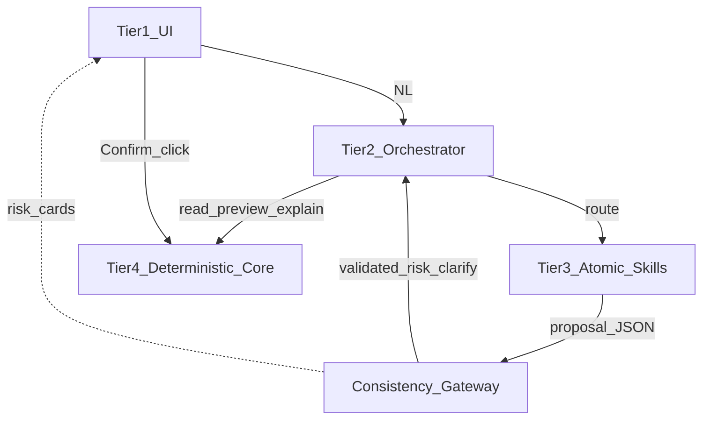
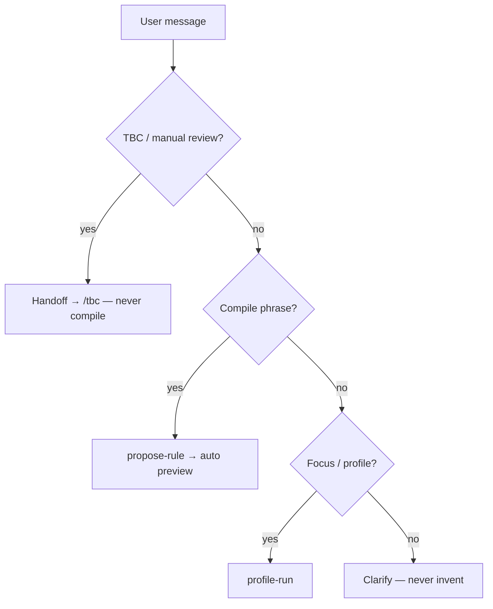
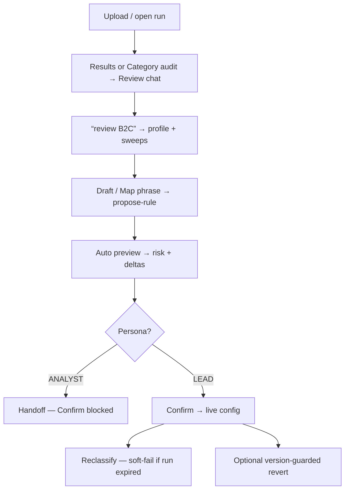
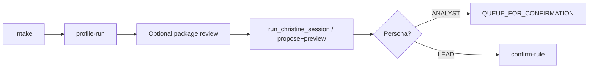

# Agent Skills Feature Framework

**Status:** implemented foundation (2026-07-15); evolves incrementally  
**Audience:** engineers and agents extending classification maintenance  
**Glossary:** [CONTEXT.md](../../CONTEXT.md)  
**Migration / critique history:** [plans/2026-07-15-atomic-skills-architecture.md](../plans/2026-07-15-atomic-skills-architecture.md)

This document is the **source of truth** for the modular Agent Skills framework around CS ticket classification maintenance: thin orchestration, atomic skills, Consistency Gateway, and an immutable deterministic core.

---

## 1. Problem and intent

Analysts and leads need to:

1. Inspect a classified **run** (focus, sweeps, TBC).
2. Draft **routing rules** from natural language or taxonomy phrases.
3. See **impact** before anything goes live.
4. **Confirm** only with human approval (Model B).

A single monolithic prompt cannot safely own filtering, rule generation, explain, and promote. The framework splits those into **versioned skills** with strict I/O, routes them from a thin orchestrator, and gates writes through the portal’s deterministic promote path.

---

## 2. Design principles

| Principle | Meaning |
|-----------|---------|
| **Immutable core** | `/run` classification uses `classify.py` + live rules only. No LLM on the classify hot path. |
| **Propose ≠ commit** | Skills may draft; only lead **Confirm** mutates live config. No auto-approve. |
| **Atomic skills** | One capability per skill (schema + tools). Failures and prompt changes stay local. |
| **Thin orchestrator** | Christine / Review chat route and stop; they do not embed scoring or taxonomy encyclopaedias. |
| **Gateway before Confirm** | Schema validation, soft conflict warnings, preview impact, risk grades — evidence from the engine, not an LLM “conflict judge.” |
| **Preserve code** | Wrap and extract; prefer not to rewrite the scoring engine ([CONTEXT.md](../../CONTEXT.md)). |
| **One rule shape** | Existing **RuleSpec** JSON + allow-list **5-tuples** — not a parallel YAML/regex DSL. |

**Rejected patterns:** auto-commit; LLM `single_classify` writing live categories; Vector DB / semantic cache as prerequisites; chat replacing the TBC workbench.

---

## 3. Four-layer architecture



| Tier | Name | Responsibility | Examples |
|------|------|----------------|----------|
| **1** | User interface | Chat, cards, Confirm/revert, dedicated workbenches | Review chat (`/rules/new?mode=orch`), Category audit, **TBC queue** |
| **2** | Cognitive orchestration | Intent → skill; intake; stop conditions | Cursor `christine-workflow`; `rules.js` intent router |
| **3** | Skills framework | Isolated capability: prompt/docs + I/O + tool calls | `profile-run`, `propose-rule`, … |
| **4** | Deterministic core | Scoring, live rules, allow-list, Drive, session logs | `classify.py`, promote, `POST /rules/*` |

**Consistency Gateway** sits between tiers 3 and 4: proposals are graded and never written until Confirm.

```text
┌────────────────────────────────────────────────────────┐
│ 1. USER INTERFACE                                       │
│    Review chat · Category audit · TBC queue · Confirm  │
└───────────────────────────┬────────────────────────────┘
                            │ natural language / clicks
                            ▼
┌────────────────────────────────────────────────────────┐
│ 2. ORCHESTRATION                                        │
│    Christine skill (Cursor) · Review chat intent router │
└───────────────────────────┬────────────────────────────┘
                            │ route to one skill
                            ▼
┌────────────────────────────────────────────────────────┐
│ 3. ATOMIC SKILLS                                        │
│    profile · propose · preview · explain · filter ·     │
│    confirm (lead)                                       │
└───────────────────────────┬────────────────────────────┘
                            │ JSON proposal / read result
                            ▼
┌────────────────────────────────────────────────────────┐
│ CONSISTENCY GATEWAY                                     │
│    validate · soft conflict · preview risk · no auto    │
└───────────────────────────┬────────────────────────────┘
                            │ validated / read APIs
                            ▼
┌────────────────────────────────────────────────────────┐
│ 4. DETERMINISTIC CORE                                   │
│    Scoring engine · versioned rule base · run memory    │
└────────────────────────────────────────────────────────┘
```

---

## 4. Surfaces that host the framework

| Surface | Role |
|---------|------|
| **Portal Review chat** | Conductor UI: profile → draft → preview → Confirm handoff. **Target layout:** Cursor-style **side dock** beside the workbench (not a full-page chat that obscures tables). Interim: `/rules/new?mode=orch`. TBC **handoff** to `/tbc` |
| **Category audit** | Bucket review + Propose rule / Explain; hosts side-panel chat entry |
| **TBC queue** | Ticket-by-ticket manual-review workbench (not replaced by chat; chat docks beside it) |
| **Cursor skills** | Agent documentation + routing for the same APIs |
| **CLI runner** | `scripts/run_christine_session.py` — package queue for demos / batch playlist |

Portal APIs remain the **execution substrate**. Cursor skills describe how agents call them; they do not replace HTTP.

---

## 5. Orchestration (Tier 2)

### 5.1 Cursor: `christine-workflow`

Path: [`.cursor/skills/christine-workflow/SKILL.md`](../../.cursor/skills/christine-workflow/SKILL.md)

- Collect intake: `run_id` / export, `focus_nl`, `persona`, `goal`, optional sweep/phrase.
- Route to atomic skills (table below).
- Stop on incomplete intake, `ZERO_MATCHES`, ANALYST+Confirm, `PREVIEW_STALE`, auto-Confirm requests.

### 5.2 Portal: Review chat intent router

Path: [`src/cs_tickets/static/rules.js`](../../src/cs_tickets/static/rules.js)  
Heuristic mirror (tests): [`tests/test_review_chat_intent.py`](../../tests/test_review_chat_intent.py)

Diagram: [flows.md §5](../flows.md#5-review-chat-intent-routing).



| Priority | Intent | Behaviour |
|----------|--------|-----------|
| 1 | TBC / manual review / “show all TBC…” | Handoff card → `/run/{id}/tbc` — **never compile** |
| 2 | Compile phrase (`Map …`, `draft a rule`, …) | `propose-rule` → auto `preview-rule` when `run_id` set |
| 3 | Focus (`review B2C`, profile/audit) | `profile-run` via `POST …/review_chat/turn` |
| 4 | Unclear NL | Clarify options — **never invent a rule** |

---

## 6. Atomic skills catalogue (Tier 3)

Located under [`.cursor/skills/`](../../.cursor/skills/). Each skill declares `skill_version`, read/write policy, and I/O.

| Skill | Write? | Responsibility | Primary entrypoints |
|-------|--------|----------------|---------------------|
| [`profile-run`](../../.cursor/skills/profile-run/SKILL.md) | no | Focus → slice counts, sweeps, `ZERO_MATCHES` | `session_profile`, `POST /run/{id}/review_chat/turn` |
| [`propose-rule`](../../.cursor/skills/propose-rule/SKILL.md) | no | NL → RuleSpec draft | `POST /rules/compile` |
| [`preview-rule`](../../.cursor/skills/preview-rule/SKILL.md) | no | Dry-run impact / shield overlap | `POST /rules/preview` (+ upload fallback) |
| [`explain-ticket`](../../.cursor/skills/explain-ticket/SKILL.md) | no | Decision trace | `GET /run/{id}/explain/{ticket_id}` |
| [`filter-tickets`](../../.cursor/skills/filter-tickets/SKILL.md) | no | NL → structured filters | `*_parse_focus`, rules parse focus |
| [`confirm-rule`](../../.cursor/skills/confirm-rule/SKILL.md) | **yes** | Lead promote + soft reclassify | `POST /rules/confirm`, `POST …/reclassify` |

**Related but separate:** [`batch-allowlist-test`](../../.cursor/skills/batch-allowlist-test/SKILL.md) — Training allow-list impact on NDJSON (outside Christine loop).

**Not a chat skill:** TBC ticket apply/ack UI — that remains the **TBC queue page**.

### Skill versioning

- Bump `skill_version` when I/O or prompt semantics change.
- Orchestrator route table may need a note when behaviour changes.
- Future semantic cache keys: `(skill_name, skill_version, input_hash)`.

---

## 7. Consistency Gateway

Module: [`src/cs_tickets/consistency_gateway.py`](../../src/cs_tickets/consistency_gateway.py)

| Step | Behaviour |
|------|-----------|
| Schema validate | RuleSpec + allow-list (compile path; ≤2 retries then `clarify_message`) |
| Soft conflict | Post-compile warnings (shield floors, shared blobs, same-path overrides) |
| Hard impact | Preview on living `run_id`; orch Confirm gated until preview succeeds |
| Risk grade | Attached to compile API and preview `summary` |
| Commit enforcer | Skills emit proposals; only Confirm writes live |

### Risk grades

| Grade | Meaning |
|-------|---------|
| `ok` | No soft/hard flags from gateway heuristics |
| `warn_shield` | Shield / overlap / weight-floor style warning, or preview shield overlap |
| `warn_churn` | Large tier churn in preview summary |
| `warn_duplicate` | Duplicate / already-exists style warning |
| `block_schema` | Validation errors — draft rejected |

### Conflict ladder (product)

1. Compile → soft warn / clarify.  
2. Preview → before/after + `shield_overlap` (e.g. Stefan).  
3. UI surfaces `risk`.  
4. Lead Confirm (or stop).  
5. Version-guarded global revert if `config_version` still matches; targeted rule soft-delete is future work.

There is **no** LLM conflict arbitrator.

---

## 8. Deterministic core (Tier 4)

| Asset | Role |
|-------|------|
| Scoring engine | Weights, overrides, allow-list; decides TBC vs concrete tier |
| Live rule base | `runs/live/classifier_rules.json` + `config_version` + backups |
| Run store | In-memory portal runs (upload → classify → audit/TBC/chat) |
| Taxonomy protocol | [`docs/taxonomy-requirements.md`](../taxonomy-requirements.md) — compile inject + human protocol (not read by `/run`) |
| Session MD | Optional execution log under `docs/sessions/` |

LLM/skills **propose data** that feeds the engine; they do not rewrite engine logic.

---

## 9. End-to-end user flows

Larger diagram set: [flows.md](../flows.md).

### 9.1 Rule maintenance (primary Christine loop)



### 9.2 TBC categorization review

```mermaid
flowchart LR
  CHAT[“Show all TBC…” in Review chat] --> CARD[Handoff card]
  CARD --> QUEUE[/run/id/tbc]
  QUEUE --> WORK[Walk tickets / suggest / ack]
  WORK --> BACK[Return to chat only to draft recurring rule]
```

Chat **routes** into TBC; it does not replace the queue workbench.

### 9.3 CLI / Cursor playlist



---

## 10. Key components (code map)

| Component | Path |
|-----------|------|
| Consistency Gateway | `src/cs_tickets/consistency_gateway.py` |
| Session profile | `src/cs_tickets/session_profile.py` |
| Review chat turn | `src/cs_tickets/portal_review_chat.py` |
| Compile / clarify | `src/cs_tickets/rule_compile.py` |
| Preview overlap | `src/cs_tickets/portal_rules.py` (`preview_rule_on_rows`) |
| Portal routes | `src/cs_tickets/portal_app.py` |
| Review chat UI | `src/cs_tickets/static/rules.js` |
| Session package / runner | `src/cs_tickets/session_metadata.py`, `scripts/run_christine_session.py` |
| Atomic skills | `.cursor/skills/*/` |

### Important APIs

| Method | Path | Skill / use |
|--------|------|-------------|
| POST | `/run/{id}/review_chat/turn` | profile-run |
| GET | `/run/{id}/review_chat` | redirect → `/rules/new?mode=orch` |
| POST | `/rules/compile` | propose-rule (+ `risk`) |
| POST | `/rules/preview` | preview-rule (+ `summary.risk`) |
| POST | `/rules/confirm` | confirm-rule |
| POST | `/run/{id}/reclassify` | soft-fail after Confirm |
| GET | `/run/{id}/explain/{ticket_id}` | explain-ticket |
| GET | `/run/{id}/tbc` | TBC workbench (handoff target) |

---

## 11. Personas (Model B)

| Persona | Affordance |
|---------|------------|
| **ANALYST** | Profile, draft, preview; Confirm hidden / refused |
| **LEAD** | Confirm when `PORTAL_ALLOW_CONFIRM` allows; owns promote |

See [plans/2026-07-06-christine-workflow-decisions.md](../plans/2026-07-06-christine-workflow-decisions.md).

---

## 12. What is in / out

### In scope (framework)

- Atomic Cursor skills + thin Christine router  
- Review chat orchestration mode + intent routing  
- Consistency Gateway risk grades  
- Session metadata package + CLI runner  
- Taxonomy inject into compile  

### Out of scope (for now)

- Full conversation agent that triages every TBC in-chat  
- Auto-approve rules  
- LLM writing categories on `/run`  
- Near-dupe index across full live base (planned depth)  
- Session-scoped single-rule soft-delete (D.8)  
- Vector RAG / semantic cache  

---

## 13. Testing pointers

```bash
python -m pytest tests/test_consistency_gateway.py \
  tests/test_review_chat_intent.py tests/test_review_chat.py \
  tests/test_session_profile.py tests/test_session_metadata.py \
  tests/test_preview_overlap.py tests/test_rule_compile_clarify.py -v
```

---

## 14. Related documents

| Doc | Role |
|-----|------|
| [plans/2026-07-15-atomic-skills-architecture.md](../plans/2026-07-15-atomic-skills-architecture.md) | Compact plan + migration checklist |
| [plans/2026-07-13-christine-orchestration-skill.md](../plans/2026-07-13-christine-orchestration-skill.md) | Original Christine orchestration plan (Phases A–E) |
| [taxonomy-requirements.md](../taxonomy-requirements.md) | Stable taxonomy protocol |
| [plans/2026-07-03-explicit-rule-authoring.md](../plans/2026-07-03-explicit-rule-authoring.md) | Compile + Confirm product rules |
| [design.md](../design.md) | Broader product design notes |
| [flows.md](../flows.md) | Mermaid diagrams for all major flows |

---

## 15. Evolving the framework

When adding a capability:

1. Prefer a **new atomic skill** (or extend one with a clear I/O bump + `skill_version`).  
2. Implement against **portal APIs / core modules** — not a new scoring path.  
3. Route from Christine + Review chat intent table.  
4. Pass proposals through the **gateway** (validate / risk) before Confirm.  
5. Update this document and skill `SKILL.md` in the same change set.
