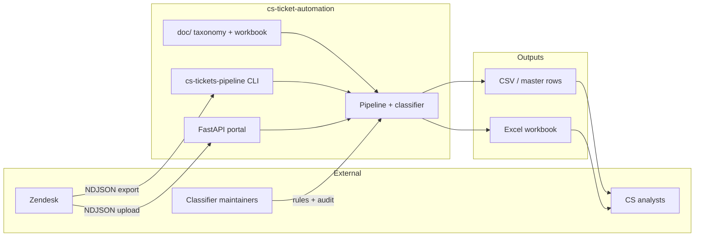
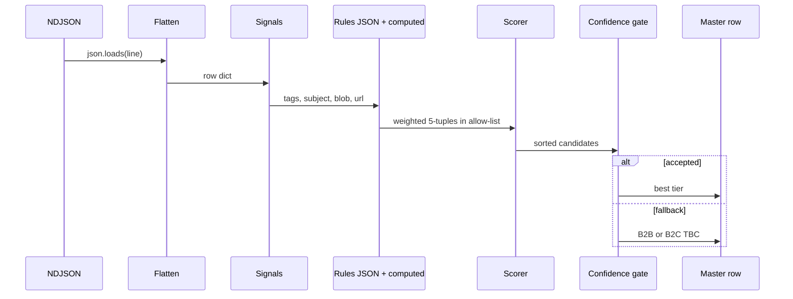
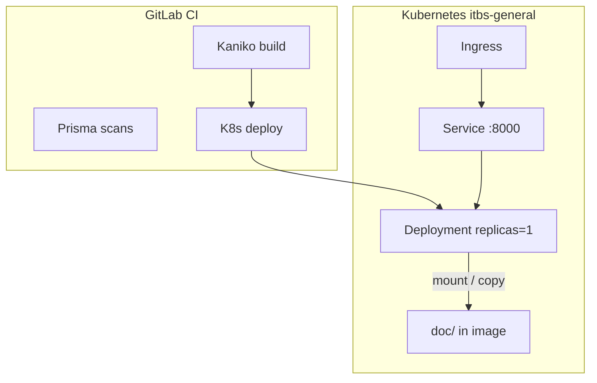

# Technical Design — CS Ticket Automation

**System:** `cs-tickets` Python package  
**Version:** 0.1.0  
**Last updated:** 2026-05-19

This document describes how the pipeline is built, how classification works, and how components deploy. For product goals and metrics, see [prd.md](./prd.md).

---

## 1. System context



---

## 2. Architecture principles

1. **Allow-list as safety boundary** — Classification only adds score to 5-tuples present in `AllowList`. Output coercion is a last resort with warnings.
2. **Explainability over opacity** — Weighted rules with ids; `ClassificationDecision` carries evidence and ranked candidates.
3. **Data vs code rules** — Simple tag/blob/subject/url matches live in JSON; disambiguation (non-renewal vs renewal, refund+cancel, B2B print stacks) lives in `classify.py`.
4. **Streaming I/O** — NDJSON read line-by-line; suitable for large exports on modest hardware.
5. **No ML in the hot path** — Deterministic, testable, diff-friendly behavior.

---

## 3. Component overview

| Layer | Module(s) | Responsibility |
|-------|-----------|----------------|
| **I/O** | `flatten.py` | Zendesk JSON → `BASE_COLUMNS` dict |
| **Taxonomy** | `taxonomy.py` | Parse CSV workbook paths → `AllowList` frozenset |
| **Contract** | `schema.py` | `MASTER_COLUMNS`, tier columns, TBC fallback tuples |
| **Classification** | `classify.py`, `classifier_rules.py`, `classifier_rules.json` | Score, pick, fallback, explain |
| **Orchestration** | `pipeline.py` | `iter_master_rows(ndjson, allow, bad_satisfaction_only=…)` |
| **CSAT filter** | `satisfaction.py` | Parse Zendesk `satisfaction_rating`; `has_bad_satisfaction_rating()` |
| **CLI** | `cli.py`, `__main__.py` | Typer entry `cs-tickets-pipeline` |
| **Portal** | `portal_app.py`, `portal_stats.py`, `portal_workbook.py` | HTTP upload, HTML stats, openpyxl XLSX |
| **Tooling** | `tools/audit_classifier.py` | Offline TBC / unreachable-tier reports |
| **Tests** | `tests/*` | Unit and integration coverage |

---

## 4. Data flow (per ticket)



### 4.1 Flattening (`flatten.py`)

Maps Zendesk API fields into the first 20 `MASTER_COLUMNS` fields. Tags are serialized as a JSON string for downstream parsing. Custom fields and channel metadata needed for classification are preserved where present in the export.

### 4.2 Signal extraction (`classify._signals`)

| Signal | Source | Use |
|--------|--------|-----|
| `tags_joined` | Parsed tag list, lowercased | Tag rules, B2B print context |
| `subject` / `raw_subject` | Ticket titles | Subject rules, press-release detection |
| `blob` / `blob_NNN` | Subject + description slices | Phrase rules (length limits reduce noise) |
| `url` | Ticket API URL | `printsupport` queue detection |

### 4.3 Allow-list (`taxonomy.load_allowlist`)

Union of:

- Distinct 5-tuples from workbook sheet **SCMP_Tickets_Master_Categorized**
- Leaves parsed from pivot-style **`doc/Taxonomy.csv`** (granular column forced to `N/A` for CSV-derived rows)
- **`PIPELINE_FALLBACK_TIER_TUPLES`** — B2B and B2C `TBC (Manual Review)` only in code (not required in taxonomy CSV)

```text
AllowList.tuples ⊆ (workbook ∪ taxonomy_csv ∪ fallbacks)
```

---

## 5. Classifier design

### 5.1 Rule types

**Data-driven (`classifier_rules.json`)**

Each `RuleSpec` has:

- `id`, `tier` (5-list), `weight`
- Optional: `any_tags`, `all_tags`, `any_subject`, `any_blob`, `any_url`
- Optional: `requires_b2b_print_context`

Matching: all specified groups must pass; within each `any_*` group, one match suffices. `any_blob` / `any_subject` checks use normalized lowercased text (blob capped at 1200 chars for rules).

**Computed (`classify._score_tiers`)**

Examples:

| Logic | Purpose |
|-------|---------|
| `computed:non_renewal_cancel.b2c` | Weight 14; runs before JSON renewal rules |
| Refund + cancel / refund-only | Complaint paths |
| `computed:cancel_language.b2c` | Cancel phrases without refund tag; skips AlipayHK notices |
| Invoice / PO blob and tags | Billing & Admin |
| Print logistics tags | B2B + B2C logistics tuple |
| B2B print-support block | Renewal stacking, editorial, gift, pricing, UI/UX |

Guards:

- `_is_non_renewal_intent` — blocks `sales.renewal.*` JSON rules; drives cancellation tuple
- `_is_alipayhk_auto_debit_notice` — excludes generic cancel blob on system-style subjects
- `_b2b_print_context` — URL/tags contain printsupport / print_subs signals

### 5.2 Scoring and selection

```text
For each allow-listed tuple T:
  score(T) = sum(weight) for all matching rules pointing at T

Pick argmax score(T) with tie-break: prefer non-TBC tier4

Accept iff:
  score >= SCORE_THRESHOLD (5.0)
  AND (score >= HIGH_CONFIDENCE_SCORE (12.0) OR margin >= MIN_SCORE_MARGIN (2.0))

Else:
  fallback → B2B TBC if print context else B2C TBC
```

Constants live in `classify.py` and are documented in README / portal footer.

### 5.3 Explanation API

```python
ClassificationDecision(
    tier: tuple[str, str, str, str, str],
    score: float,
    fallback_used: bool,
    candidates: tuple[(tier, score), ...],  # descending
    evidence: tuple[RuleEvidence, ...],
)
```

Used by tests and `tools/audit_classifier.py` (fallback detection via `fallback_used` or `"tbc" in tier[3]`).

### 5.4 TBC reason buckets

`classify.tbc_reason(decision)` labels fallback rows for audit and Training preview:

| Bucket | Meaning |
|--------|---------|
| `zero_candidate` | No rules fired (or no score accumulated) |
| `allowlist_filtered` | Rules fired but every target tuple was outside the allow-list |
| `below_threshold` | Best candidate score &lt; `SCORE_THRESHOLD` (5.0) |
| `lost_margin` | Best score meets threshold but runner-up is within `MIN_SCORE_MARGIN` (2.0) |
| `other` | Fallback with candidates that fail the above checks |

Training preview also reports margin-loss and below-threshold counts per allow-list column. Auto-generated routing rules from Training commits are stored in `doc/training_rules.json` and merged at load time after `classifier_rules.json`.

---

## 6. Portal design

### 6.1 Routes

| Method | Path | Behavior |
|--------|------|----------|
| GET | `/` | Upload form + collapsed documentation |
| POST | `/run` | Multipart NDJSON → in-memory run store → result HTML; optional `bad_satisfaction_only` checkbox |
| GET | `/download/{run_id}` | XLSX attachment |
| GET | `/health` | `ok` for probes |
| GET | `/static/*` | Theme CSS |

### 6.2 Run lifecycle

- Each upload generates a UUID; rows stored in process memory (`_RUNS` dict).
- **Ephemeral** — restarts lose runs; acceptable for Phase 1 local/dev portal.
- Workbook built on download via `portal_workbook.build_run_workbook_bytes`.

### 6.3 Stats and workbook

- `portal_stats.tier_stats_table_html` — pivot counts Tier1→Tier4 (same layout as Excel tier sheet).
- Sheets: **Tickets** (full `MASTER_COLUMNS`), **Tier breakdown**.

### 6.4 Documentation in UI

Footer HTML is **embedded in `portal_app.py`** (mirrors README sections: pipeline Mermaid, allow-list, scoring, module table). Update both when changing operator-facing docs.

---

## 7. CLI design

```bash
cs-tickets-pipeline --input <ndjson> --out <csv> [--limit N] [--taxonomy path] [--workbook path] [--bad-satisfaction-only]
```

- Defaults: `doc/Taxonomy.csv`, `doc/CS_ticket_new_categorizations.xlsx`
- Delegates to `pipeline.iter_master_rows` and writes CSV with `MASTER_COLUMNS` header
- `--bad-satisfaction-only` skips tickets unless `satisfaction_rating.score` is `bad` on the raw export object (same filter as portal Run and Training preview checkboxes)

---

## 8. Deployment architecture



| Artifact | Role |
|----------|------|
| `Dockerfile` | Python app image; uvicorn serves `portal_app:app` on port 8000 |
| `k8s/dev`, `k8s/prod` | Deployment, Service, Ingress per environment |
| `k8s/sa.yaml` | Service account (Vault annotations on pod) |
| `.gitlab-ci.yml` | Build, scan, deploy stages |

**Runtime doc resolution** (`portal_app._repo_root`):

1. `CS_TICKETS_REPO_ROOT` env if `doc/` present  
2. `$HOME/site/wwwroot` (Azure App Service pattern)  
3. Package parents (local dev)  
4. Walk up from `cwd`

---

## 9. Repository layout

```text
cs-ticket-automation/
├── doc/                    # Committed taxonomy + reference workbook
├── data/                   # Gitignored local NDJSON exports (.gitkeep only)
├── docs/
│   ├── prd.md
│   ├── design.md
│   └── plans/              # Classifier iteration notes
├── src/cs_tickets/         # Application package
├── tests/                  # pytest
├── tools/audit_classifier.py
├── k8s/                    # Deployment manifests
├── out/                    # CLI output (gitignored csv pattern in .gitignore)
├── Dockerfile
├── pyproject.toml
└── README.md
```

---

## 10. Testing strategy

| Area | Tests |
|------|--------|
| Flatten | `test_flatten.py` — field mapping |
| Taxonomy | `test_taxonomy.py` — allow-list contains fallbacks |
| Classify | `test_classify.py` — rules, margins, B2B/B2C, new batch regressions |
| Pipeline | `test_pipeline.py` — end-to-end row shape, allow-list membership |
| Portal | `test_portal.py`, `test_portal_stats.py` — HTTP, HTML fragments |

**Audit (manual / pre-merge):**

```bash
PYTHONPATH=src python -m tools.audit_classifier --input data/<export>.json
```

Report: row count, TBC %, top tiers, top TBC tags/subjects, unreachable allow-list count.

---

## 11. Extension points

| Change | Touch |
|--------|--------|
| New simple pattern | `classifier_rules.json` + test in `test_classify.py` |
| Disambiguation / negative guards | `classify.py` computed block |
| New valid tier | Taxonomy CSV and/or workbook + optional new rule |
| New output column | `schema.MASTER_COLUMNS` + flatten + portal workbook |
| Thread-aware classification | `flatten.py` (parent id, comments) + new rules |

---

## 12. Known limitations

| Limitation | Impact | Future direction |
|------------|--------|------------------|
| Subject-only signal on `RE:` threads | ~60+ TBC per combined exports | Parent tags / full thread in flatten |
| Weak Zendesk tags (`miscellaneous`) | High TBC correlation | Tagging macros + cautious rules |
| AlipayHK notices | Mixed Renewal / Cancel / TBC | Label sprint then dedicated rules |
| Portal run storage in memory | No multi-replica shared state | External store or stateless CSV-only mode |
| Portal docs duplicated from README | Drift risk | Single-source doc generation |
| 33 unreachable allow-list tuples | Taxonomy leaves never scored | Add rules when volume justifies |

---

## 13. Security and privacy

- Portal accepts **arbitrary file upload** — deploy only on trusted networks / internal ingress.
- Exports may contain PII (email, names in descriptions); `data/` is gitignored; treat outputs as confidential.
- No authentication on Phase 1 portal; production should rely on network policy / SSO at ingress (out of repo scope).

---

## 14. Related documents

- [prd.md](./prd.md) — requirements, metrics, phases
- [README.md](../README.md) — developer quickstart
- [plans/2026-05-14-tier-classifier-improvements.md](./plans/2026-05-14-tier-classifier-improvements.md) — rule batches and audit baselines
