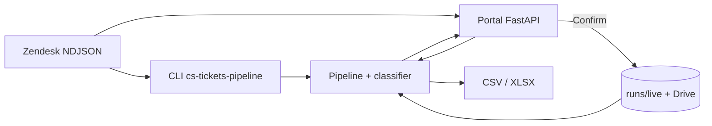
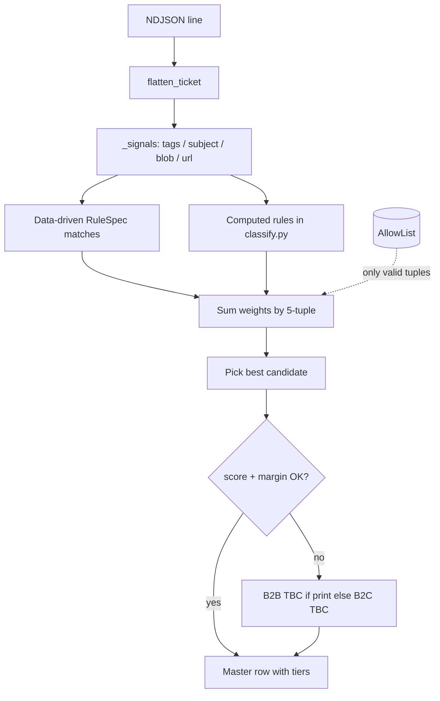
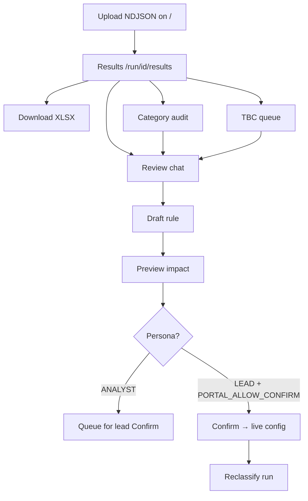
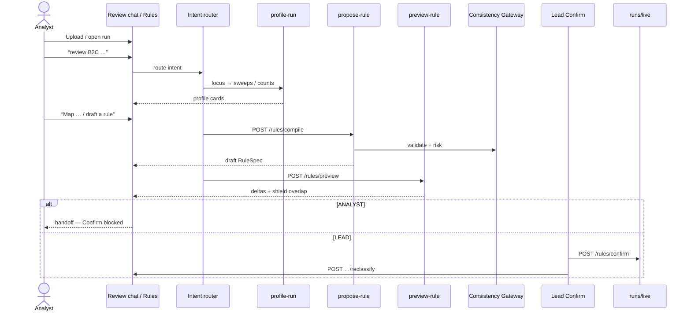
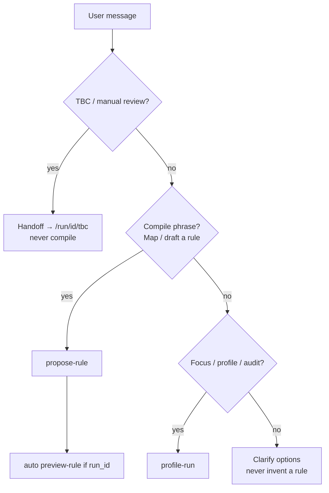
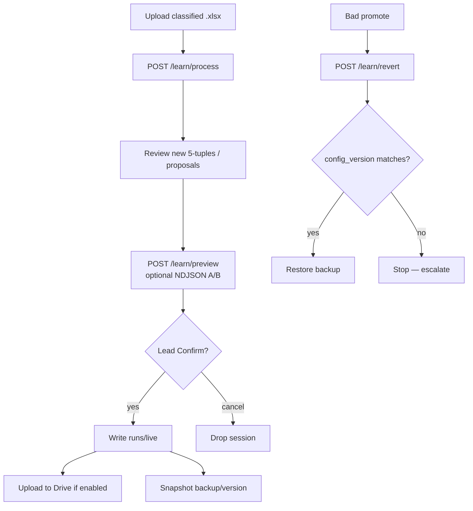
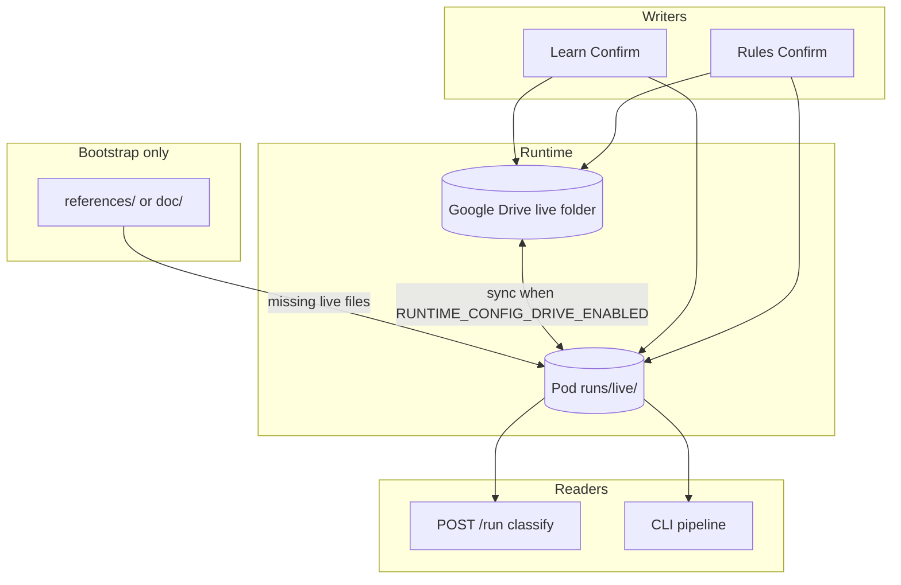
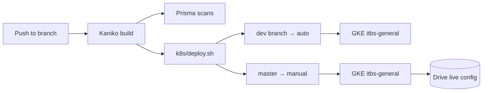
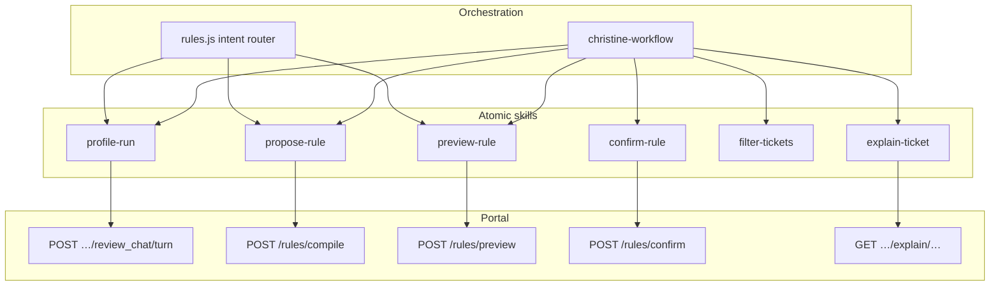

# Flow diagrams

Visual reference for the main operator and system flows. Source of truth for behaviour remains the linked design docs; these diagrams are for onboarding and orientation.

**Related:** [HANDOFF.md](./HANDOFF.md) · [design.md](./design.md) · [architecture/agent-skills-framework.md](./architecture/agent-skills-framework.md) · [api-reference.md](./api-reference.md)

---

## 1. System overview

End-to-end: Zendesk export in → classified master rows out → optional maintenance back into live config.



---

## 2. Per-ticket classify path (`/run` and CLI)

Deterministic hot path — **no LLM**.



Confidence gate: score ≥ `SCORE_THRESHOLD` (5.0) **and** (score ≥ `HIGH_CONFIDENCE_SCORE` (12.0) **or** margin ≥ `MIN_SCORE_MARGIN` (2.0)).

Detail: [design.md §5](./design.md#5-classifier-design) · [README](../README.md).

---

## 3. After upload — analyst journey

What an analyst does after `POST /run` succeeds.



---

## 4. Rule maintenance (Christine / Review chat loop)

Primary maintenance loop for routing rules.



Framework: [agent-skills-framework.md](./architecture/agent-skills-framework.md).

---

## 5. Review chat intent routing

How natural language is routed (never invents a rule when unclear).



---

## 6. TBC queue review

Chat **routes into** the queue; it does not replace the workbench.

```mermaid
flowchart TB
  START[Results or Review chat<br/>“show all TBC”] --> PAGE[/run/id/tbc]
  PAGE --> FILT[Optional NL focus filter]
  FILT --> LIST[Paginated TBC tickets]
  LIST --> EXPL[Explain ticket]
  LIST --> SUG[Optional AI suggest]
  LIST --> ACK[Ack chunk]
  LIST --> OVR[Run-scoped override]
  LIST --> RULE[Draft rule for recurring pattern]
  RULE --> COMP[POST /rules/compile]
  COMP --> PREV[Preview → Confirm path]
```

---

## 7. Learn New (allow-list + rules from workbook)



---

## 8. Live config and Drive sync



---

## 9. Category audit

```mermaid
flowchart TB
  RES[Run results] --> AUD[/run/id/category_audit]
  AUD --> FOCUS[NL parse focus]
  AUD --> SWEEP[GET sweeps by tier1 / categories]
  SWEEP --> BUCKET[Bucket cards]
  BUCKET --> EXPL[Explain ticket]
  BUCKET --> PROP[Propose rule from pattern]
  PROP --> RULES[Rules compile / preview]
  AUD --> CSV[Export CSV]
```

---

## 10. Deploy (CI → GKE)



Detail: [ops-runbook.md](./ops-runbook.md).

---

## 11. Agent skills ↔ portal APIs



---

## Quick links by role

| Role | Start with |
|------|------------|
| New engineer | §1, §2, §8 |
| Analyst / lead | §3, §4, §6, §7 |
| Agent / Christine | §4, §5, §11 |
| Ops | §8, §10 |
