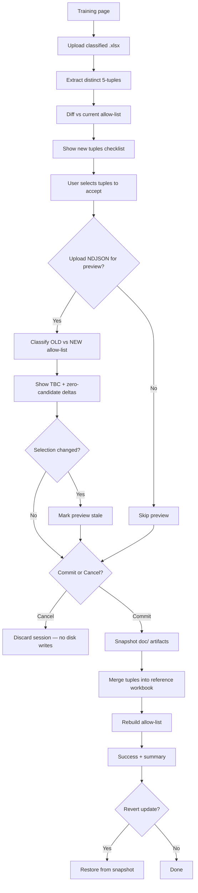

# Allowlist Training Feature — Implementation Plan

> **For implementer:** When you execute this plan (the actual coding), document your steps, process, and final design decisions in a separate markdown file (e.g. `docs/plans/2026-06-06-allowlist-training-implementation-notes.md`) so the requester can review rationale, catch bugs early, and understand the code. This plan describes *what* to build; that notes file describes *what you did*.

**Goal:** Let analysts upload an already-classified `.xlsx`, review tier combinations that are new relative to the current allow-list, selectively accept them, validate the change against an NDJSON export (TBC count), commit to update the allow-list, and revert afterward if needed.

**Architecture:** Extend the existing FastAPI portal with a “Training” flow. Reuse `load_allowlist()`, `_load_workbook_tuples()`, and `iter_taxonomy_pivot_rows()` from `taxonomy.py`. Persist accepted changes to the same source artifacts the allow-list already uses (`doc/CS_ticket_new_categorizations.xlsx` and, when needed, `doc/Taxonomy.csv`). Do not introduce a separate allow-list file.

**Tech stack:** Python 3.11, FastAPI, openpyxl (already used), existing `classify_row_with_explanation` / `iter_master_rows`, pytest.

**Example classified upload:** [`20260528_-_CS_ticket_new_categorizations.xlsx`](../../20260528_-_CS_ticket_new_categorizations.xlsx) (same schema as `doc/CS_ticket_new_categorizations.xlsx`, sheet `SCMP_Tickets_Master_Categorized`). For automated tests, prefer `doc/CS_ticket_new_categorizations.xlsx` via the `repo_root` fixture, or a trimmed copy under `tests/fixtures/` — do not depend on the repo-root example file being present in CI.

---

## Context

### How the allow-list is built today

`load_allowlist(taxonomy_csv, workbook_xlsx)` unions three sources:

| Source | Module | What it contributes |
|--------|--------|---------------------|
| Reference workbook | `_load_workbook_tuples()` | Distinct full **5-tuples** including `Granular_Tech_UI_Type` |
| `doc/Taxonomy.csv` | `iter_taxonomy_pivot_rows()` | Tier1–Tier4 leaves with **Granular forced to `N/A`** |
| Code fallbacks | `PIPELINE_FALLBACK_TIER_TUPLES` in `schema.py` | B2B and B2C `TBC (Manual Review)` tuples |

The allow-list is computed in memory on every run; it is **not** persisted as its own artifact.

### Design decisions

#### Persisting accepted updates

| Destination | When |
|-------------|------|
| **`doc/CS_ticket_new_categorizations.xlsx`** (primary) | Always, for every analyst-accepted 5-tuple from the upload. Same sheet/columns the loader already reads. |
| **`doc/Taxonomy.csv`** (secondary) | When the accepted tuple introduces a **new Tier1–Tier4 leaf** not already present in the pivot CSV. Keeps the official taxonomy tree and portal pivot stats aligned. |
| **`schema.py` fallbacks** | Never from uploads. Always unioned automatically. |

**Phase 1 shortcut:** Merge accepted tuples into the reference workbook only. Defer Taxonomy.csv auto-sync to Phase 2. Workbook-only updates are sufficient for the allow-list to grow.

#### Commit row semantics (resolved)

On **Commit**, append **one exemplar ticket row per accepted distinct 5-tuple** — not a tier-only stub row, and not every upload row that shares the tuple.

| Choice | Decision |
|--------|----------|
| Row source | First upload row encountered for each accepted tuple (deterministic) |
| Columns written | Full master row (same schema as existing workbook rows) |
| Rows per tuple | Exactly one, regardless of how many upload tickets share that tuple |

Rationale: the reference workbook already holds real classified tickets (534 rows → 59 distinct tuples today). One exemplar row per new combination matches that pattern, keeps commits predictable, and still adds the tuple to the allow-list via `_load_workbook_tuples()`.

#### Snapshot and undo semantics (resolved)

| Action | When | Disk effect |
|--------|------|-------------|
| **Cancel** | Any time before Commit (including abandoning the classified upload) | None — session discarded, `doc/` untouched |
| **Commit** | User confirms accepted tuples | Snapshot `doc/` artifacts, then merge exemplar rows |
| **Revert** | After a successful Commit | Restore `doc/` from that commit's snapshot |

Snapshots are created **only on Commit**, immediately before writing. No snapshot on upload or preview.

#### Detecting new combinations

Diff upload tuples against the **current allow-list** (computed via `load_allowlist`), not against Taxonomy.csv or the workbook individually. Comparing to a single source produces false positives — Taxonomy.csv misses workbook-only granular variants; the workbook misses CSV paths already allowed with `N/A` granular.

```python
upload_tuples = extract_distinct_five_tuples(uploaded_xlsx)  # complete 5-tuples only
current = load_allowlist(tax_path, wb_path)
new_to_allowlist = upload_tuples - current.tuples
```

**Complete tuples only:** `_load_workbook_tuples()` currently accepts any row where `any(tup)` — partially filled tier rows would pollute the diff. Training extractors must filter to rows where **all five** `schema.TIER_COLUMNS` are non-empty after strip. Incomplete rows are skipped (optionally counted for a UI warning).

Granular-variant hint badge (when Tier1–Tier4 already allowed with `N/A` granular) deferred to Phase 2 — Phase 1 shows a flat list of new 5-tuples.

#### Validating allow-list changes (TBC metrics)

A higher TBC count after expanding the allow-list is **mostly a scoring / rules problem**, not proof that the new allow-list is worse. Adding tuples increases the candidate pool; rules that previously had little competition may lose to near-ties, and margin gating (`MIN_SCORE_MARGIN`, `SCORE_THRESHOLD`) can push tickets to TBC fallback.

| Symptom | Likely cause | Fix direction |
|---------|--------------|---------------|
| TBC rows had **no candidate scores** before and after | Coverage gap — no rules target those tuples | Add/update rules in `classifier_rules.json` or computed rules |
| TBC rows had scores but **lost on margin** after allow-list growth | Scoring competition | Tune weights, add disambiguation rules, or adjust margin — not revert allow-list |
| New tuple added but **never appears** in output | Tuple in allow-list but unscored (unreachable) | Rules work, not allow-list work |

**Phase 1 validation:**

1. Primary metric: **TBC count and TBC %** on a fixed NDJSON golden set, old allow-list vs candidate allow-list.
2. Secondary metrics: delta in `fallback_used`, count of rows with **zero scored candidates** (`not decision.candidates`), tier distribution shift.
3. Store a **golden NDJSON** (and optionally golden TBC baseline numbers) in `tests/fixtures/` or `data/golden/` — not a frozen “golden allow-list” as the only gate. The allow-list should reflect approved taxonomy; the golden set validates classifier behavior.

If TBC rises after adding tuples that analysts explicitly classified, treat that as a signal to **add or tune rules** for those tuples, not to reject the taxonomy expansion.

#### TBC preview gating (resolved)

NDJSON A/B preview is **inform only** — a rising TBC count or % never blocks Commit. Show the delta plus brief copy explaining that TBC can increase when new categories compete during scoring; follow-up rule tuning may be needed. Revert remains available post-commit if the outcome is unsatisfactory.

#### TBC metric source (resolved)

Preview metrics follow **`tools/audit_classifier.py`**, not the portal run summary:

```python
decision.fallback_used or "tbc" in decision.tier[3].lower()
```

The classify portal uses `iter_master_rows` → `attach_tiers` and `run_metadata.count_tbc_rows` (Tier4 contains `"tbc"`). These should agree in practice because fallback tiers include `TBC (Manual Review)`, but preview copy should say metrics match the audit CLI, not the download workbook metadata sheet.

#### Preview staleness (resolved)

If the user changes checkbox selection **after** running NDJSON preview, treat the preview as **stale**: hide or grey out comparison results and show “Selection changed — re-run preview to update metrics.” Commit remains allowed without re-preview (preview is advisory); do not silently show outdated TBC numbers.

#### Deployment (resolved)

**Phase 1: local only.** Training routes and the index link appear only when both `doc/` and `doc/CS_ticket_new_categorizations.xlsx` are writable — use `os.access(path, os.W_OK)` on the directory and file (Windows read-only attribute matters). On Azure or other read-only deploys, hide Training — classify-only portal continues to work. Revisit hosted Training in Phase 2 if needed.

#### Git vs Training commit (resolved)

Training **Commit** writes to `doc/` on disk only; it does **not** run `git commit`. After a successful Training commit, the analyst must review `git diff doc/` and commit workbook changes to version control separately.

Training **Revert** restores the pre-commit **filesystem snapshot** only; it does **not** undo a git commit. If the workbook was already committed to git, Revert can desync disk from repo history — document this in README and post-commit success copy.

#### Checkbox defaults (resolved)

New combinations in the checklist start **unchecked**. Analyst must explicitly select tuples to accept. Provide select-all / select-none controls for convenience.

#### Granular variant badge (resolved)

Defer to **Phase 2**. Phase 1 lists new 5-tuples in a flat checklist without a parent-path hint when Tier1–Tier4 already exists with `N/A` granular.

#### Checklist ticket count (resolved)

Each new 5-tuple row shows **how many upload tickets** carry that combination (e.g. "24 tickets in upload"). Commit still adds one exemplar row per accepted tuple.

#### Empty selection (resolved)

**Commit disabled** until at least one tuple is checked. If the upload contains **no new tuples** (everything already in allow-list), show an informational message and do not offer Commit.

#### Golden NDJSON CI test (resolved)

**Defer to Phase 2.** Phase 1 ships the Training workflow only; curating a golden export and TBC baseline is a separate follow-up. Manual NDJSON preview in Training covers pre-commit validation.

#### Revert scope (resolved)

Phase 1 exposes **"Undo last update"** only — always restores the most recent commit's snapshot. No snapshot picker UI. Up to 5 snapshots retained on disk for manual recovery; older ones pruned.

#### Session management (resolved)

Training spans multiple POST requests; state must survive between them (same pattern as portal `_RUNS` + run id).

| Concern | Decision |
|---------|----------|
| Session id | UUID issued on upload; passed as hidden form field `session_id` on every subsequent POST |
| Store | In-memory `_TRAINING_SESSIONS: dict[str, _TrainingSession]` in `portal_app.py` (or `allowlist_training.py`) |
| Persisted paths | Temp dir per session: uploaded `.xlsx`, optional NDJSON, temp workbook copy for candidate allow-list |
| Cleanup | On **Cancel**, **Commit** success, or explicit session drop: delete temp dir. Server restart drops all in-progress sessions (same limitation as `_RUNS`) |
| Concurrency | Single-operator assumed. If a new upload starts while another session is open, replace the prior session and delete its temp files. Do not block on un-reverted snapshots — footer **Undo last update** is independent of in-progress sessions |

---

## Phase 1 — Training button

### User flow



### Functional requirements

| ID | Requirement |
|----|-------------|
| FR-T1 | Portal exposes a **Training** entry point (button/link from index or `/training`). |
| FR-T2 | Accept `.xlsx` upload; parse sheet **`SCMP_Tickets_Master_Categorized`** only. Return HTTP 400 with a clear message if the sheet is missing or the header lacks all `schema.TIER_COLUMNS`. (No first-sheet fallback in Phase 1.) |
| FR-T3 | List 5-tuples in upload that are **not** in current allow-list; user can select subset to accept. |
| FR-T4 | Optional NDJSON upload runs classification twice (old vs candidate allow-list) on the same export. |
| FR-T5 | Preview highlights **TBC count**, TBC % (audit-style), and side-by-side tier changes for changed tickets. Stale preview is invalidated when checkbox selection changes. |
| FR-T6 | **Cancel** abandons the session without modifying `doc/`. |
| FR-T7 | **Commit** writes accepted tuples to reference workbook after snapshotting for revert. |
| FR-T8 | After a successful commit, **Revert** restores the pre-commit snapshot of `doc/CS_ticket_new_categorizations.xlsx` (and `doc/Taxonomy.csv` if modified). Not offered alongside Commit/Cancel during preview. |

### Non-goals (Phase 1)

- Automatic Taxonomy.csv rewrite (manual or Phase 2).
- Changing classifier thresholds or rules as part of training.
- Google Drive persistence of training snapshots (local `doc/` only).
- Multi-user concurrent training (single-operator local portal assumed).
- Hosted Training on read-only deploys (Azure portal is classify-only in Phase 1).

---

## Implementation tasks

### Task 1: Allow-list diff helpers (`taxonomy.py`)

**Files:**

- Modify: `src/cs_tickets/taxonomy.py`
- Create: `tests/test_allowlist_training.py`

**Add** (reuse `schema.TIER_COLUMNS` — do not introduce a duplicate constant):

```python
def _is_complete_five_tuple(t: tuple[str, str, str, str, str]) -> bool:
    return all((v or "").strip() for v in t)

def iter_workbook_master_rows(
    xlsx: Path,
    sheet: str = "SCMP_Tickets_Master_Categorized",
) -> Iterator[dict[str, str]]:
    """Yield full master-row dicts in sheet order (header mapped via MASTER_COLUMNS)."""

def extract_workbook_five_tuples(
    xlsx: Path,
    sheet: str = "SCMP_Tickets_Master_Categorized",
) -> frozenset[tuple[str, str, str, str, str]]:
    """Distinct complete 5-tuples from upload; skips incomplete rows."""

def count_tickets_per_tuple(
    xlsx: Path,
    sheet: str = "SCMP_Tickets_Master_Categorized",
) -> dict[tuple[str, str, str, str, str], int]:
    """Ticket counts per complete 5-tuple (for checklist UI)."""

def diff_against_allowlist(
    upload_tuples: frozenset[tuple[str, str, str, str, str]],
    allow: AllowList,
) -> frozenset[tuple[str, str, str, str, str]]:
    return frozenset(t for t in upload_tuples if t not in allow)

def merge_tuples_into_workbook(
    target_xlsx: Path,
    source_xlsx: Path,
    new_tuples: frozenset[tuple[str, str, str, str, str]],
    *,
    sheet: str = "SCMP_Tickets_Master_Categorized",
) -> int:
    """Append one exemplar row per new tuple. Return rows added."""
```

**`merge_tuples_into_workbook` implementation notes:**

1. Open **target** with `load_workbook(..., read_only=False)`; open **source** read-only.
2. Resolve header → column index map; require all `MASTER_COLUMNS` present (or at minimum all tier columns).
3. For each tuple in `new_tuples`, scan **source rows in sheet order** via `iter_workbook_master_rows` and append the **first** row whose 5-tuple matches.
4. Append after the last existing data row; do not modify the header row or existing rows.
5. Write cell values with the same string normalization `_load_workbook_tuples` uses (`str(x)` for non-None).
6. Save target in place.

**Tests:**

- Upload example xlsx (or `doc/` workbook copy) vs repo allow-list → diff is computable.
- Incomplete tier rows in a synthetic fixture are excluded from diff.
- `merge_tuples_into_workbook` on temp copy adds rows and `load_allowlist` grows accordingly.
- Exemplar row is the first source row in sheet order for each tuple.
- Empty diff when upload ⊆ current allow-list.

---

### Task 2: Training session state

**Files:**

- Create: `src/cs_tickets/allowlist_training.py`

**Responsibilities:**

- `_TrainingSession` dataclass:
  - `session_id: str`
  - `temp_dir: Path` — owns uploaded `.xlsx`, optional NDJSON, temp workbook copy
  - `upload_path: Path`
  - `upload_tuples`, `new_tuples`, `selected_tuples`
  - `ticket_counts: dict[tuple, int]` — from `count_tickets_per_tuple`
  - `preview_result: AllowlistCompareResult | None`
  - `preview_selection_hash: str | None` — fingerprint of tuple set used for last preview (invalidate on change)
  - `last_snapshot_dir: Path | None` — set after successful commit
- `create_session(upload_xlsx: Path, repo_root: Path) -> _TrainingSession` — copy upload into session temp dir, compute diff + counts.
- `build_candidate_allowlist(session, selected) -> AllowList` — copy real workbook to temp path, `merge_tuples_into_workbook` with `selected`, call `load_allowlist` against temp workbook + real taxonomy CSV.
- `snapshot_doc_artifacts(repo_root: Path) -> Path` — copy `doc/CS_ticket_new_categorizations.xlsx` (+ `Taxonomy.csv` if present) to `doc/.snapshots/<uuid>/`.
- `commit_session(session) -> None` — snapshot, then merge selected into real workbook via `merge_tuples_into_workbook`.
- `revert_snapshot(snapshot_dir: Path, repo_root: Path) -> None` — restore files from snapshot.
- `drop_session(session) -> None` — delete temp dir and remove from `_TRAINING_SESSIONS`.

Keep snapshots under `doc/.snapshots/` (gitignore). Cap retained snapshots (e.g. last 5) to avoid disk bloat. Track `last_snapshot_dir` separately from in-progress session state so **Undo last update** works after the session is dropped.

---

### Task 3: NDJSON A/B comparison

**Files:**

- Create: `src/cs_tickets/allowlist_compare.py`
- Reuse: `tools/audit_classifier.py` patterns

**Add:**

```python
@dataclass(frozen=True)
class AllowlistCompareResult:
    total: int
    tbc_old: int
    tbc_new: int
    changed_rows: list[dict]  # ticket id, old tier4, new tier4, old full tuple, new full tuple
    zero_candidate_old: int
    zero_candidate_new: int

def compare_allowlists_on_ndjson(
    ndjson_path: Path,
    allow_old: AllowList,
    allow_new: AllowList,
    *,
    limit: int | None = None,
) -> AllowlistCompareResult:
    ...
```

**TBC detection** (audit-style, per row):

```python
decision.fallback_used or "tbc" in decision.tier[3].lower()
```

Use `classify_row_with_explanation(row, allow)` on flattened NDJSON rows — same core path as production (`attach_tiers` wraps this). Do **not** use `run_metadata.count_tbc_rows` for preview totals.

**Zero-candidate definition:** count rows where `not decision.candidates` (no rule scored any allow-listed tuple) **before** treating the row as TBC/fallback. Rows that already have candidates but lose on margin are **not** zero-candidate.

**`changed_rows`:** include tickets where the full 5-tuple differs between old and new allow-list runs (not just tier4).

Expose summary HTML fragment for portal (table: metric | old | new | delta). Include a footnote that metrics match `audit_classifier`, not the portal download metadata sheet.

---

### Task 4: Portal routes and UI

**Files:**

- Modify: `src/cs_tickets/portal_app.py`
- Modify: `src/cs_tickets/static/cs_tickets_theme.css` (minimal styling for checklist + comparison table)
- Optional: `src/cs_tickets/static/training.js` if checkbox UX needs client-side select-all / preview-stale detection

**Gating:** Show Training link and routes only when `training_available(repo_root)` is true (`doc/` writable **and** workbook writable).

**Routes:**

| Method | Path | Purpose |
|--------|------|---------|
| GET | `/training` | Upload form for classified xlsx |
| POST | `/training/upload` | Parse file, create session, show new tuples checklist |
| POST | `/training/preview` | NDJSON + `session_id` + selected tuples → comparison; store result + selection hash on session |
| POST | `/training/commit` | `session_id` + selected tuples → snapshot + merge + confirm |
| POST | `/training/cancel` | Drop session (`session_id`); no `doc/` writes |
| POST | `/training/revert` | Restore **latest** commit snapshot ("Undo last update"); no active session required |

Every POST after upload must include hidden field **`session_id`**. Checkbox names should encode the 5-tuple (e.g. pipe-delimited) so the server can parse `selected_tuples`.

**UI sections:**

1. Step 1 — Upload classified workbook.
2. Step 2 — Table of new 5-tuples (checkboxes default **unchecked**; select all/none; **ticket count** column per tuple). Changing any checkbox marks preview stale if one exists.
3. Step 3 — Optional NDJSON upload for A/B preview (requires ≥1 tuple checked).
4. Step 4 — Results: TBC old vs new (audit-style), zero-candidate counts, link to changed-ticket sample. Show stale banner if selection changed since preview.
5. Step 5 — Commit / Cancel (preview stage only; no revert here).
6. Step 6 — Post-commit success screen with summary, reminder to `git diff doc/` + commit, and **Revert last update** action. Training page footer also exposes revert when a recent snapshot exists.

Add link from `/` index: “Training (update allow-list)” — only when gating passes.

---

### Task 5: Documentation and gitignore

**Files:**

- Modify: `.gitignore` — `doc/.snapshots/`
- Modify: `README.md` — short “Training / allow-list updates” section covering: local-only gating, workflow steps, **git commit is separate from Training commit**, Revert restores disk not git history
- Implementer creates: `docs/plans/2026-06-06-allowlist-training-implementation-notes.md` during coding

---

## Phase 2 — UI simplification and follow-ups (later)

- Plain-language copy (“New categories found in your file”) instead of “5-tuple”.
- Wizard steps with progress indicator.
- Badge when Tier1–Tier4 already in allow-list with `N/A` granular but upload adds a granular variant.
- Automate Taxonomy.csv sync when new Tier1–Tier4 leaves are accepted.
- **Golden NDJSON fixture** (`data/golden/export-golden.ndjson`) + CI test for TBC baseline regression.
- Surface golden-set TBC badge: green/red vs baseline with short explanation.
- Hosted Training on writable deploy path (optional).

---

## Acceptance criteria (Phase 1)

- [ ] Upload example xlsx; new tuples not in allow-list are listed correctly; incomplete tier rows excluded.
- [ ] Accepting tuples and committing updates `doc/CS_ticket_new_categorizations.xlsx`; subsequent `load_allowlist()` includes them.
- [ ] Cancel leaves `doc/` unchanged and deletes session temp files.
- [ ] Revert (post-commit) restores pre-commit workbook from snapshot.
- [ ] NDJSON preview shows audit-style TBC old vs new on the same file; stale banner when selection changes after preview.
- [ ] Training hidden when `doc/` or workbook is not writable.
- [ ] `pytest -q` passes including new training tests.
- [ ] Implementer notes markdown exists explaining code paths and any deviations from this plan.

---

## Risk register

| Risk | Mitigation |
|------|------------|
| Azure deploy has read-only `doc/` | Phase 1: hide Training when `doc/` or workbook is not writable (`os.access`); document local-only workflow. Phase 2: optional writable `CS_TICKETS_REPO_ROOT`. |
| Upload replaces entire workbook accidentally | Merge-only semantics; never overwrite workbook without snapshot. |
| TBC rises after expansion | Show zero-candidate vs margin-loss breakdown; document that rules may need follow-up. |
| Large xlsx with duplicate tuples | Dedupe on extract; show count of tickets per new tuple in UI. |
| Server restart mid-session | Same as `_RUNS`: in-progress Training session lost; user re-uploads. Document in README. |
| Training commit vs git history diverge | README + post-commit copy: run `git diff doc/` and commit separately; Revert restores disk only. |
| Stale NDJSON preview after checkbox change | Invalidate preview UI; require re-run to refresh metrics. |
| Partial tier rows in upload | Filter to complete 5-tuples in extract; optional skip count in UI. |

---

## Task checklist (implementation order)

1. [ ] Task 1 — taxonomy diff/merge helpers + tests
2. [ ] Task 2 — session + snapshot module
3. [ ] Task 3 — NDJSON A/B compare
4. [ ] Task 4 — portal routes + UI
5. [ ] Task 5 — docs, gitignore, implementer notes

---

## Reference: key existing code

| Concern | Location |
|---------|----------|
| Allow-list load | `src/cs_tickets/taxonomy.py` → `load_allowlist()` |
| Workbook tuple extract | `taxonomy._load_workbook_tuples()` |
| Tier column names | `schema.TIER_COLUMNS` (same as `MASTER_COLUMNS[20:]`) |
| Classify + explain | `classify_row_with_explanation()` |
| TBC audit CLI | `tools/audit_classifier.py` |
| Portal upload pattern | `portal_app.run_upload()` |
| Portal TBC in workbook metadata | `run_metadata.count_tbc_rows()` (not used for Training preview) |
