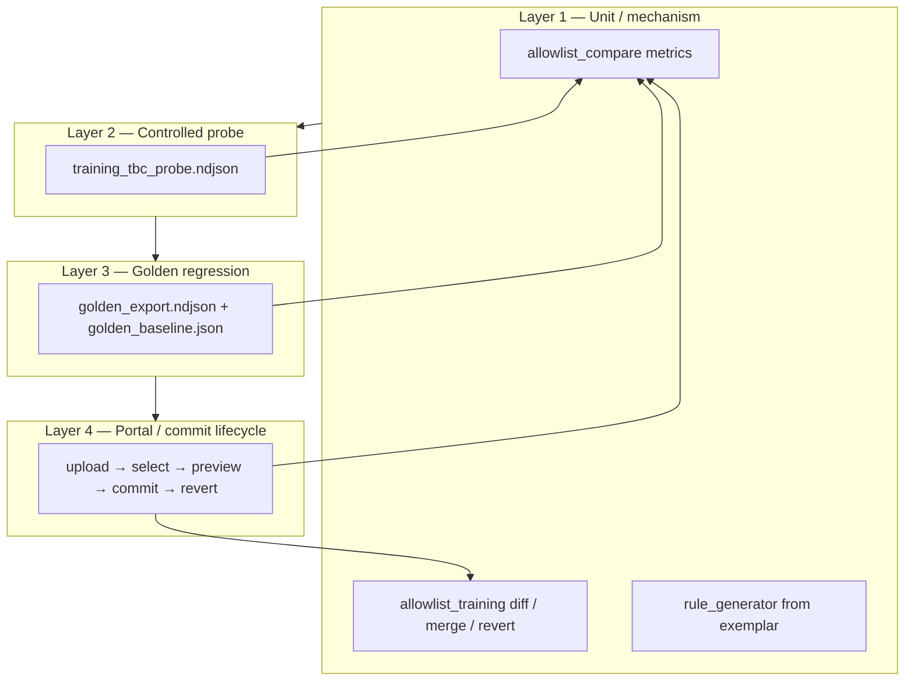
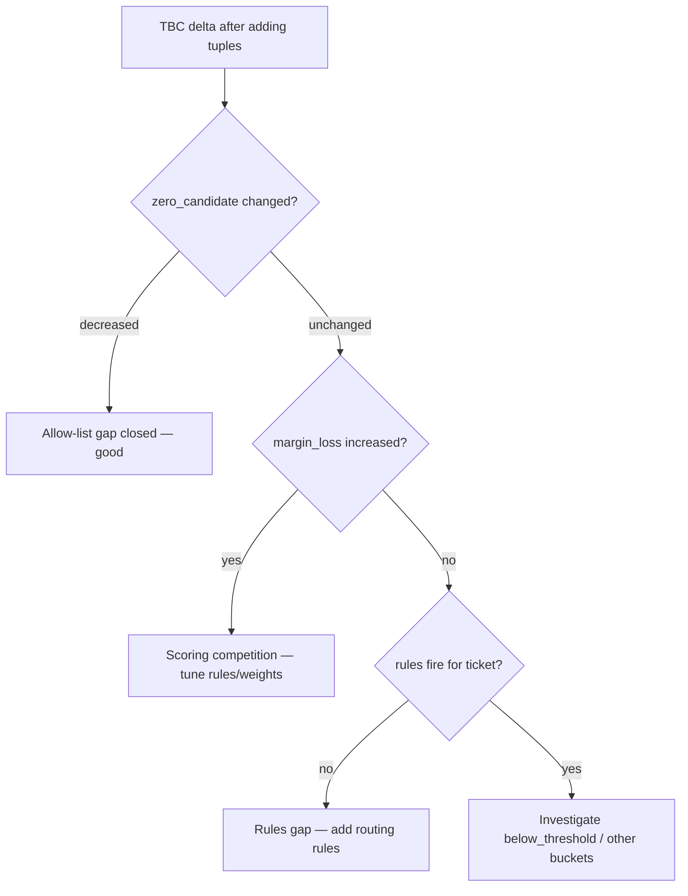

# Allowlist Update Testing Architecture — Plan

> **For implementer:** When you execute the optional tasks in this plan (CLI report tool, expanded golden fixtures, additional pytest), document your steps and design decisions in a separate markdown file (e.g. `docs/plans/2026-06-09-allowlist-testing-architecture-notes.md`). This plan describes *how to test and measure* the allow-list update feature; that notes file describes *what you built*.

**Goal:** Provide a layered testing architecture for the allow-list Training / update feature so analysts and engineers can **measure TBC count changes** and **ticket classification deltas** when merging new 5-tuples — and correctly interpret whether an outcome is an allow-list win, a rules gap, or a scoring-competition regression.

**Architecture:** Center evaluation on **A/B classification** (`old allow-list` vs `candidate allow-list`) over a **fixed NDJSON ticket set**, using `compare_allowlists_on_ndjson()` as the single metrics engine. Classified `.xlsx` uploads supply new tuples only; they do not drive reclassification metrics. Four test layers: unit mechanism → controlled probe → golden regression → portal lifecycle.

**Tech stack:** Python 3.11, pytest, `cs_tickets.allowlist_compare`, `cs_tickets.allowlist_training`, `tools/audit_classifier.py`, existing portal Training routes.

**Depends on:** [2026-06-06-allowlist-training-feature.md](./2026-06-06-allowlist-training-feature.md) (shipped), [2026-06-08-allowlist-training-fixes.md](./2026-06-08-allowlist-training-fixes.md) (shipped), [2026-06-09-training-rule-proposals.md](./2026-06-09-training-rule-proposals.md) (rules overlay + coverage badges). Operational runbook: [`testcase.md`](../../testcase.md).

**Related brief:** [`allowlistupdatefeature.md`](../../allowlistupdatefeature.md)

---

## Context

### What we are testing

The allow-list update feature (Training portal) lets analysts:

1. Upload a classified `.xlsx` with tier combinations.
2. Select **new** 5-tuples relative to the current allow-list.
3. Optionally preview impact on a Zendesk `.ndjson` export (old vs new allow-list).
4. Commit exemplar rows to `doc/CS_ticket_new_categorizations.xlsx` (and, per rule-proposals plan, generated rules to `doc/training_rules.json`).
5. Revert the last commit from snapshot.

**Testing must validate two distinct outcomes:**

| Outcome | Question |
|---------|----------|
| **Allow-list mechanics** | Did accepted tuples merge correctly? Does revert restore prior state? |
| **Classifier impact** | Did TBC count and per-ticket tiers change as expected on a fixed ticket export? |

### Two inputs — do not conflate

| Input | Role in testing |
|-------|-----------------|
| Classified `.xlsx` (Training Step 1) | Supplies **new 5-tuples** to diff and merge |
| Zendesk `.ndjson` (Preview Step 3, Run page) | Supplies **raw tickets** for classification and TBC metrics |

Re-running or re-uploading the classified workbook **does not** test reclassification. Preview and all automated compare tests classify the **NDJSON export**.

### When allow-list expansion fixes TBC

All three must be true for a tuple to move a ticket off TBC:

1. A classifier rule matches the ticket (tags / subject / description / url).
2. That rule's target 5-tuple is **not** in the old allow-list (scores are gated — tuple absent → no candidate score).
3. The analyst adds that exact 5-tuple via Training.

If rules never fire, adding a random analyst tuple will **not** reduce TBC. See negative control in [`testcase.md`](../../testcase.md).

### Current repo state (June 2026)

Against `doc/` today:

- ~**106** allow-list tuples (exact count may drift with workbook edits).
- **0** `classifier_rules.json` rule targets missing from the allow-list.
- Example workbook `20260528_-_CS_ticket_new_categorizations.xlsx` has **0** tuples new vs current allow-list.

There is no “natural” new tuple for a happy-path test without a **controlled setup** (temporarily remove a workbook-only tuple, then add it back through Training). Automated tests use synthetic `AllowList` objects instead of mutating `doc/`.

### TBC can rise after a “good” allow-list change

Adding tuples increases the scored candidate pool. Rules that previously had little competition may lose to near-ties; margin gating (`MIN_SCORE_MARGIN`, `SCORE_THRESHOLD`) can push tickets to TBC fallback. **A higher TBC count is not proof the new allow-list is worse** — it may signal rule tuning is needed. See interpretation guide below.

---

## Design decisions

| Topic | Decision | Rationale |
|-------|----------|-----------|
| Metrics engine | `compare_allowlists_on_ndjson()` only | Same logic powers portal preview and pytest; one definition of TBC |
| TBC definition | `decision.fallback_used or "tbc" in decision.tier[3].lower()` | Matches `tools/audit_classifier.py`, not portal run-metadata alone |
| Golden set | Fixed NDJSON in `tests/fixtures/` + baseline ceilings in JSON | Validates classifier behavior on a stable ticket sample; allow-list reflects approved taxonomy |
| Golden allow-list | **Do not** freeze as the only CI gate | Taxonomy should grow; golden NDJSON catches unintended regressions |
| Controlled probe | Synthetic allow-list minus one known tuple | Proves mechanism without editing `doc/` in CI |
| Negative control | Tuple with no matching rule | Confirms Training is not “magic reclassification” |
| Real export evaluation | `data/*.ndjson` (gitignored), advisory | Too volatile for CI unless baselined separately |
| Portal E2E | Manual checklist in `testcase.md` Test B | Requires writable `doc/` and temporary workbook strip |
| Rule overlay testing | Pass `rule_specs_new` to compare when simulating commit | Preview must reflect generated rules before disk write (per rule-proposals plan) |
| Revert validation | Compare metrics identical pre-commit vs post-revert | Stronger than tuple membership alone |

---

## Test layers



### Layer 1 — Unit / mechanism (fast, deterministic)

**Scope:** Pure functions; no portal; no `doc/` mutation.

| Module | What to assert |
|--------|----------------|
| `allowlist_compare` | Metric counters, `changed_rows`, B2B/B2C split, margin/below-threshold buckets |
| `allowlist_training` | Tuple diff vs `load_allowlist()`, merge, session commit/revert in isolated tmp repo |
| `rule_generator` | Deterministic rule from exemplar; compare with `rule_specs_new` |

**Existing tests:**

| File | Coverage |
|------|----------|
| `tests/test_allowlist_session.py` | Compare on NDJSON + pretty JSON; commit/revert round-trip |
| `tests/test_allowlist_training.py` | Diff, merge, empty diff when upload ⊆ allow-list |
| `tests/test_golden_classifier.py` | Probe TBC 1→0, negative control, zero-candidate + generated rule |

**Run:**

```bash
.\.venv\Scripts\python.exe -m pytest tests/test_allowlist_session.py tests/test_allowlist_training.py tests/test_golden_classifier.py -q
```

### Layer 2 — Controlled TBC probe (mechanism proof)

**Purpose:** Prove the allow-list gap hypothesis on a single ticket with known rule, tuple, and expected delta.

| Field | Value |
|-------|-------|
| **Rule** | `sales.new_subscriber.b2c` in `classifier_rules.json` |
| **Target 5-tuple** | `B2C \| Service Task \| Sales Leads \| Rate or Renewal Inquiry \| N/A` |
| **Ticket id** | `910001` |
| **Tags** | `["new_subscriber"]` |
| **Subject** | `Subscription pricing` |
| **Tuple source** | Reference workbook only (not in `doc/Taxonomy.csv`) |

**Fixtures:**

| File | Role |
|------|------|
| `tests/fixtures/training_tbc_probe.ndjson` | Single-ticket Zendesk export |
| `tests/fixtures/training_tbc_probe_upload.xlsx` | Classified upload for portal Test B (generate via `tools/build_training_test_upload.py`) |

**Expected compare result** (`allow_old = full minus probe tuple`, `allow_new = full`):

| Metric | Old | New | Delta |
|--------|-----|-----|-------|
| TBC (combined) | 1 | 0 | −1 |
| Zero-candidate rows | 1 | 0 | −1 |
| Changed rows | id `910001` | TBC → Rate or Renewal Inquiry | — |

**Existing test:** `test_training_probe_resolves_tbc_when_tuple_missing` in `tests/test_golden_classifier.py`.

**Quick CLI check** (no pytest): see Test A in [`testcase.md`](../../testcase.md).

### Layer 3 — Golden NDJSON regression (realistic distribution)

**Purpose:** After allow-list or rule changes, ensure TBC and zero-candidate counts on a small real export stay within baseline **ceilings** — catch silent regressions without requiring TBC = 0.

| File | Role |
|------|------|
| `tests/fixtures/golden_export.ndjson` | Fixed ticket sample (5 rows today) |
| `tests/fixtures/golden_baseline.json` | `total`, `tbc_max`, `zero_candidate_max` ceilings |

**Existing test:** `test_golden_export_tbc_within_baseline`.

**Baseline format:**

```json
{
  "total": 5,
  "tbc_max": 2,
  "zero_candidate_max": 2
}
```

**When to update baseline:** Only after deliberate classifier or allow-list changes that are reviewed and accepted — not on every commit.

**Optional extension:** Per-ticket expected tier map for high-confidence non-TBC tickets (higher maintenance; defer until golden export stabilizes).

### Layer 4 — Portal / commit lifecycle

**Scope:** HTTP routes, session state, preview staleness, commit without preview, revert.

**Existing tests:** `tests/test_portal.py` (`test_training_preview_uses_candidate_allowlist_without_commit`, `test_training_commit_without_preview_file`, upload rejection, etc.).

**Manual E2E:** [`testcase.md`](../../testcase.md) Test B — requires temporarily stripping probe tuple from `doc/CS_ticket_new_categorizations.xlsx`, full portal flow, then revert or restore backup.

**Real export evaluation (advisory):** [`testcase.md`](../../testcase.md) Test C — place export in `data/`, run `tools/audit_classifier.py`, diagnose allow-list-gap TBCs with evidence + empty candidates.

---

## Metrics contract

All layers must use the same definitions from `AllowlistCompareResult` (`src/cs_tickets/allowlist_compare.py`).

### Primary metrics

| Field | Definition | Use |
|-------|------------|-----|
| `total` | Rows classified in NDJSON | Denominator for rates |
| `tbc_old` / `tbc_new` | Audit-style TBC count | Headline manual-review delta |
| `tbc_b2b_*` / `tbc_b2c_*` | TBC split by segment (tier1) | Analyst-facing preview |
| `zero_candidate_old/new` | `not decision.candidates` | **Allow-list gap** vs routing gap |
| `changed_rows` | Per-ticket tier change | Classification diff sample |

### Secondary metrics (diagnosis)

| Field | Definition | Use |
|-------|------------|-----|
| `margin_loss_old/new` | TBC with `tbc_reason == "lost_margin"` | Scoring competition |
| `below_threshold_old/new` | TBC with `tbc_reason == "below_threshold"` | Weak signal |
| `allowlist_old_size` / `allowlist_new_size` | Tuple set sizes | Scope of change |
| `tuples_merged` | New tuples in candidate allow-list | Training selection size |
| `rules_targeting_selected_*` | Rules whose target ∈ selected tuples | Coverage check (rule-proposals) |

### Derived metrics (reports / CLI)

| Metric | Formula |
|--------|---------|
| TBC % (old/new) | `tbc_* / total` |
| Net TBC improvement | `tbc_old - tbc_new` (positive = fewer TBC) |
| Allow-list gap fix rate | Tickets: zero-candidate old → scored new |
| Regression rate | Tickets: non-TBC old → TBC new |

### TBC detection (normative)

```python
decision.fallback_used or "tbc" in decision.tier[3].lower()
```

Portal run metadata (`run_metadata.count_tbc_rows`) should agree in practice but **preview and tests follow audit style**.

---

## Interpretation guide

Use this decision tree when reviewing preview or compare output:



| Observation | Likely cause | Action |
|-------------|--------------|--------|
| TBC ↓, zero-candidate ↓ | Tuple was missing; rules already matched | Accept commit |
| TBC unchanged, tuple added | No rule targets tuple | Generate/add routing rules (Training rule proposals) |
| TBC ↑, zero-candidate unchanged | New tuples increased competition | Tune weights / disambiguation; do not auto-reject tuple |
| TBC ↑, margin_loss ↑ | Near-tie candidates after allow-list growth | Same as above |
| Tuple committed, never in `changed_rows` | Tuple legal but unroutable | Rules work, not allow-list work |
| Negative control: random tuple | TBC unchanged | Confirms mechanism is sound |

**Commit gating (product):** Rising TBC does **not** block Commit in Phase 1 — preview is advisory. Revert remains available post-commit.

---

## Fixture catalog

### Shipped in repo (CI-safe)

| Asset | Path | Purpose |
|-------|------|---------|
| TBC probe NDJSON | `tests/fixtures/training_tbc_probe.ndjson` | 1-ticket controlled scenario |
| TBC probe upload | `tests/fixtures/training_tbc_probe_upload.xlsx` | Portal manual Test B (regenerate with `tools/build_training_test_upload.py`) |
| Golden export | `tests/fixtures/golden_export.ndjson` | Regression sample |
| Golden baseline | `tests/fixtures/golden_baseline.json` | TBC / zero-candidate ceilings |
| Five-ticket smoke | `tests/fixtures/five_tickets.ndjson` | Compare identity smoke (old == new) |
| Negative tuple | `TestSeg \| TestStream \| TestCat \| TestType \| TestGran` | In-code only; no rule |

### Local / advisory

| Asset | Path | Purpose |
|-------|------|---------|
| Full Zendesk export | `data/*.ndjson` (gitignored) | Production-like TBC distribution |
| Analyst classified workbook | Upload via portal | Source tuples from real analyst work |
| Workbook backup | `doc/CS_ticket_new_categorizations.xlsx.bak` | Manual Test B strip/restore |

### Synthetic scenarios (pytest / tmp_path)

| Scenario | Setup |
|----------|-------|
| Revert round-trip | `test_session_commit_and_revert` — isolated `tmp_path` repo |
| Rule-generated zero-candidate fix | `test_training_probe_resolves_zero_candidate_when_rule_generated` |
| Novel tuple merge | `test_diff_and_merge_against_allowlist` |

---

## Test matrix

| Layer | Scenario | Input | Expected signal | Test location |
|-------|----------|-------|-----------------|---------------|
| 1 | Compare identity | `five_tickets.ndjson`, same allow-list | `tbc_old == tbc_new`, `changed_rows == []` | `test_compare_allowlists_on_ndjson` |
| 1 | Commit + revert | Upload xlsx with novel tuple | Tuple in allow-list after commit; gone after revert | `test_session_commit_and_revert` |
| 2 | Allow-list gap | Probe NDJSON, old = full − probe tuple | `tbc_old=1`, `tbc_new=0` | `test_training_probe_resolves_tbc_when_tuple_missing` |
| 2 | Negative control | Probe NDJSON, add `NEGATIVE_TUPLE` | `tbc_old == tbc_new` | `test_training_negative_control_tuple_without_rule_does_not_reduce_tbc` |
| 2 | Rule closes gap | Tmp probe + `rule_specs_new` | `zero_candidate_new < zero_candidate_old` | `test_training_probe_resolves_zero_candidate_when_rule_generated` |
| 3 | Golden ceiling | `golden_export.ndjson` vs current allow-list | `tbc ≤ tbc_max`, `zero_candidate ≤ zero_candidate_max` | `test_golden_export_tbc_within_baseline` |
| 4 | Preview without commit | Portal POST preview | Candidate allow-list used; `doc/` unchanged | `test_training_preview_uses_candidate_allowlist_without_commit` |
| 4 | Commit without preview | Portal POST commit | Workbook updated; optional rules file | `test_training_commit_without_preview_file` |
| Manual | Full portal E2E | Strip probe tuple from workbook | Preview −1 TBC; commit; optional Run confirm | `testcase.md` Test B |
| Advisory | Real export diagnosis | `data/export.ndjson` | List evidence + empty-candidate TBCs | `testcase.md` Test C |

---

## CI gates

| Gate | Block merge? | Command / location |
|------|--------------|-------------------|
| Layer 1–3 pytest | **Yes** | `pytest tests/test_allowlist_session.py tests/test_allowlist_training.py tests/test_golden_classifier.py tests/test_portal.py -q` |
| Full test suite | **Yes** (repo default) | `pytest` |
| Golden baseline drift | **Yes** (if golden test fails) | Fix classifier or update `golden_baseline.json` with review |
| Manual portal Test B | No — pre-release | `testcase.md` |
| Real `data/` export compare | No — analyst workflow | `tools/audit_classifier.py` + compare CLI (optional Task 1) |

---

## Goals and success criteria

### Primary goals

1. **TBC reduction where allow-list was the blocker** — evidence present, zero candidates, tuple added → specific tier.
2. **No false improvement** — tuples without rules do not change TBC on probe set.
3. **Safe rollback** — revert restores prior allow-list and compare metrics.
4. **Explainable deltas** — metrics distinguish zero-candidate vs margin-loss vs below-threshold.

### Secondary goals

5. **Rule coverage follows expansion** — commit writes routable rules for novel tuples (rule-proposals plan).
6. **Segment visibility** — B2B/B2C TBC split in preview matches compare output.
7. **Golden stability** — no unexpected TBC spike on fixed export.

### Non-goals

- Proving every analyst tuple reduces TBC (competition can increase TBC).
- Using classified workbook re-run as validation of classifier impact.
- Freezing allow-list size or composition as the sole quality metric.

---

## Optional implementation tasks

These extend the architecture; none are required for the current pytest suite to pass.

### Task 1 — Compare report CLI

> **Superseded by:** [2026-06-09-batch-allowlist-impact-analysis.md](./2026-06-09-batch-allowlist-impact-analysis.md) Phase 1, which extends single-file compare to batch commit verdict + optional ablation (Phase 2). A minimal `tools/compare_allowlist_report.py` remains valid if you only need one NDJSON without batch aggregation.

**Files:** `tools/compare_allowlist_report.py` (new) or `tools/batch_allowlist_compare.py` (per batch plan)

**Behavior:** Wrap `compare_allowlists_on_ndjson()` with argparse:

```bash
.\.venv\Scripts\python.exe tools\compare_allowlist_report.py \
  --ndjson tests/fixtures/golden_export.ndjson \
  --taxonomy doc/Taxonomy.csv \
  --workbook doc/CS_ticket_new_categorizations.xlsx \
  --merge-tuples "B2C,Service Task,Sales Leads,Rate or Renewal Inquiry,N/A"
```

Print metric table (old / new / delta), TBC %, and optional `--csv changed_rows.csv`. Useful for analyst review outside the portal.

### Task 2 — Revert metric identity test

**Files:** `tests/test_allowlist_session.py`

After `commit_session` + `revert_latest_snapshot` on tmp repo, run compare on a fixture NDJSON with `allow_before` vs `allow_after_revert` and assert identical `tbc_*` and `zero_candidate_*`.

### Task 3 — Expand golden export

**Files:** `tests/fixtures/golden_export.ndjson`, `tests/fixtures/golden_baseline.json`

Add 10–20 tickets from a stable real export (anonymized if needed). Re-baseline `tbc_max` / `zero_candidate_max` after review. Optionally add `expected_tiers.json` for non-TBC tickets.

### Task 4 — Portal preview HTML metric assertions

**Files:** `tests/test_portal.py`

POST preview with probe NDJSON + session selecting probe tuple; parse HTML for B2B/B2C/combined TBC rows and assert numeric cells match `compare_allowlists_on_ndjson()` output.

### Task 5 — Allow-list-gap auditor helper

**Files:** `tools/audit_classifier.py` or `tools/find_allowlist_gap_tbc.py` (new)

Emit ticket ids where `evidence` non-empty and `candidates` empty — actionable Training candidates from real exports (script body in `testcase.md` Test C).

---

## Troubleshooting

| Observation | Likely cause |
|-------------|--------------|
| Tuple not in Step 2 checklist | Tuple still in allow-list (workbook and/or Taxonomy.csv) |
| TBC unchanged after preview | Rules do not target tuple, or ticket had scoring competition before |
| TBC count rises | New tuples increased competition — see interpretation guide |
| `zero_candidate` unchanged | Allow-list was not the blocker; need rules |
| Probe test fails on fresh clone | `doc/` missing or probe tuple not in reference workbook |
| Golden test fails after intentional classifier change | Update `golden_baseline.json` with documented review |

---

## Summary

Architect allow-list update testing as **A/B classification over fixed NDJSON**, with:

1. **Layer 2 probe** — proves allow-list gap mechanism (`tbc 1 → 0`).
2. **Layer 3 golden** — regression ceilings on a small real sample.
3. **Interpretation layer** — `zero_candidate` vs `margin_loss` explains TBC direction.
4. **Layer 4 portal + revert** — lifecycle safety.

TBC count alone is insufficient to judge whether a new allow-list is better. Use the full metric contract and decision tree above; treat rising TBC after analyst-approved tuples as a signal for **rule tuning**, not automatic rejection.

**Quick start:**

```bash
# Automated (CI)
.\.venv\Scripts\python.exe -m pytest tests/test_golden_classifier.py tests/test_allowlist_session.py -q

# Manual portal flow
# See testcase.md Test B
```
