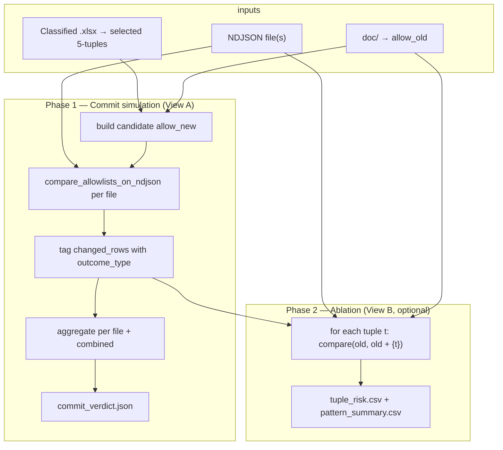
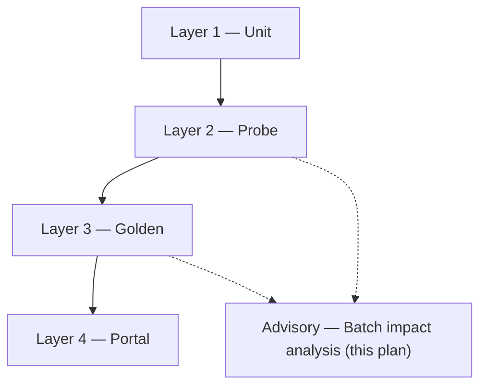

# Batch Allow-List Impact Analysis — Plan

> **For implementer:** When you execute this plan (the actual coding), document your steps, process, and final design decisions in a separate markdown file (e.g. `docs/plans/2026-06-09-batch-allowlist-impact-analysis-notes.md`) so the requester can review rationale, catch bugs early, and understand the code. This plan describes *what* to build; that notes file describes *what you did*.

**Goal:** Provide **batch A/B allow-list evaluation** over fixed NDJSON exports so analysts and engineers can (1) judge whether a Training commit is worth making — net TBC change, gap fixes, regressions, no-ops — and (2) profile which newly merged **5-tuples** (or taxonomy patterns) correlate with helpful vs harmful ticket transitions, by segment and TBC reason.

**Architecture:** One metrics engine (`compare_allowlists_on_ndjson()`), one NDJSON batch input, two report views on the same run:

- **View A — Commit verdict** (analyst-facing): full selected tuple set, `allow_old` → `allow_new`, aggregated per export + combined.
- **View B — Tuple risk profile** (research/tuning): optional per-tuple **ablation** pass (`allow_old` → `allow_old + {t}`) on the same NDJSON batch.

**Tech stack:** Python 3.11, `cs_tickets.allowlist_compare`, `cs_tickets.allowlist_training` (`build_candidate_allowlist`, `build_candidate_rule_set`), `cs_tickets.taxonomy`, pytest, CSV/JSON report output.

**Depends on:** [2026-06-09-allowlist-testing-architecture.md](./2026-06-09-allowlist-testing-architecture.md) (metrics contract, interpretation guide, test layers), [2026-06-06-allowlist-training-feature.md](./2026-06-06-allowlist-training-feature.md) (shipped), [2026-06-08-allowlist-training-fixes.md](./2026-06-08-allowlist-training-fixes.md) (shipped), [2026-06-09-training-rule-proposals.md](./2026-06-09-training-rule-proposals.md) (optional `rule_specs_new` overlay). Operational runbook: [`testcase.md`](../../testcase.md).

**Related brief:** [`allowlistupdatefeature.md`](../../allowlistupdatefeature.md)

**Relationship to testing architecture:** This plan **extends** (does not replace) the four-layer testing architecture. Layers 1–4 (unit → probe → golden → portal) stay unchanged. This plan subsumes **Task 1** (single-file compare report CLI) as Phase 1 of a richer batch tool and adds Phase 2 ablation. View A uses the same headline metrics and interpretation tree already defined in the testing architecture doc.

---

## Context

### The two questions

| View | Audience | Question |
|------|----------|----------|
| **A — Commit verdict** | Analyst at Training preview/commit | Is this selection of new 5-tuples worth committing? |
| **B — Tuple risk profile** | Engineer / taxonomy tuning | Which added tuples or patterns are noisy, inert, or risky? |

Both questions are answered from the **same NDJSON ticket batch** and the **same compare engine**. View B is an optional second pass; View A does not depend on it.

### Inputs — do not conflate

| Input | Role |
|-------|------|
| Classified `.xlsx` (Training upload or `--merge-tuples-from`) | Supplies **new 5-tuples** to diff and merge into candidate allow-list |
| Zendesk `.ndjson` file or directory | Supplies **raw tickets** for classification and all TBC metrics |
| Current `doc/` artifacts | `allow_old` baseline (`Taxonomy.csv` + reference workbook + fallbacks) |
| Optional generated rules | `rule_specs_new` when simulating Training commit with rule proposals |

Re-classifying the analyst workbook rows **does not** measure classifier impact. All metrics come from NDJSON exports.

### When allow-list expansion fixes TBC

Unchanged from [2026-06-09-allowlist-testing-architecture.md](./2026-06-09-allowlist-testing-architecture.md): a tuple moves a ticket off TBC only when a rule matches, the rule's target was missing from the old allow-list, and the analyst adds that exact 5-tuple. TBC can also **rise** after a valid commit when new tuples increase scoring competition — not proof the allow-list is worse.

### Bulk vs ablation attribution

| Mode | Allow-list transition | Attribution |
|------|----------------------|-------------|
| **Commit simulation** | `allow_old` → `allow_new` (full selection) | Real-world Training preview effect; per-ticket deltas are **not** attributable to a single tuple when N > 1 |
| **Per-tuple ablation** | `allow_old` → `allow_old + {t}` for each `t` | Isolates each tuple's marginal impact; slower (N × files × tickets) |

Use commit simulation for go/no-go. Use ablation when simulation shows mixed or negative net TBC and you need to find culprits.

**Non-goal:** Sum of per-tuple ablation deltas does **not** reconcile with full-selection commit simulation when N > 1 (interaction effects). Do not add a test expecting them to match.

---

## Normative definitions

### Multi-file aggregation

When `--ndjson-dir` (or multiple paths) supplies more than one file:

| Field | Rule |
|-------|------|
| `per_file` | One `AllowlistCompareResult` per NDJSON basename; no cross-file dedupe |
| `combined.total`, `tbc_*`, `zero_candidate_*`, etc. | **Sum** of per-file counters |
| `combined.changed_rows` | Concatenate per-file rows, then **dedupe by ticket `id`** — keep the row from the **first file** in sorted path order |
| Duplicate IDs across files | Operator should use disjoint exports; dedupe prevents inflated `changed_rows` but summed counters may still double-count if the same ticket appears in multiple files |

`commit_verdict.json` must include `"duplicate_ticket_ids": [...]` when dedupe drops rows, so analysts can spot overlapping exports.

### Combined result is synthetic (not a single compare run)

`BatchCompareResult.combined` reuses the `AllowlistCompareResult` shape for convenience, but it is **not** the output of one `compare_allowlists_on_ndjson()` call. Counters are **summed per file**; `changed_rows` are **deduped by ticket id**. When duplicate IDs exist, summed `tbc_*` / `zero_candidate_*` may disagree with metrics recomputed from deduped rows alone.

`commit_verdict.json` must include:

| Field | Value |
|-------|-------|
| `"combined_is_synthetic"` | `true` |
| `"counter_aggregation"` | `"summed_per_file"` |
| `"changed_rows_aggregation"` | `"deduped_by_ticket_id_first_file_wins"` |

Outcome counts (`gap_fix_count`, `regression_count`, etc.) and verdict bands are derived from **deduped** `changed_rows`, not from summed per-file row counts. Analysts should treat combined counter deltas as approximate when `duplicate_ticket_ids` is non-empty.

### Combined `AllowlistCompareResult` metadata

On the synthetic `combined` result, set:

| Field | Value |
|-------|-------|
| `allowlist_old_size` / `allowlist_new_size` | Same as any single-file result (identical allow-lists) |
| `tuples_merged` | Count of tuples in the selection (not summed) |
| `rules_targeting_selected_*` | From the commit-simulation compare (not summed) |

### Tuple-level `no_op` (single definition)

A selected tuple `t` is **`no_op`** when ablation `compare(allow_old, allow_old + {t})` yields:

- `tbc_delta == 0`, **and**
- zero rows in `changed_rows` (no tier change of any kind)

View A commit simulation reports **`selection_no_op_count`** only when explicitly requested — see [Phase 1 no-op computation](#phase-1-no-op-computation) below.

Do **not** use alternate definitions (e.g. “no row where `new_tuple == t`” in full commit simulation — that conflates reroutes and multi-tuple interaction).

### Phase 1 no-op computation

Computing `selection_no_op_*` requires one `compare(allow_old, allow_old + {t})` per selected tuple per NDJSON file — **O(selected × files × tickets)** on top of commit simulation. Phase 1 does **not** run this by default.

| Flag | Behavior |
|------|----------|
| *(default, Phase 1)* | `selection_no_op_count` and `selection_no_op_rate` are `null` in `commit_verdict.json`; `rules_needed` band uses tuple rule-coverage only (see verdict bands) |
| `--compute-no-op` | Run lightweight per-tuple compare across the batch; populate `selection_no_op_*` |
| `--ablation` (Phase 2) | Always computes per-tuple `no_op` in `tuple_risk.csv`; also populates `selection_no_op_*` in `commit_verdict.json` |

For fast Phase 1 runs on large exports, omit `--compute-no-op`. Use `--ablation` when tuple-level decomposition is needed.

### Ablation with `--with-rules`

| Mode | `allow_new` | `rule_specs_new` |
|------|-------------|------------------|
| Commit simulation + `--with-rules` | `allow_old` + full selection | `build_candidate_rule_set(upload, selected=full_selection)` |
| Ablation + `--with-rules` | `allow_old + {t}` only | `build_candidate_rule_set(upload, selected={t})` — **one tuple's rules** |
| Ablation without `--with-rules` | `allow_old + {t}` | `None` (allow-list only) |

`has_rule` on `tuple_risk.csv` is true when the tuple appears in `rule_target_tiers` **or** ablation with `--with-rules` produced at least one candidate rule for `{t}`.

---

## Design decisions

| Topic | Decision | Rationale |
|-------|----------|-----------|
| Metrics engine | `compare_allowlists_on_ndjson()` only | Same logic as portal preview and pytest; one TBC definition |
| View A scope | Unchanged from testing architecture | Headline `tbc_*`, `zero_candidate_*`, `margin_loss_*`, B2B/B2C split |
| View A enrichment | Explicit per-row `outcome_type` on `changed_rows` | Makes analyst grouping explicit; shared row format for View B |
| View B scope | Optional `--ablation` pass | Research/tuning; not required for commit verdict |
| Candidate allow-list | Reuse `build_candidate_allowlist()` pattern (temp workbook merge) | Matches portal Training preview without mutating `doc/` |
| Candidate rules | Reuse `build_candidate_rule_set()` when upload + selection available | Aligns with rule-proposals plan |
| Tuple selection input | `--merge-tuples` (inline), `--merge-tuples-from` (xlsx), or `--selected-tuples-json` | Supports CLI and scripted batches |
| NDJSON input | `--ndjson` (single file) or `--ndjson-dir` (glob `*.ndjson`); mutually exclusive | Batch over `data/` (gitignored) or `tests/fixtures/` |
| Multi-file aggregation | Sum counters across files; **dedupe `changed_rows` by ticket `id`** (first file wins) | Avoid double-counting when exports overlap; document in reports |
| Row enrichment | Optional flag on compare (`enrich_changed_rows=True`); default off | Preserves Layer 1–3 callers; batch tool and optionally portal opt in |
| Ablation + rules | With `--with-rules`, generate rules **per ablated tuple only** via `build_candidate_rule_set(selected={t})` | Isolates marginal rule impact; do not pass full-selection rules during ablation |
| CI | Phase 1 pytest on fixtures only; `data/` advisory | Real exports too volatile unless separately baselined |
| Code preservation | New `tools/batch_allowlist_compare.py` + small `allowlist_compare` helpers | Per `CONTEXT.md` — extend compare, don't rewrite classifier |
| Verdict bands | Advisory labels with **numeric thresholds** (see below); not hard commit gates | Testable via fixture-backed golden tests |
| Report schema | `"schema_version": 1` in JSON outputs | Forward compatibility when columns or bands change |

---

## Pipeline



---

## Metrics contract

### Inherited from testing architecture (unchanged)

All aggregate fields on `AllowlistCompareResult` remain normative. See [Metrics contract](./2026-06-09-allowlist-testing-architecture.md#metrics-contract) in the testing architecture doc.

TBC detection:

```python
decision.fallback_used or "tbc" in decision.tier[3].lower()
```

### Extension — enriched `changed_rows`

Add optional fields when building compare output (new helper `enrich_changed_row()` in `allowlist_compare.py`; wire via `enrich_changed_rows=True` on compare — **default off** so Layer 1–3 tests stay unchanged). Used by batch tool; portal may opt in later.

| Field | Type | Definition |
|-------|------|------------|
| `outcome_type` | `str` | One of `gap_fix`, `regression`, `reroute` (see table below) |
| `gap_fix_mechanism` | `str \| None` | When `outcome_type == gap_fix`: `allowlist_gap` if `old_zero_candidate`, else `scoring_recovery` |
| `old_tbc` | `bool` | TBC under old allow-list |
| `new_tbc` | `bool` | TBC under new allow-list |
| `old_tbc_reason` | `str \| None` | `tbc_reason(old_dec)` when `old_tbc` |
| `new_tbc_reason` | `str \| None` | `tbc_reason(new_dec)` when `new_tbc` |
| `old_zero_candidate` | `bool` | `not old_dec.candidates` |
| `new_zero_candidate` | `bool` | `not new_dec.candidates` |
| `segment` | `str \| None` | `B2B` / `B2C` from decision tier1 |
| `ndjson_source` | `str` | Basename of source NDJSON file (batch tool only) |

Existing fields preserved: `id`, `old_tier4`, `new_tier4`, `old_tuple`, `new_tuple`.

### Outcome typing (normative)

Applied only when `old_dec.tier != new_dec.tier`:

| Condition | `outcome_type` | `gap_fix_mechanism` | Analyst reading |
|-----------|----------------|---------------------|-----------------|
| `old_tbc` and not `new_tbc` and `old_zero_candidate` | `gap_fix` | `allowlist_gap` | Allow-list gap closed |
| `old_tbc` and not `new_tbc` and not `old_zero_candidate` | `gap_fix` | `scoring_recovery` | TBC resolved via margin/threshold (had candidates) |
| not `old_tbc` and `new_tbc` | `regression` | — | Scoring competition or threshold regression |
| not `old_tbc` and not `new_tbc` | `reroute` | — | Tier changed without TBC involvement |

Tickets with unchanged tier are omitted from `changed_rows` (unchanged). Tuple-level **`no_op`** uses the single definition in [Normative definitions](#normative-definitions).

**Analyst guidance:** Prefer mechanism aggregates in `commit_verdict.json` (`zero_candidate_*`, `margin_loss_*`, `gap_fix_by_mechanism`) over `gap_fix_count` alone — the headline count merges allow-list gaps and scoring recoveries.

### Derived batch metrics

| Metric | Formula / rule |
|--------|----------------|
| Net TBC improvement | `tbc_old - tbc_new` (positive = fewer TBC) |
| TBC % | `tbc_* / total` per file and combined |
| `gap_fix_count` | Rows with `outcome_type == gap_fix` |
| `gap_fix_allowlist_gap_count` | Rows with `gap_fix_mechanism == allowlist_gap` |
| `gap_fix_scoring_recovery_count` | Rows with `gap_fix_mechanism == scoring_recovery` |
| `regression_count` | Rows with `outcome_type == regression` |
| `reroute_count` | Rows with `outcome_type == reroute` |
| Allow-list gap fix rate | Rows: `old_zero_candidate` and not `new_zero_candidate`, divided by `total` |
| Regression rate | `regression_count / combined.total` |
| `selection_no_op_count` | Selected tuples that are `no_op` (see normative definition) |
| `selection_no_op_rate` | `selection_no_op_count / len(selected_tuples)` |

### Verdict bands (advisory)

Evaluate rules **in order**; first match wins. Thresholds are defaults — tune in `classify_verdict_band()` with fixture-backed tests.

| Band | Rule (all must hold unless noted) |
|------|-----------------------------------|
| **rules_needed** | `selection_no_op_rate >= 0.5` (only when `selection_no_op_rate` is computed) **or** `tuples_with_rules_count < len(selected_tuples) * 0.5` |

`tuples_with_rules_count` = number of selected 5-tuples that have at least one routing rule (existing JSON/computed targets **or** a rule generated by `build_candidate_rule_set` when `--with-rules` is set). This is **tuple coverage**, not `rules_targeting_selected_new` (which counts rules whose target is in the selection — one tuple may have multiple rules).
| **risky** | Net TBC improvement `< 0` **and** `zero_candidate_new == zero_candidate_old` **and** `margin_loss_new > margin_loss_old` |
| **strong_commit** | Net TBC improvement `> 0` **and** `gap_fix_count > 0` **and** `regression_count <= gap_fix_count` |
| **review** | Default when no other band matches (flat TBC, mixed signals, or regressions exceed gap fixes) |

`commit_verdict.json` includes `"verdict_band"`, `"verdict_reasons": [...]` (which rules fired), and full mechanism metrics so analysts are not misled by collapsed `gap_fix_count`. Bands are labels, not portal commit blockers.

---

## Implementation phases

### Phase 1 — Commit simulation + View A (required)

**Delivers analyst-facing batch evaluation.** Equivalent to testing-architecture Task 1, extended to multiple files and structured reports.

**New files:**

| File | Role |
|------|------|
| `tools/batch_allowlist_compare.py` | CLI entrypoint |
| `src/cs_tickets/batch_allowlist_analysis.py` | Batch loop, aggregation, verdict, report writers |
| `src/cs_tickets/allowlist_compare.py` | Add `enrich_changed_row()`; optional `enrich_changed_rows` flag on compare entrypoint |

**Reuse:**

- `load_allowlist()`, `diff_against_allowlist()`, `merge_tuples_into_workbook()` from `taxonomy.py`
- `build_candidate_allowlist()`, `build_candidate_rule_set()` from `allowlist_training.py` when session-like inputs (upload xlsx + selected tuples) are provided
- For CLI-only tuple lists without full session: build candidate via temp dir + workbook copy (same as `build_candidate_allowlist`)

**CLI (Phase 1):**

```bash
.\.venv\Scripts\python.exe tools/batch_allowlist_compare.py \
  --ndjson-dir data/ \
  --taxonomy doc/Taxonomy.csv \
  --workbook doc/CS_ticket_new_categorizations.xlsx \
  --merge-tuples-from path/to/upload.xlsx \
  --selected-tuples-json selected.json \
  --output-dir reports/run-20260609/ \
  --with-rules
```

| Flag | Purpose |
|------|---------|
| `--ndjson` | Single export |
| `--ndjson-dir` | All `*.ndjson` in directory |
| `--merge-tuples` | Repeatable inline 5-tuple (`T1,T2,T3,T4,T5`) |
| `--merge-tuples-from` | Extract novel tuples from classified xlsx; intersect with `--selected-tuples-json` when both given |
| `--selected-tuples-json` | JSON array of 5-tuples (Training Step 2 selection); optional filter on `--merge-tuples-from` |
| `--output-dir` | Write `commit_verdict.json`, `changed_rows.csv`, `per_file.json` |
| `--with-rules` | Pass `build_candidate_rule_set` output as `rule_specs_new` (full selection in commit simulation; per-tuple in ablation) |
| `--limit` | Per-file ticket cap (smoke / dev) |
| `--compute-no-op` | Run per-tuple no-op checks for `selection_no_op_*` (off by default; see Phase 1 no-op computation) |
| `--enrich-rows` | Enable `outcome_type` and related fields on `changed_rows` (default on for batch tool) |

**CLI validation (normative):**

| Rule | Behavior |
|------|----------|
| NDJSON source | Exactly one of `--ndjson` or `--ndjson-dir` required; supplying both → exit 2 |
| Tuple source | At least one of `--merge-tuples`, `--merge-tuples-from`, or tuples inside `--selected-tuples-json` required |
| `--merge-tuples-from` alone | Use all tuples novel vs current allow-list (same as Training diff) |
| `--merge-tuples-from` + `--selected-tuples-json` | Intersection: only tuples present in both |
| `--selected-tuples-json` alone | Inline tuples only; no xlsx exemplars for rule generation unless `--merge-tuples-from` also set |
| `--with-rules` without xlsx | Error unless `--merge-tuples-from` provides upload for exemplars |
| Empty selection after intersection | Exit 1 with clear message |
| `--output-dir` | Required; created if missing |

**Outputs (Phase 1):**

| File | Contents |
|------|----------|
| `commit_verdict.json` | `"schema_version": 1`, `"combined_is_synthetic": true`, `"counter_aggregation"`, `"changed_rows_aggregation"`, combined metrics, `gap_fix_by_mechanism`, outcome counts, mechanism fields (`zero_candidate_*`, `margin_loss_*`), `tuples_with_rules_count`, `selection_no_op_*` (null unless `--compute-no-op`), verdict band + reasons, `duplicate_ticket_ids`, per-file summary |
| `per_file.json` | Full `AllowlistCompareResult`-serializable dict per NDJSON basename |
| `changed_rows.csv` | All enriched changed rows across files (deduped by ticket id) |

**Tests (Phase 1):**

| Test | Location | Assert |
|------|----------|--------|
| Batch identity | `tests/test_batch_allowlist_analysis.py` | Same allow-list on `five_tickets.ndjson` → zero deltas |
| Batch probe | `tests/test_batch_allowlist_analysis.py` | `training_tbc_probe.ndjson`, old = full − probe tuple → combined `gap_fix_count >= 1`, `gap_fix_mechanism == allowlist_gap` on ticket `910001` |
| Verdict matches single compare | `tests/test_batch_allowlist_analysis.py` | One-file batch equals direct `compare_allowlists_on_ndjson` (counters + changed_rows) |
| Negative control | `tests/test_batch_allowlist_analysis.py` | Random tuple → `gap_fix_count == 0`, TBC unchanged |
| Outcome type matrix | `tests/test_batch_allowlist_analysis.py` | Table-driven: probe → `gap_fix`; synthetic regression/reroute fixtures or constructed allow-lists → correct `outcome_type` |
| Multi-file aggregation | `tests/test_batch_allowlist_analysis.py` | Two fixture files → combined counters = sum of per-file; disjoint IDs preserved |
| Multi-file dedupe | `tests/test_batch_allowlist_analysis.py` | Same ticket id in two files → one row in `changed_rows`; `duplicate_ticket_ids` populated |
| `--with-rules` path | `tests/test_batch_allowlist_analysis.py` | Mirrors `test_training_probe_resolves_zero_candidate_when_rule_generated` in batch wrapper |
| Tuple selection intersection | `tests/test_batch_allowlist_analysis.py` | `--merge-tuples-from` + selection json → only intersected tuples in `allow_new` |
| Verdict band classification | `tests/test_batch_allowlist_analysis.py` | Table-driven synthetic `BatchCompareResult` → expected band + `verdict_reasons` per threshold rules |
| Enrichment opt-in | `tests/test_allowlist_compare.py` or batch tests | Default `compare_allowlists_on_ndjson` unchanged; enrichment only when flag set |
| Candidate allow-list parity | `tests/test_batch_allowlist_analysis.py` | `build_candidate_allowlist()` from CLI temp workbook matches portal session path for same upload + selection |

**Test ownership vs testing architecture:** Layer 1–3 tests in `test_golden_classifier.py` and `test_allowlist_session.py` remain authoritative for probe mechanism and golden ceilings. Batch tests **wrap** the same engine — do not duplicate probe assertions unless batch-specific (aggregation, dedupe, verdict). Layer 4 portal tests stay in `test_portal.py`; add parity test above rather than moving portal tests.

### Phase 2 — Per-tuple ablation + View B (optional)

**Delivers research/tuning profile.** Runs only when `--ablation` is set.

**CLI addition:**

```bash
.\.venv\Scripts\python.exe tools/batch_allowlist_compare.py \
  --ndjson-dir data/ \
  --merge-tuples-from upload.xlsx \
  --selected-tuples-json selected.json \
  --output-dir reports/run-20260609/ \
  --ablation
```

**Additional outputs:**

| File | Contents |
|------|----------|
| `tuple_risk.csv` | Per selected tuple: `tuple`, `tbc_delta`, `gap_fix_count`, `regression_count`, `reroute_count`, `no_op`, `has_rule`, `segment`, `stream`, `cat` |
| `pattern_summary.csv` | Rollup by `(segment, stream, cat)` — i.e. tier1, tier2, tier3 of the tuple — summing ablation metrics |

**Column mapping:** `segment` = tier1 (`B2B`/`B2C`), `stream` = tier2, `cat` = tier3. Tuple CSV uses pipe-joined 5-tuple; quote fields if a tier contains commas.

**Per-tuple row (normative):**

| Column | Source |
|--------|--------|
| `tuple` | Pipe-joined 5-tuple |
| `tbc_delta` | `tbc_old - tbc_new` for `compare(old, old + {tuple})` aggregated over batch |
| `gap_fix_count` | Sum of `gap_fix` rows |
| `regression_count` | Sum of `regression` rows |
| `reroute_count` | Sum of `reroute` rows |
| `no_op` | Normative definition: `tbc_delta == 0` and zero `changed_rows` |
| `has_rule` | Tuple in `rule_target_tiers` or `--with-rules` generated ≥1 rule for `{t}` |

**Performance:** Ablation is O(selected × files × tickets). **Cache** `classify_row_with_explanation(row, allow_old)` once per ticket per file; only re-classify under `allow_old + {t}`. Acceptable for analyst selections (typically < 20 tuples) on advisory `data/` exports. Add `--ablation-limit` to cap tuples for smoke if needed.

**Tests (Phase 2):**

| Test | Assert |
|------|--------|
| Single-tuple ablation on probe | Probe tuple alone → `tbc_delta == 1` on probe file |
| Negative tuple ablation | `no_op == true`, all outcome counts zero |
| Ablation row count | N selected tuples → N rows in `tuple_risk.csv` |
| Ablation + `--with-rules` | Per-tuple rules only; `has_rule == true` when rule generated for probe tuple |
| Ablation without rules gap | Novel tuple with no rule → `no_op == true`, `has_rule == false` |
| Pattern rollup | Synthetic two-tuple selection groups by `(segment, stream, cat)` |
| Full selection ≠ sum of ablations | Two-tuple probe selection: document that marginal deltas need not sum to commit-simulation delta (non-goal guard test) |

---

## Interpretation guide

Use the decision tree from [2026-06-09-allowlist-testing-architecture.md](./2026-06-09-allowlist-testing-architecture.md#interpretation-guide) for commit simulation. Batch-specific additions:

| Observation | View | Likely cause | Action |
|-------------|------|--------------|--------|
| Strong commit on probe file, flat on `data/` | A | Real export has no matching tickets for selected tuples | Expected; use export-specific diagnosis |
| High `no_op` in `tuple_risk.csv` | B | Rules gap | Generate/add routing rules before allow-list helps; check `rules_needed` band |
| High `gap_fix_count` but flat `zero_candidate_*` | A | Mostly scoring recoveries, not allow-list gaps | Read `gap_fix_by_mechanism`; tune margin/threshold if needed |
| One tuple high `regression_count` in ablation | B | Competition introducer | Consider excluding from selection or tune rules |
| Net TBC ↑ in simulation, ablation shows single culprit | A + B | Isolate tuple; rest may be safe | Partial commit (manual deselect) |
| All files regress equally | A | Systemic scoring issue, not tuple-specific | Rule/weight tuning |

---

## Placement in test layers



| Layer | This plan |
|-------|-----------|
| 1–3 | Unchanged; batch tool **reuses** same compare functions tested in `test_golden_classifier.py`, `test_allowlist_session.py` |
| 4 | Unchanged; portal preview should match Phase 1 single-file output — verify via candidate allow-list parity test |
| Advisory | Batch over `data/*.ndjson` + analyst uploads; not a CI merge gate unless baselined per export |
| Layer 3 golden ceilings | **Not replaced** — batch tool evaluates analyst selections; golden baseline tests still run independently |

---

## Module sketch

### `batch_allowlist_analysis.py`

```python
@dataclass(frozen=True)
class BatchCompareResult:
    per_file: dict[str, AllowlistCompareResult]
    combined: AllowlistCompareResult  # summed counters; changed_rows deduped by ticket id
    outcome_counts: dict[str, int]
    gap_fix_by_mechanism: dict[str, int]  # allowlist_gap, scoring_recovery
    selection_no_op_count: int
    duplicate_ticket_ids: list[str]
    verdict_band: str
    verdict_reasons: list[str]

@dataclass(frozen=True)
class TupleAblationResult:
    tuple: tuple[str, str, str, str, str]
    tbc_delta: int
    gap_fix_count: int
    regression_count: int
    reroute_count: int
    no_op: bool
    has_rule: bool

def run_commit_simulation(
    ndjson_paths: list[Path],
    allow_old: AllowList,
    allow_new: AllowList,
    *,
    rule_specs_new: tuple[RuleSpec, ...] | None = None,
    selected_tuples: frozenset[tuple[str, str, str, str, str]] | None = None,
) -> BatchCompareResult: ...

def run_tuple_ablation(
    ndjson_paths: list[Path],
    allow_old: AllowList,
    selected: frozenset[tuple[str, str, str, str, str]],
    *,
    rule_specs_builder: Callable[[tuple], tuple[RuleSpec, ...] | None] | None = None,
    cache_old_classifications: bool = True,
) -> list[TupleAblationResult]: ...

def classify_verdict_band(result: BatchCompareResult) -> str: ...
```

Keep aggregation logic pure and testable; CLI is a thin argparse wrapper.

---

## Success criteria

### Phase 1

1. Single NDJSON output matches existing `compare_allowlists_on_ndjson` / portal preview for same inputs (parity test).
2. Multi-file batch produces combined TBC delta, deduped `changed_rows.csv` with `outcome_type` and `gap_fix_mechanism`.
3. Probe fixture batch shows `gap_fix` / `allowlist_gap` on ticket `910001` when probe tuple is in selection.
4. Negative control tuple produces no gap fixes across batch.
5. `classify_verdict_band()` passes fixture-backed threshold tests.
6. Default compare path unchanged when enrichment flag is off.

### Phase 2

7. Ablation on probe tuple alone reproduces Layer 2 expected delta without full selection noise.
8. `tuple_risk.csv` identifies no-op tuples with `has_rule == false` when rules gap exists (without `--with-rules`).
9. `pattern_summary.csv` rolls up by `(segment, stream, cat)`.
10. Ablation with `--with-rules` uses per-tuple rules only; `has_rule` reflects generated rules.
11. Full-selection commit delta is **not** asserted to equal sum of ablation deltas (interaction non-goal).

### Non-goals

- Proving every analyst tuple reduces TBC (competition can increase TBC).
- Using classified workbook rows as the ticket evaluation set.
- Freezing allow-list composition as the quality metric.
- Blocking Training commit based on verdict band (advisory only in Phase 1).

---

## Troubleshooting

| Observation | Likely cause |
|-------------|--------------|
| Empty `changed_rows.csv` | Selection tuples are no-ops on this export (rules gap or no matching tickets) |
| Verdict differs from portal preview | Mismatched selection, missing `--with-rules`, different NDJSON file, or candidate allow-list build path differs |
| `duplicate_ticket_ids` non-empty | Same ticket in multiple NDJSON files; combined counters may double-count — use disjoint exports |
| Ablation slow | Large selection × large exports; use `--limit`, `--ablation-limit`, or rely on classification cache |
| `gap_fix_count` high but `zero_candidate_*` flat | Mostly `scoring_recovery` gap fixes — check `gap_fix_by_mechanism` |
| `gap_fix` count < TBC delta | Some TBC reductions are offset by regressions on other tickets |
| All tuples `no_op` in ablation | Export has no tickets that rules route to those targets |
| Sum of ablation deltas ≠ commit simulation | Expected when N > 1 (tuple interaction) |

---

## Summary

Batch allow-list impact analysis **extends** the testing architecture with an advisory tool that answers two questions from one NDJSON batch:

1. **View A (Phase 1):** Commit verdict — net TBC, outcome buckets (`gap_fix`, `regression`, `reroute`), mechanism breakdown (`gap_fix_by_mechanism`, `zero_candidate`, `margin_loss`), numeric verdict bands.
2. **View B (Phase 2):** Tuple risk profile — per-tuple ablation (with per-tuple rules when `--with-rules`) and pattern rollup for tuning.

View A is unchanged in *purpose* from the original analyst-facing proposal; View B is purely additive. Implement Phase 1 first; Phase 2 bolts on when simulation results need decomposition.

**Quick start (after implementation):**

```bash
# Phase 1 — commit simulation on fixtures
.\.venv\Scripts\python.exe tools/batch_allowlist_compare.py \
  --ndjson tests/fixtures/golden_export.ndjson \
  --workbook doc/CS_ticket_new_categorizations.xlsx \
  --merge-tuples "B2C,Service Task,Sales Leads,Rate or Renewal Inquiry,N/A" \
  --output-dir /tmp/batch-report

# Phase 2 — add ablation for tuple risk
.\.venv\Scripts\python.exe tools/batch_allowlist_compare.py \
  --ndjson-dir data/ \
  --merge-tuples-from upload.xlsx \
  --selected-tuples-json selected.json \
  --output-dir reports/latest \
  --ablation --with-rules
```
