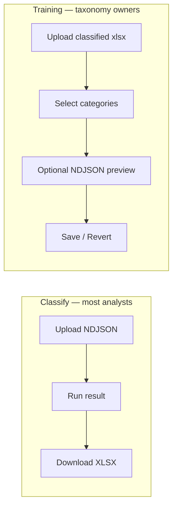

# Portal UX Improvement — Implementation Plan

> **For implementer:** When you execute this plan, document steps and design decisions in `docs/plans/2026-06-10-portal-ux-improvement-notes.md`. This plan describes *what* to build; that notes file describes *what you did*.

**Goal:** Make the FastAPI portal usable for **non-technical CS analysts** as the primary surface — upload export → understand results → download workbook — and make **Training** safe to use without maintainer hand-holding.

**Users (from [prd.md](../prd.md)):**

| Persona | Primary flow | UX need |
|---------|--------------|---------|
| **CS analyst / team lead** | Classify (`/`) | Clear TBC signal, easy download, minimal jargon |
| **Taxonomy owner** | Training (`/training`) | Know whether a category update helps before saving |
| **Classifier maintainer** | Both + CLI | Technical detail available but not in the way |

**Architecture:** Presentation-layer changes only. Reuse existing backends (`iter_master_rows`, `allowlist_training`, `batch_allowlist_analysis`). No new frameworks — inline HTML builders, `portal_*` modules, vanilla JS, shared CSS.

**Tech stack:** FastAPI, existing `static/cs_tickets_theme.css`, openpyxl workbook output unchanged.

**Depends on:** [design.md](../design.md) §6 Portal, [CONTEXT.md](../../CONTEXT.md) glossary, [2026-06-09-batch-allowlist-impact-analysis.md](./2026-06-09-batch-allowlist-impact-analysis.md) (verdict bands).

**Related plans:**

- **Training detail:** [2026-06-10-training-ux-wizard-and-impact-preview.md](./2026-06-10-training-ux-wizard-and-impact-preview.md) — Phase 2 of this plan (do not duplicate; implement per that doc).
- **Product brief:** [`allowlistupdatefeature.md`](../../allowlistupdatefeature.md) Phase 2 UI simplification.

---

## Context

### Two portal flows today



### Pain points (observed)

| Area | Problem | Impact |
|------|---------|--------|
| **Classify results** | TBC buried in tier pivot table | Analysts must hunt for manual-review count |
| **Classify results** | Download link easy to miss on result page | Users think run failed without Excel |
| **Classify upload** | No loading feedback on large exports | Uncertainty during 30s+ runs |
| **Terminology** | "Allow-list", "5-tuple", "Training" | Sounds like ML; scares non-technical users |
| **Training** | Long single page, no progress | Users lose place in 3-step flow |
| **Training preview** | TBC delta without recommendation | 92% no-op commits still look “fine” (`reports/run-20260528-export`) |
| **Training preview** | Changed tickets show id + Tier4 only | Cannot see gap-fix vs regression |
| **Cross-cutting** | Maintainer docs in portal footer | Good for engineers; noise for analysts |
| **Cross-cutting** | Classify vs Training feel like different apps | No shared nav or copy |

### What must not break

- Allow-list safety boundary and Training commit/revert disk semantics ([CONTEXT.md](../../CONTEXT.md))
- Audit-style TBC definition (fallback or Tier4 contains `tbc`)
- Training hidden when `doc/` not writable
- Google Drive upload optional path
- Bad CSAT filter on classify and training preview

### UX principles (normative)

1. **Plain language first** — Say **category** not 5-tuple; **reference categories** not allow-list; **manual review** alongside TBC where helpful.
2. **Headline metrics** — TBC count and % above the fold on classify results; verdict banner on training preview.
3. **Progressive disclosure** — Analyst view default; “Technical details” collapsed for maintainers.
4. **Recommend actions** — Preview answers “should I save?” not only “what changed?”
5. **Code preservation** — New `portal_copy.py` / `portal_training_copy.py`; extend HTML builders; avoid rewriting `portal_app.py` into a template engine.

---

## Phased delivery

| Phase | Scope | Est. | Doc |
|-------|--------|------|-----|
| **1** | Classify flow UX | 2–3 d | This plan §Phase 1 |
| **2** | Training wizard + impact preview | 5–6 d | [training-ux plan](./2026-06-10-training-ux-wizard-and-impact-preview.md) |
| **3** | Shared shell + polish | 1–2 d | This plan §Phase 3 |
| **4** | Optional enhancements | backlog | This plan §Phase 4 |

Implement **Phase 1 → Phase 2 → Phase 3** in order. Phase 2 can start in parallel only after copy constants from Phase 3 Task 1 are stubbed (shared terminology).

---

## Phase 1 — Classify flow UX

**Goal:** After uploading NDJSON, analysts immediately see **how many tickets need manual review** and can **download the workbook** without hunting.

### Task 1.1 — TBC summary card on result page

**Files:** `src/cs_tickets/portal_stats.py` (new helper), `portal_app.py` (result template)

Add `classify_run_summary_html(rows) -> str`:

| Stat | Source |
|------|--------|
| Total tickets | `len(rows)` |
| Manual review (TBC) count | Tier4 contains `tbc` (case-insensitive) or matches fallback tuples |
| TBC % | count / total |
| B2B / B2C TBC split | `Tier1_Segment` |

Render as a prominent card **above** tier breakdown:

```text
┌─────────────────────────────────────────┐
│  634 tickets categorized                │
│  60 need manual review (9.5%)           │
│  B2B: 6  ·  B2C: 54                     │
└─────────────────────────────────────────┘
```

Use plain language: **“need manual review”** with `(TBC)` in smaller text for glossary alignment.

**Tests:** `tests/test_portal_stats.py` — TBC counting on fixture rows.

### Task 1.2 — Download call-to-action

**Files:** `portal_app.py`

Current result page lists “New Upload” and Drive link but buries download. Add primary button:

```html
<a href="/download/{run_id}" class="btn btn-primary">Download Excel workbook</a>
```

Place next to run summary; repeat after tier breakdown for long pages.

**Tests:** `tests/test_portal.py` — result HTML contains download link with run_id.

### Task 1.3 — Upload loading state

**Files:** `static/classify.js` (new), `portal_app.py` index template

Mirror `training.js` pattern:

- Disable Run button on submit
- Label → “Categorizing…”
- `data-loading-form` on upload form

**Tests:** Manual; optional DOM assertion in `test_portal.py` for script tag presence.

### Task 1.4 — Plain-language classify copy

**Files:** `src/cs_tickets/portal_copy.py` (new), `portal_app.py`

| Before | After |
|--------|-------|
| CS Tickets Categorisation | **Categorize support tickets** |
| Upload a Zendesk NDJSON export… | Upload your Zendesk ticket export (`.json` or `.ndjson`) |
| Training (update allow-list) | **Update reference categories** (link subtitle: for classified workbook uploads) |
| classifier warnings | technical warnings (footer link) |
| Tier breakdown | **Category breakdown** |

Keep `TBC` in parentheses where the term is introduced once per page.

### Task 1.5 — Collapse maintainer documentation

**Files:** `portal_app.py`

Move embedded pipeline README / scoring docs (if present on index or footer) into `<details><summary>How categorization works (technical)</summary>…</details>`.

Default **closed** on classify pages. Training keeps a shorter analyst-facing blurb only.

---

## Phase 2 — Training flow UX

**Implement entirely per:** [2026-06-10-training-ux-wizard-and-impact-preview.md](./2026-06-10-training-ux-wizard-and-impact-preview.md)

**Summary (for roadmap only):**

- 3-step wizard stepper (Upload → Review → Preview & save)
- Plain-language copy via `portal_training_copy.py`
- Verdict banner from `run_commit_simulation()` + `classify_verdict_band()`
- Enriched changed-ticket table (gap-fix / regression / reason)
- Granular variant badge; “Deselect low-impact categories” helper
- Commit confirmation dialog

**Key outcome:** When `verdict_band == rules_needed` and no-op rate ≥ 50%, analyst sees **“Low impact expected”** before saving — addressing the 92% no-op scenario from batch reports.

**Do not re-specify tasks here** — follow the linked plan’s task checklist and acceptance criteria.

---

## Phase 3 — Shared shell and polish

### Task 3.1 — Unified portal navigation

**Files:** `src/cs_tickets/portal_layout.py` (new), `portal_app.py`, `portal_training.py`

Shared header on all pages:

```text
[ Categorize tickets ]  [ Update reference categories ]     (Training link hidden when not writable)
```

Active state on current section. Extract `portal_page_shell(title, nav_active, body)` used by classify and training.

### Task 3.2 — Merge copy modules

**Files:** `portal_copy.py`, `portal_training_copy.py`

Shared `TERMS` dict:

```python
TERM_CATEGORY = "category"
TERM_MANUAL_REVIEW = "manual review (TBC)"
TERM_REFERENCE_CATEGORIES = "reference categories"
```

Training and classify import same strings — no drift.

### Task 3.3 — Responsive tables

**Files:** `cs_tickets_theme.css`

- `.preview-wrap`, `.stats-wrap` — horizontal scroll on narrow viewports
- Wizard stepper stacks vertically under 640px
- Verdict banner full-width on mobile

### Task 3.4 — Error messages in plain language

**Files:** `portal_app.py`, `portal_training.py`

Map HTTP 400 details to analyst-friendly text where possible:

| Technical | Shown to user |
|-----------|----------------|
| `Select at least one tuple` | Select at least one category to save |
| `Unknown or expired training session` | Your session expired — please upload your file again |
| Invalid JSON export | We could not read this file. Use a Zendesk NDJSON export (one ticket per line). |

Keep raw detail in `title` attribute or `<details>` for maintainers.

---

## Phase 4 — Backlog (optional)

| Item | Rationale | Defer why |
|------|-----------|-----------|
| Per-ticket “Why this category?” drill-down | Uses `classify_row_with_explanation` | Scope; maintainer tool first |
| Classify run comparison (two uploads) | A/B without CLI | Needs run persistence |
| Training View B ablation in browser | Tuple risk table | Performance; CLI exists |
| Snapshot history picker | Multi-commit undo | [CONTEXT.md](../../CONTEXT.md) Phase 1 revert only |
| Single-source doc generation (README ↔ portal) | design.md limitation | Separate infra task |
| Localized UI (zh-HK) | Analyst locale | English-only Phase 1 |

---

## Functional requirements

| ID | Requirement |
|----|-------------|
| FR-UX-01 | Classify result shows TBC count and % in a summary card above tier breakdown |
| FR-UX-02 | Download workbook is a primary button on result page |
| FR-UX-03 | Classify upload shows loading state during processing |
| FR-UX-04 | Primary user-facing copy avoids “5-tuple” and “allow-list” |
| FR-UX-05 | Technical documentation collapsed by default on classify pages |
| FR-UX-06 | Training implements FR-U1–U12 from [training-ux plan](./2026-06-10-training-ux-wizard-and-impact-preview.md) |
| FR-UX-07 | Shared nav between classify and training |
| FR-UX-08 | Terminology consistent across both flows |
| FR-UX-09 | No change to classification logic, allow-list, or Training disk semantics |
| FR-UX-10 | `pytest tests/test_portal.py tests/test_portal_stats.py` extended for new HTML fragments |

---

## Implementation order

```text
Week 1 — Phase 1 (classify)
  1.1 TBC summary card + tests
  1.2 Download CTA
  1.4 portal_copy.py + copy pass
  1.3 classify.js loading
  1.5 collapse docs

Week 2 — Phase 2 (training) — per linked plan
  Tasks 1–11 in training-ux plan

Week 3 — Phase 3 (shared)
  3.1 portal_layout.py nav
  3.2 merge copy
  3.3 responsive CSS
  3.4 error message pass
```

**Total:** ~8–11 days for Phases 1–3.

---

## Acceptance criteria

### Phase 1 (Classify)

- [ ] Result page shows TBC count/% without opening pivot table
- [ ] Download button visible without scrolling on typical laptop viewport
- [ ] Upload button shows loading state on submit
- [ ] Index page uses plain-language titles; Training link says “Update reference categories”
- [ ] Maintainer docs collapsed by default

### Phase 2 (Training)

- [ ] All acceptance criteria in [training-ux plan](./2026-06-10-training-ux-wizard-and-impact-preview.md)

### Phase 3 (Shared)

- [ ] Nav appears on classify and training pages; Training hidden when not writable
- [ ] Same term for “category” on both flows
- [ ] Tables scroll horizontally on narrow viewport without layout break

### Non-regression

- [ ] Full `pytest` suite passes
- [ ] Training commit/revert/cancel behaviour unchanged
- [ ] TBC definition unchanged (audit-style)

---

## Test plan

### Automated

```bash
pytest tests/test_portal.py tests/test_portal_stats.py tests/test_allowlist_session.py -q
```

Add cases for: TBC summary HTML, download link, wizard fragments (Phase 2), nav active state.

### Manual checklist (analyst walkthrough)

1. **Classify:** Upload May 14 NDJSON → see TBC headline → download XLSX → open Tier breakdown sheet.
2. **Training:** Upload classified workbook with novel categories → wizard shows step 2 → select all → preview with same NDJSON → verdict banner visible → do **not** commit if `rules_needed`.
3. **Language:** No “5-tuple” in primary labels on either flow.

Append to [`testcase.md`](../../testcase.md) as “Portal UX manual checks”.

---

## Risks and mitigations

| Risk | Mitigation |
|------|------------|
| TBC count on result page disagrees with Excel metadata | Use same row filter as `audit_classifier` / tier4 `tbc` check; document in notes |
| Verdict banner frightens analysts | Plain-language labels + recommended action, not error styling for `review` |
| Duplicate copy between README and portal | `portal_copy.py` as single source for UI strings only |
| Phase 2 preview slower with `run_commit_simulation` | Cap changed-row display; share compare cache (per training-ux plan) |
| HTML builder sprawl | `portal_layout.py` + copy modules; resist splitting into Jinja until Phase 4+ |

---

## Out of scope

- Authentication / SSO
- React or SPA rewrite
- Hosted Training on read-only deploys
- Changes to classifier thresholds or allow-list rules
- Google Sheets / Apps Script integration

---

## References

- [prd.md](../prd.md) — personas and metrics
- [2026-06-06-allowlist-training-feature.md](./2026-06-06-allowlist-training-feature.md) — Phase 2 UI backlog (superseded by training-ux + this plan)
- [2026-06-10-training-ux-wizard-and-impact-preview.md](./2026-06-10-training-ux-wizard-and-impact-preview.md) — Phase 2 detail
- [testcase.md](../../testcase.md) — manual Training tests
