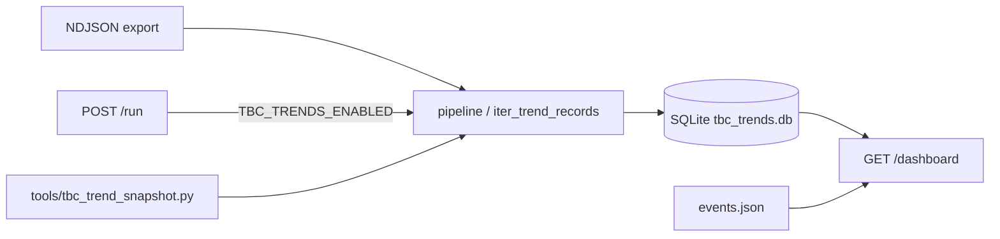

# TBC Trend Dashboard — Implementation Notes

**Date:** 2026-06-11  
**Plan:** [2026-06-11-tbc-trend-dashboard.md](./2026-06-11-tbc-trend-dashboard.md)  
**Scope:** v1 offline snapshot + report CLI; Phase 2 portal dashboard + auto-snapshot.

---

## Design process

### Problem framing

The PRD lists “dashboard for TBC trend by tag/subject cluster over time” as a Phase 3 goal. Before building UI, we needed to answer whether maintainers could **measure** TBC hotspots reproducibly. `tools/audit_classifier.py` already printed top TBC tags and subjects per export, but output was ephemeral stdout — no persistence, no week-over-week comparison, no portal surface.

### Approach: offline-first, then portal read model

| Step | Decision | Rationale |
|------|----------|-------------|
| 1 | **SQLite ticket store** before charts | Same pattern as batch allow-list reports: durable artifact under `reports/`, gitignored, queryable without re-classifying |
| 2 | **Reuse classify path** (`iter_trend_records`) | Same thread enrichment, allow-list, and `tbc_reason()` as audit tooling — dashboard numbers must match `audit_classifier` |
| 3 | **ISO week of `created_at`** as time axis | Business trend (when tickets arrived), not export file date or portal run time |
| 4 | **Deterministic subject fingerprint** | PRD non-goal is ML; normalize `RE:`/`FW:`, collapse digit runs, cap length — explainable clusters |
| 5 | **v1 CLI only** | Validate clustering and rollup SQL on real May exports before UI commitment |
| 6 | **Phase 2: read-only portal** | Dashboard reads existing DB; does not replace CLI batch ingest for large export folders |
| 7 | **`portal_trends.py` separate from `portal_stats.py`** | Per-run pivot (Classify) vs cross-run trends (Dashboard) are different concerns; mirrors `portal_training.py` split |
| 8 | **CSS bar sparklines, no Chart.js** | Matches portal UX plan: inline HTML, vanilla JS/CSS, no new frontend dependencies |
| 9 | **Opt-in auto-snapshot** (`TBC_TRENDS_ENABLED`) | Portal runs are ephemeral; persisting every upload in prod without explicit flag would surprise operators and grow disk on K8s pods |
| 10 | **Snapshot failures are non-fatal** | `try_append_portal_snapshot` logs and returns `None`; Classify upload still succeeds |
| 11 | **Optional `events.json`** | Rule-batch markers on a timeline without git integration in v1; manual curation is enough for maintainer reviews |

### What we explicitly deferred (Phase 3)

- Tag-pair composite clusters
- Prefix templates from classifier backlog
- First-class `--classified-xlsx` ingest (workbook rows with human tiers vs classifier — useful for analyst vs auto comparison)
- Portal chart interactivity (drill-down to ticket list)

### Validation on real data (2026-06-11)

May 6 export (`587` tickets): classifier **70 TBC (11.9%)** vs analyst workbook **4 TBC (0.7%)** on the same ticket set. Confirmed the pipeline measures classifier TBC; human categorization is a separate ingest path (ad-hoc script today).

---

## Shipped

### v1 — offline

| Component | Path |
|-----------|------|
| Core module | `src/cs_tickets/tbc_trends.py` |
| Snapshot CLI | `tools/tbc_trend_snapshot.py` |
| Report CLI | `tools/tbc_trend_report.py` |
| Tests | `tests/test_tbc_trends.py` |

### Phase 2 — portal

| Component | Path |
|-----------|------|
| Dashboard HTML | `src/cs_tickets/portal_trends.py` |
| Route + auto-snapshot | `src/cs_tickets/portal_app.py` — `GET /dashboard`, hook on `POST /run` |
| Styles | `src/cs_tickets/static/cs_tickets_theme.css` — `.trend-bar`, trends tables |
| Tests | `tests/test_portal_trends.py` |

---

## Behaviour

- **TBC detection** matches `audit_classifier.py`: `fallback_used` or `"tbc" in tier[3]` (`Tier4_Type`).
- **Time bucket:** ISO week from ticket `created_at`.
- **Subject cluster:** `subject_cluster_key()` — reply prefix strip, digit normalization, 80-char cap.
- **Storage:** SQLite at `reports/tbc_trends/tbc_trends.db` (gitignored via `reports/*`).
- **Dedup:** `INSERT OR REPLACE` on `ticket_id`; re-processing an export overwrites prior rows for those tickets.
- **Classifier version:** SHA-256 prefix of packaged `classifier_rules.json` + `doc/training_rules.json` when present.

---

## Usage

### CLI (batch ingest)

```bash
.\.venv\Scripts\python.exe tools/tbc_trend_snapshot.py --ndjson-dir data/
.\.venv\Scripts\python.exe tools/tbc_trend_report.py --output-dir reports/tbc-trends/
```

### Portal

```bash
# Optional: auto-append each Classify upload
set TBC_TRENDS_ENABLED=1
uvicorn cs_tickets.portal_app:app --reload --port 8777
# Open http://127.0.0.1:8777/dashboard
```

### Environment

| Variable | Default | Role |
|----------|---------|------|
| `TBC_TRENDS_ENABLED` | off | Snapshot each portal upload |
| `TBC_TRENDS_DB_PATH` | `reports/tbc_trends/tbc_trends.db` | SQLite path |
| `TBC_TRENDS_EVENTS_PATH` | `reports/tbc_trends/events.json` | Optional milestone markers |

### Events file (optional)

```json
[{"date": "2026-05-14", "label": "Rule batch 3"}]
```

---

## Data flow (Phase 2)



---

## Tests

```bash
pytest tests/test_tbc_trends.py tests/test_portal_trends.py -q
pytest -q
```
