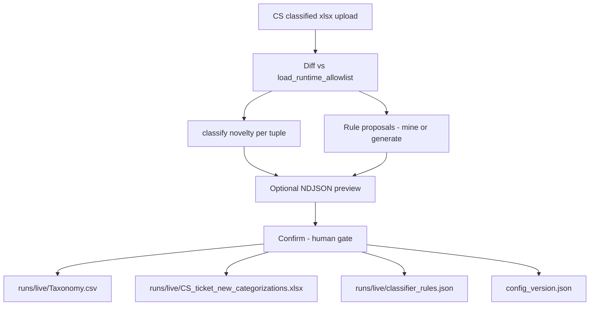

# Hybrid Allowlist Update — Implementation Plan

> **For implementer:** When you execute this plan, document steps, process, and final design decisions in `docs/plans/2026-06-12-hybrid-allowlist-update-notes.md`. This plan describes *what* to build; that notes file describes *what you did*.

**Goal:** Unify production Phase 2 (“Learn New”, runtime config + rule/taxonomy proposals) with the shipped Training flow (5-tuple diff, workbook exemplars, NDJSON impact preview) into one allow-list update path that writes to the **correct source artifact per novelty type** and loads from **`runs/live/`** without redeploy.

**Architecture:** Single portal flow (`/learn`, CS-facing label **Learn New**). **Process** mines proposals; optional **Preview** runs A/B NDJSON analysis; **Confirm** routes accepted changes through `confirm_hybrid_proposals()` in `feedback/promote.py`, updating `runs/live/Taxonomy.csv`, `runs/live/CS_ticket_new_categorizations.xlsx`, and `runs/live/classifier_rules.json` as needed, then bumps `config_version.json`.

**Tech stack:** Python 3.11+, FastAPI, openpyxl, existing `taxonomy.py`, `allowlist_compare.py`, `batch_allowlist_analysis.py`, production `feedback/` + `runtime_config.py` patterns (ported or vendored).

**Depends on:**

- [2026-06-06-allowlist-training-feature.md](./2026-06-06-allowlist-training-feature.md) (shipped Training mechanics)
- [2026-06-09-allowlist-testing-architecture.md](./2026-06-09-allowlist-testing-architecture.md) (preview / A/B metrics)
- [2026-06-09-training-rule-proposals.md](./2026-06-09-training-rule-proposals.md) (rule generation)
- Production [prd-phase2-learning-feedback.md](../../../cs-ticket-automation-dev-prod/cs-ticket-automation-dev/docs/prd-phase2-learning-feedback.md) §11 (taxonomy merge spec — treat as north star)

---

## Problem statement

Two implementations exist with complementary strengths and gaps:

| Gap | Production `/learn` | Current `/training` |
|-----|---------------------|---------------------|
| Granular 5-tuple allow-list growth | Detects `granular_new` but Confirm only merges Tier1–4 to CSV → **no-op** when path exists | Workbook exemplar append → **works** |
| Taxonomy tree / pivot alignment | CSV merge on Confirm → **works** | Workbook-only → **CSV drifts** |
| Live config without redeploy | `runs/live/` runtime config → **works** | Writes `doc/` → **needs git + deploy on K8s** |
| NDJSON impact preview | None | `allowlist_compare` + batch analysis → **works** |
| Rule proposals | Cluster mining with purity/support | Per-tuple exemplar generator on commit |

`load_allowlist()` is a **union** of workbook 5-tuples and taxonomy paths (granular `N/A`). Updates must respect that model — one write target is not enough.

---

## Design principle

> **Diff at 5-tuple granularity. Persist to the channel that `load_allowlist()` reads for that kind of tuple.**



---

## Novelty routing (core hybrid rule)

Reuse `novelty_type_for_tuple()` in `taxonomy.py`. On **Confirm**, **recompute** novelty from `load_runtime_allowlist()` (do not trust Process-time `proposal.novelty_type` if live config changed). Map each accepted taxonomy proposal:

| Novelty type | Allow-list effect needed | Write target | Mechanism |
|--------------|-------------------------|--------------|-----------|
| `tier4_new` | New Tier1–4 path | `Taxonomy.csv` | `merge_taxonomy_csv()` |
| `tier4_new` + granular ≠ `N/A` | Tier1–4 path **and** full 5-tuple | **CSV + workbook** | CSV first, then `merge_tuples_into_workbook()` |
| `tier3_new` | New branch under Tier1–2 | `Taxonomy.csv` | same as tier4 (CSV only unless granular ≠ `N/A`) |
| `tier1_new` | New segment | `Taxonomy.csv` | same + `ALLOW_TIER1_PROMOTE` guard |
| `granular_new` | Full 5-tuple with specific granular | **Workbook** | `merge_tuples_into_workbook()` |
| `path_new` | Catch-all: path missing from union | **Both** when Tier4 absent from CSV and granular ≠ `N/A` | CSV first, then workbook |

**Invariant after Confirm:** recompute `load_runtime_allowlist()` and assert every accepted 5-tuple is present. Block version bump if validation fails (rollback from backup).

### Workbook location

Runtime workbook path: `runs/live/CS_ticket_new_categorizations.xlsx`.

- Bootstrap from `doc/CS_ticket_new_categorizations.xlsx` on first `ensure_live_bootstrapped()` (already in prod `runtime_config.py`).
- Granular merges append exemplar rows to **live workbook**, not `doc/`.
- (Deferred) Syncing `runs/live/` to Google Drive.

---

## Rule handling (hybrid)

Keep **two proposal sources**, merge into **one live rules file**:

| Stage | Source | Notes |
|-------|--------|-------|
| Process | Production `mine_rule_proposals()` | Primary for CS-facing table (purity, support, evidence ids) |
| Confirm fallback | Training `generate_rule_from_exemplar()` | When a accepted tuple has **no** matching mined rule and no existing rule target |
| Persist | `runs/live/classifier_rules.json` | Single file; deprecate `doc/training_rules.json` overlay for runtime |

**Load path:** `load_runtime_rule_specs()` reads live rules; package `classifier_rules.json` bootstraps empty live dir only.

**Do not** confirm rules whose target 5-tuple is not already in the allow-list or in accepted taxonomy proposals. Enforced in `validate_confirm_selection` / `_validate_rule_targets()` at Confirm.

**Interim guard (Phases 1–3):** `GET /training` redirects to `/learn`. Legacy `POST /training/*` routes remain for soak; they still write `doc/` — do not use for production updates.

---

## Portal UX (single flow)

Rename/replace `/training` with `/learn` for CS; keep Training preview machinery under the hood.

| Step | Route | User sees | Backend |
|------|-------|-----------|---------|
| 1 Upload | `GET/POST /learn` | “Upload categorized workbook” | `parse_categorized_workbook()` |
| 2 Process | `POST /learn/process` | Rule table + taxonomy table (CS-friendly copy from `portal_learn.py`) | mine rules + taxonomy |
| 3 Preview (optional) | `POST /learn/preview` | Collapsed “Impact preview” (engineer/analyst) | `allowlist_compare` + `batch_allowlist_analysis` on uploaded NDJSON |
| 4 Confirm | `POST /learn/confirm` | “Live — config version N” | `confirm_hybrid_proposals()` |
| Revert | `POST /learn/revert` | Restore prior version | restore `runs/live/backup/{version}/` |

**Preview is optional** — CS can Confirm without NDJSON. Preview selection uses **accepted rule ids + taxonomy ids**; rebuild candidate config via `build_candidate_live_config(dry_run=True)` (Phase 4 deliverable — not yet implemented).

**Copy:** Use production UX guidelines (Process ≠ live; Confirm applies to next run). Surface novelty badges from deferred Training plan (`granular_new` → “New granular type”).

---

## Module plan

### New / moved modules

| Module | Responsibility |
|--------|----------------|
| `runtime_config.py` | Port from prod: bootstrap, `load_runtime_allowlist`, `load_runtime_rule_specs`, cache invalidation |
| `drive_live_config.py` | (Deferred) Drive sync for runtime config |
| `feedback/` package | Port from prod: parse, mine_rules, mine_taxonomy, promote (extend promote) |
| `feedback/promote.py` | Hybrid router: `confirm_hybrid_proposals()`, backup/restore, novelty recompute, rule-target validation, `revert_latest_live_backup()` |
| `portal_learn.py` | CS HTML for proposal tables + confirm success |

### Existing modules to reuse (minimal change)

| Module | Change |
|--------|--------|
| `taxonomy.py` | Keep `merge_tuples_into_workbook`, `diff_against_allowlist`, `extract_workbook_five_tuples`; add helper `novelty_type_for_tuple(tup, allow) -> str` (extract from prod mine_taxonomy) |
| `allowlist_training.py` | Keep for Phase 4 preview machinery; commit path superseded by `/learn` confirm |
| `allowlist_compare.py` | Accept `AllowList` built from runtime paths (candidate live dir copy in temp) |
| `rule_generator.py` | Keep; invoked as Confirm fallback only |
| `portal_app.py` | `/run` uses `load_runtime_allowlist()`; replace `/training/*` with `/learn/*` |

### Deprecate (after migration)

| Artifact | Fate |
|----------|------|
| `doc/training_rules.json` overlay | Migrate contents into live rules on bootstrap; remove from `load_rule_specs()` |
| `/training` routes | Redirect to `/learn` for one release, then remove |
| `doc/.snapshots/` | Replace with `runs/live/backup/{version}/` (prod model) |

---

## `confirm_hybrid_proposals()` spec

```python
def confirm_hybrid_proposals(
    live_dir: Path,
    *,
    upload_id: str,
    upload_filename: str,
    upload_xlsx: Path,  # temp copy for workbook merge
    rule_proposals: tuple[RuleProposal, ...],
    taxonomy_proposals: tuple[TaxonomyProposal, ...],
    accepted_rule_ids: frozenset[str],
    accepted_taxonomy_ids: frozenset[str],
) -> ConfirmResult:
    """
    1. validate_confirm_selection()
    2. backup live_dir -> live_dir/backup/{version}/
    3. Split accepted taxonomy proposals by novelty_type
    4. merge_taxonomy_csv() for tier*_new / tier1 (guarded)
    5. merge_tuples_into_workbook() on live workbook for granular_new (+ path_new with granular != N/A)
    6. merge_rules_json() for accepted rule proposals
    7. rule fallback: generate_rule_from_exemplar for accepted tuples still lacking rule target
    8. allow_after = load_allowlist(live_tax, live_wb); assert accepted tuples subset allow_after
    9. write_config_version(version+1); archive proposals/ manifest
    10. return ConfirmResult
    """
```

On step 8 failure: restore backup, raise `PromoteError` with explicit missing tuples.

---

## Implementation phases

### Phase 1 — Runtime config foundation (no UX change yet)

**Status:** Done (see notes file).

**Deliverables**

- [x] Port `runtime_config.py`, `drive_live_config.py` (adapt imports to this repo)
- [x] Switch `portal_app._default_allowlist()` and classify paths to `load_runtime_allowlist(repo_root)`
- [x] Switch rule loading to `load_runtime_rule_specs()` where portal classifies
- [x] Tests: `test_runtime_config.py` — bootstrap from `doc/`, empty live dir, cache invalidation
- [x] Local dev: document `runs/live/` behavior in README (Drive sync deferred)

**Exit criteria:** `/run` behaves identically when `runs/live/` bootstrapped from current `doc/`.

### Phase 2 — Hybrid promote router (backend only)

**Status:** Done (see notes file).

**Deliverables**

- [x] Port `feedback/promote.py`, extend with workbook merge branch
- [x] Hybrid routing in `feedback/promote.py` (`confirm_hybrid_proposals`) + post-merge validation
- [x] `novelty_type_for_tuple` in `taxonomy.py`
- [x] Unit tests:
  - `granular_new` only → workbook grows, CSV unchanged, tuple in allow-list
  - `tier4_new` only → CSV grows, workbook optional, `(…, N/A)` in allow-list
  - both accepted in one Confirm → both files updated
  - validation failure → backup restored, version unchanged

**Exit criteria:** Confirm works via pytest calling `confirm_hybrid_proposals()` without portal.

### Phase 3 — Learn UI + Process/Confirm

**Status:** Done (see notes file).

**Deliverables**

- [x] Port `feedback/parse.py`, `mine_rules.py`, `mine_taxonomy.py`, `portal_learn.py`
- [x] Implement `/learn` routes; `GET /training` redirects to `/learn`
- [x] Wire Confirm → `confirm_hybrid_proposals()` → `_sync_runtime_classifier()`
- [x] `/learn/revert` from `runs/live/backup/{version}/`
- [x] Portal tests: `test_portal_learn.py`, `test_feedback_mine.py`, `test_feedback_parse.py`

**Exit criteria:** CS can upload workbook, confirm taxonomy + rules, next `/run` uses new config locally.

### Phase 4 — Preview integration (Training superpowers)

**Status:** Done (see notes file).

**Deliverables**

- [x] `POST /learn/preview` — NDJSON upload + selected proposal ids
- [x] `build_candidate_live_config()` — simulates CSV + workbook + rules in temp copy of `runs/live/`
- [x] Reuse `run_commit_simulation()` / `compare_allowlists_on_ndjson()` for metrics
- [x] Collapsed `<details>` impact preview on process page (opens after first preview run)
- [x] Tests: candidate parity + portal preview on probe NDJSON

**Exit criteria:** Preview metrics match existing Training preview for equivalent selections on same fixtures.

### Phase 5 — Migration & cleanup

**Deliverables**

- [ ] One-time migration script: copy `doc/training_rules.json` entries into `runs/live/classifier_rules.json`
- [ ] Redirect `/training` → `/learn`; remove old routes after soak period
- [ ] Update `testcase.md`, README, `docs/design.md` §15
- [ ] Optional: git mirror job for `runs/live/` → `doc/` (maintainer-only, not CS path)

**Exit criteria:** No code path writes allow-list to `doc/` on Confirm; CI pytest green.

---

## Testing strategy

| Layer | What | Fixtures |
|-------|------|----------|
| Unit | Novelty routing, CSV merge, workbook merge, validation gate | Synthetic tuples + temp live dir |
| Integration | Full Confirm → reload allow-list → classify row | `tests/fixtures/` xlsx + ndjson |
| Regression | Hybrid Confirm equivalent to old Training commit for granular-only cases | Golden allow-list counts |
| Portal | HTTP learn flow, preview optional, revert | `test_portal.py` patterns |
| Manual | GKE dev: Confirm → Drive → second pod sees new version | Dev cluster checklist |

**Key regression test (prod bug):**

```python
def test_granular_new_confirm_adds_full_five_tuple():
    # Allow-list already has (B2C, Svc, Bill, Inv, N/A) via CSV
    # Upload has (B2C, Svc, Bill, Inv, PortalLogin)
    # Confirm taxonomy proposal -> tuple must appear in load_runtime_allowlist()
```

---

## Configuration & deployment

| Environment | Live config path |
|-------------|------------------|
| Local dev | `./runs/live/` |
| GKE dev/prod | `/app/runs/live/` (emptyDir or PVC — decide later) |

No change to GitLab CI deploy triggers. Confirm must **not** require image rebuild.

**Env vars:** `ALLOW_TIER1_PROMOTE` only (Drive-related env vars are deferred).

---

## Open decisions (resolve in notes file)

| # | Question | Recommendation |
|---|----------|----------------|
| 1 | Keep `/training` name internally? | No — single `/learn` route; keep Training modules as implementation detail |
| 2 | Merge prod rule mining vs Training rule generator on Process? | Prod mining in UI; generator as Confirm fallback only |
| 3 | Preview required before Confirm? | No — optional advanced step |
| 4 | Reintroduce Drive sync? | Not in this plan version (defer until Learn UI is stable) |
| 5 | CLI `cs-tickets-pipeline` uses live config? | Yes — already uses `load_runtime_allowlist` when `runs/live` bootstrapped |
| 6 | GKE multi-replica without Drive? | `runs/live/` is per-pod until Drive sync returns — document single-writer expectation |

---

## Success metrics

| Metric | Target |
|--------|--------|
| Granular Confirm adds tuple to allow-list | 100% in automated test |
| Tier4 Confirm adds CSV path | 100% in automated test |
| Confirm without redeploy visible on next `/run` | < 5s after Confirm locally |
| Training preview TBC metrics preserved | Same engine, same golden fixtures |
| No writes to git-tracked `doc/` on Confirm | Enforced by tests |

---

## Out of scope

- Auto-syncing `doc/` to git on Confirm
- Replacing prod rule mining with ML
- Changing classifier scoring thresholds as part of this plan
- TBC trend dashboard changes (orthogonal; see [2026-06-11-tbc-trend-dashboard.md](./2026-06-11-tbc-trend-dashboard.md))

---

## Suggested first PR (minimal vertical slice)

1. Phase 1 + Phase 2 only
2. No preview UI yet
3. CLI test: bootstrap live → confirm one `granular_new` fixture → assert allow-list

This proves the hybrid router before porting the full Learn UI.
