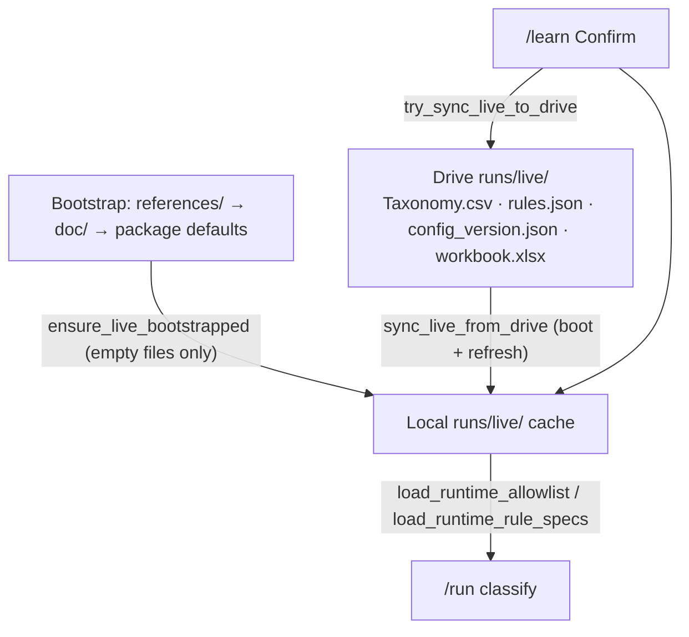

# Drive Live Config Alignment — Implementation Plan

> **For implementer:** Document steps and decisions in [2026-06-16-drive-live-config-alignment-notes.md](./2026-06-16-drive-live-config-alignment-notes.md).

**Goal:** Align local development with the production GKE model before reconciling with the prod snapshot: **Google Drive `runs/live/` is the deployed source of truth**; `runs/live/` on disk is a pod-local cache; `doc/` and `references/` are bootstrap seeds only.

**Parent:** [2026-06-12-hybrid-allowlist-update.md](./2026-06-12-hybrid-allowlist-update.md) Phase 5 extension  
**North star:** [prd-phase2-learning-feedback.md](../../../cs-ticket-automation-dev-prod/cs-ticket-automation-dev/docs/prd-phase2-learning-feedback.md) §6.1, §12

---

## Problem

Hybrid Phases 1–4 write allow-list updates to `runs/live/` and call `try_sync_live_to_drive()` on Confirm, but the plan **deferred** Drive as optional. Legacy `/training` still writes to `doc/`. On GKE:

- `/app/runs` is `emptyDir` — wiped on pod restart
- Prod env sets `RUNTIME_CONFIG_DRIVE_ENABLED=true`
- Workbook 5-tuples (hybrid `granular_new`) must survive restarts — prod sync omitted workbook; we add it

---

## Target architecture

| Environment | Read path | Write path (Confirm) | Persistence |
|-------------|-----------|----------------------|-------------|
| Local dev (Drive off) | `runs/live/` seeded from `doc/` | `runs/live/` | Delete `runs/live/` to re-bootstrap |
| GKE / Drive on | `runs/live/` after Drive pull | `runs/live/` + Drive upload | Drive folder |

---

## Implementation phases

### Phase A — Drive sync completeness

- [ ] Add `CS_ticket_new_categorizations.xlsx` to `_LIVE_FILES` in `drive_live_config.py`
- [ ] Centralize MIME lookup for live artifacts (csv, json, xlsx)
- [ ] Update upload count expectations in tests (3 → 4 files)

### Phase B — Bootstrap and refresh

- [ ] Seed empty live files from `references/` before `doc/` (prod pattern)
- [ ] Add `refresh_live_from_drive(repo_root)` — re-download when Drive enabled
- [ ] Call refresh from `_sync_runtime_classifier()` (multi-replica freshness after Confirm)
- [ ] `load_runtime_allowlist()`: when Drive enabled, read **only** `runs/live/`; when Drive off, allow `doc/` workbook fallback

### Phase C — Retire doc/ write path

- [ ] Remove `/training` POST routes (`upload`, `preview`, `commit`, `cancel`, `revert`)
- [ ] Keep `GET /training` → 307 `/learn`
- [ ] Update allow-list empty warning to mention Drive / live config, not `doc/`
- [ ] Remove unused `allowlist_training` / `portal_training` imports from `portal_app.py`

### Phase D — Tests and docs

- [ ] Port `tests/test_drive_live_config.py` (workbook-aware)
- [ ] Extend `tests/test_runtime_config.py` (references bootstrap, refresh hook)
- [ ] Remove superseded `/training` POST tests from `tests/test_portal.py`
- [ ] Add `references/.gitkeep`
- [ ] Update hybrid plan notes + README Drive section

---

## Exit criteria

- [ ] Confirm on `/learn` uploads 4 live files to Drive when env vars set
- [ ] `sync_live_from_drive` restores workbook after local cache wipe
- [ ] No portal route writes to `doc/` on Confirm
- [ ] `pytest` green

---

## Out of scope (reconciliation follow-up)

- Merge prod-only files (`portal_docs.py`, `resolve_live_folder.py`)
- k8s/Dockerfile diff vs prod snapshot
- Git mirror job `runs/live/` → `doc/` for maintainers
