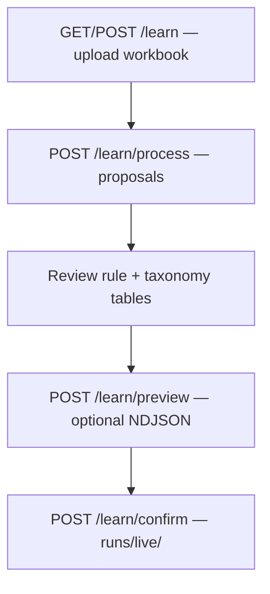

# Learn Preview — Beginner UX — Implementation Plan

> **For implementer:** When you execute this plan, document steps and design decisions in `docs/plans/2026-06-17-learn-preview-beginner-ux-notes.md`. This plan describes *what* to build; that notes file describes *what you did*.

**Goal:** Make the **Learn** (`/learn`) preview step beginner-accessible — short happy path for CS team leads who trust their workbook, progressive disclosure for analysts who want impact analysis, and plain-language guidance at every decision point (what file to upload, whether to preview, whether to confirm).

**Architecture:** Presentation-layer changes only. Reuse existing preview backend (`run_commit_simulation`, `build_candidate_live_config`, `classify_verdict_band`). Extend `portal_learn.py`, `portal_copy.py` (new Learn-specific copy module or section), `portal_app.py`, `portal_training.py` (shared verdict/golden helpers), `static/training.js`, and `static/cs_tickets_theme.css`. No new routes or session state machine.

**Tech stack:** FastAPI inline HTML builders, vanilla JS, existing CSS stepper from Training wizard.

**Depends on:** [2026-06-12-hybrid-allowlist-update.md](./2026-06-12-hybrid-allowlist-update.md) (Learn flow shipped), [2026-06-10-training-ux-wizard-and-impact-preview.md](./2026-06-10-training-ux-wizard-and-impact-preview.md) (verdict banner + no-op machinery — reuse, do not duplicate), [2026-06-09-batch-allowlist-impact-analysis.md](./2026-06-09-batch-allowlist-impact-analysis.md) (View A verdict semantics).

**Related:** [portal-ux-improvement.md](./2026-06-10-portal-ux-improvement.md) UX principles, [prd-phase2-learning-feedback.md](../prd-phase2-learning-feedback.md) Process vs Confirm semantics.

---

## Context

### Learn flow today



| Step | Route | User sees today |
|------|-------|-----------------|
| 1 Upload | `GET/POST /learn` | Workbook upload + Process button |
| 2 Process | `POST /learn/process` | Two dense tables, technical metadata (`upload id`, tier counts) |
| 3 Preview (optional) | `POST /learn/preview` | Always-expanded section; Training copy; results **below** upload form |
| 4 Confirm | `POST /learn/confirm` | Confirm bar at bottom; no confirm dialog; no verdict gate |

### Pain points (preview-focused)

| Pain point | Evidence |
|------------|----------|
| No progress context on `/learn` | Training has `training_wizard_html()`; Learn has none |
| Preview always expanded | Hybrid plan §Portal UX: collapsed “Impact preview (engineer/analyst)” — not implemented |
| Unclear what NDJSON file to use | Bare `<input type="file">`; no link to Categorize flow |
| Training copy on Learn page | `portal_training_copy.py` strings reference “reference workbook” / `doc/`; Learn writes `runs/live/` |
| Verdict without next step | Banner shows stats; Confirm always one click away |
| No Confirm dialog on Learn | `training.js` confirm only hooks `#training-commit-btn` |
| Stale preview + Confirm | Stale banner in results section; Confirm bar has no warning |
| Results below form | `learn_preview_panel_html()` renders `results_block` after form — users miss verdict |
| Technical noise | `upload id`, `distinct tier paths`, verdict stat labels (“Gap fixes”, “Regressions”) |
| Golden hint missing | `training_preview_section_html()` calls `_golden_baseline_hint_html()`; `learn_preview_results_html()` does not |
| Rules vs paths unexplained | Two tables; beginners don’t know preview simulates both together |

### What already works (do not break)

- Preview optional — Confirm without NDJSON must remain valid
- `run_commit_simulation()` single-pass preview (1 export pass default; 1+N with no-op checkbox)
- Verdict bands from `classify_verdict_band()` — map 1:1; no second recommendation system
- Stale preview detection via `learn_selection_hash()` + `preview_selection_hash`
- Impact column + deselect-no-op buttons when `compute_no_op=True`
- `training.js` loaded on Learn process page (`extra_scripts` in `_learn_process_page`)
- Confirm/revert/cancel backend semantics (`confirm_hybrid_proposals`, `runs/live/backup/`)

---

## Design decisions

| Topic | Decision | Rationale |
|-------|----------|-----------|
| Primary audience | CS team lead — **Confirm without preview** is the default happy path | Hybrid plan: preview optional; workbook is source of truth |
| Preview placement | Collapsed `<details>` by default; auto-expand after first successful preview | Reduces overwhelm; analysts still get full tooling |
| Wizard | 4 steps: Upload → Review → Preview (optional) → Confirm | Maps to existing single-page flow; no new routes |
| Copy source | New `portal_learn_copy.py` (Learn-specific); keep `portal_training_copy.py` for legacy Training | Learn talks about `runs/live/` and “Confirm”, not “Save to doc/” |
| Verdict next step | Add `VERDICT_NEXT_STEPS` dict alongside `VERDICT_MESSAGES` | Answers “what do I do now?” without changing band logic |
| Confirm dialog | Learn-specific confirm in `training.js` on `#learn-confirm-form` submit | Parity with Training; summarize rule + taxonomy counts |
| Risky gate | `window.confirm()` with explicit warning when `data-verdict="risky"` on confirm bar | Soft gate only — do not block server-side |
| Stale gate | Warning paragraph on confirm bar when `preview_stale=True` | Visible near Confirm, not only in collapsed results |
| Metrics table | Wrap `compare_result_html(..., plain_language=True)` in `<details>` “Technical metrics” | Progressive disclosure for maintainers |
| Verdict stat labels | Plain language in Learn context only | Training banner unchanged; Learn uses wrapper or copy override |
| Golden hint | Reuse `_golden_baseline_hint_html()` in `learn_preview_results_html()` | Parity with Training; fixture reference only |
| File upload help | 3-step numbered list + link to `/` (Categorize tickets) | Same export format analysts already use |
| Page metadata | Move `upload id` into collapsed “Session details” | Debug value for support; noise for beginners |
| “Use last export” | **Defer** to Phase 2b | Requires classify session cross-link |

### Verdict band → next-step copy (Learn)

| Band | Headline (existing) | Next step (new) |
|------|---------------------|-----------------|
| `strong_commit` | Looks good | You can confirm — these changes should help or maintain categorization on this export. |
| `review` | Review changes | Check the changed tickets below, then confirm if they look right. |
| `rules_needed` | Low impact expected | Many selections may not affect this export — deselect no-impact rows or confirm anyway. |
| `risky` | Caution | Manual review tickets increased — talk to a maintainer before confirming. |

### Wizard step mapping

| Step | Route(s) | `active_step` | Visible when |
|------|----------|---------------|--------------|
| 1 — Upload | `GET /learn` | 1 | Index |
| 2 — Review | `POST /learn/process` | 2 | Proposals non-empty |
| 3 — Preview | Same page | 3 | After successful preview (optional step: show as skippable until preview run) |
| 4 — Confirm | Same page | 3 or 4 | Confirm bar visible; step 4 highlighted when preview completed |

**Rule:** Step 3 shows `wizard-step--skippable` styling (dashed or “optional” label) until preview has run; step 4 (Confirm) is always reachable from step 2.

### Plain-language stat labels (Learn verdict banner)

| Technical (Training) | Learn label |
|----------------------|-------------|
| Gap fixes | Auto-categorized |
| Regressions | More manual review |
| Reroutes | Reclassified |
| manual review (TBC) | manual review (TBC) — keep; add footnote once per page |

---

## Functional requirements

| ID | Requirement |
|----|-------------|
| FR-L1 | Learn preview section collapsed by default in `<details>`; open after first successful preview (`<details open>` when `batch_result` present) |
| FR-L2 | Learn wizard stepper (4 steps) on upload, process, confirm success, and error pages |
| FR-L3 | `portal_learn_copy.py` holds all Learn-specific user strings; no Learn page imports Training “Save to doc/” copy |
| FR-L4 | Preview file input has visible label + 3-step upload checklist linking to Categorize (`/`) |
| FR-L5 | Preview results render **above** the preview form (verdict first) |
| FR-L6 | Verdict banner includes next-step line from `VERDICT_NEXT_STEPS` |
| FR-L7 | Learn verdict stats use plain-language labels (Auto-categorized / More manual review / Reclassified) |
| FR-L8 | Technical metrics table inside collapsed `<details>`; changed-tickets table stays visible when non-empty |
| FR-L9 | Golden baseline hint shown in Learn preview when fixture exists |
| FR-L10 | Confirm bar states preview is optional; first-time nudge recommends preview when `preview_batch_result is None` |
| FR-L11 | Confirm bar shows stale-preview warning when `preview_stale=True` |
| FR-L12 | Confirm dialog summarizes selected rule count + taxonomy count before POST |
| FR-L13 | Risky verdict triggers extra `window.confirm()` before Confirm POST |
| FR-L14 | `upload id` and row-count debug metadata in collapsed “Session details” |
| FR-L15 | Intro copy above rule/taxonomy tables explains what each section is and that preview simulates both |
| FR-L16 | No-op checkbox helper text reframed for uncertainty (“Unsure whether selections matter?”) |
| FR-L17 | No change to preview/confirm/revert backend routes or `confirm_hybrid_proposals()` semantics |
| FR-L18 | `pytest tests/test_portal_learn_html.py` and `tests/test_portal_learn.py` extended for new fragments |

---

## Phase 1 — Copy module & collapsed preview shell

**Goal:** Establish Learn voice and reduce visual noise without changing preview logic.

### Task 1 — `portal_learn_copy.py`

**Files (new):**

- `src/cs_tickets/portal_learn_copy.py`

**Content (minimum constants):**

```python
LEARN_STEP_LABELS = (
    "Upload workbook",
    "Review suggestions",
    "Check impact (optional)",
    "Confirm",
)
PREVIEW_DETAILS_SUMMARY = "Optional: see how this affects real tickets"
PREVIEW_SKIP_NOTE = (
    "Preview is not required. If you trust the labels in your workbook, "
    "you can confirm below — changes apply on the next categorization run."
)
PREVIEW_FIRST_TIME_NUDGE = (
    "First time updating categories? We recommend expanding preview and "
    "using a recent ticket export."
)
PREVIEW_FILE_LABEL = "Ticket export (.json or .ndjson)"
PREVIEW_FILE_STEPS = (
    "Export tickets from Zendesk (same format as the Categorize tickets page).",
    "Select the rules and category paths you want above.",
    "Upload that file here and click Run preview.",
)
RULES_SECTION_INTRO = "…"
TAXONOMY_SECTION_INTRO = "…"
VERDICT_NEXT_STEPS = { ... }  # per table above
VERDICT_STAT_LABELS = {
    "gap_fix": "Auto-categorized",
    "regression": "More manual review",
    "reroute": "Reclassified",
}
SESSION_DETAILS_SUMMARY = "Session details"
TBC_FOOTNOTE = "TBC = tickets the classifier sends to manual review."
CONFIRM_DIALOG_TEMPLATE = "Confirm {n_rules} rules and {n_tax} category paths? ..."
CONFIRM_RISKY_WARNING = "Preview showed increased manual review tickets. ..."
STALE_PREVIEW_CONFIRM_WARNING = "Your preview is out of date — re-run preview or confirm at your own risk."
```

### Task 2 — Collapsed preview panel

**Files (modify):**

- `src/cs_tickets/portal_learn.py` — `learn_preview_panel_html()`

**Change:**

Wrap preview form + options in:

```html
<details class="learn-preview-details" id="learn-preview-details">
  <summary>{PREVIEW_DETAILS_SUMMARY}</summary>
  <p class="meta">{PREVIEW_SKIP_NOTE}</p>
  … form …
</details>
```

Set `open` attribute when `batch_result is not None` (user has previewed at least once this session).

Import copy from `portal_learn_copy.py` instead of `portal_training_copy` for preview-specific strings. Keep shared verdict headline text from `VERDICT_MESSAGES` or duplicate into Learn copy if wording must differ.

### Task 3 — Skip-preview note on confirm bar

**Files (modify):**

- `src/cs_tickets/portal_learn.py` — `learn_confirm_bar_html(*, preview_run: bool, preview_stale: bool, verdict_band: str | None)`

Pass flags from `learn_process_body_html()` / `_learn_process_page()`.

Render `PREVIEW_SKIP_NOTE` always; `PREVIEW_FIRST_TIME_NUDGE` when `not preview_run`.

### Task 4 — Section intros (rules vs paths)

**Files (modify):**

- `src/cs_tickets/portal_learn.py` — `learn_proposals_html()`

Add `<p class="meta section-intro">` before each table using `RULES_SECTION_INTRO` / `TAXONOMY_SECTION_INTRO`.

---

## Phase 2 — Wizard & page hierarchy

**Goal:** Orient beginners on a long page; put outcomes above inputs.

### Task 5 — Learn wizard component

**Files (modify):**

- `src/cs_tickets/portal_learn.py` — `learn_wizard_html(active_step: int, *, preview_completed: bool)`
- `src/cs_tickets/static/cs_tickets_theme.css` — `.learn-wizard`, reuse `.wizard-step*` from Training; add `.wizard-step--optional` for step 3

**Pattern:** Clone `training_wizard_html()` structure; use `LEARN_STEP_LABELS`. Step 3 gets optional styling until `preview_completed`.

**Insert via:**

- `portal_app.py` — `_learn_process_page()`, `learn_index()`, confirm success/error pages

### Task 6 — Results above form

**Files (modify):**

- `src/cs_tickets/portal_learn.py` — `learn_preview_panel_html()`

**Reorder markup:**

```text
<section>
  <h2>Check impact…</h2>
  {results_block}   <!-- verdict + changed tickets — when present -->
  <details>… form …</details>
</section>
```

When results exist, scroll target: add `id="learn-preview-results"` on results div for optional anchor link from wizard step 3.

### Task 7 — Demote session metadata

**Files (modify):**

- `src/cs_tickets/portal_app.py` — `_learn_process_page()`

Move lines showing `upload id`, `distinct tier paths`, `eligible_row_count` into:

```html
<details class="session-details">
  <summary>{SESSION_DETAILS_SUMMARY}</summary>
  …
</details>
```

Keep human summary lead: `{n} rows parsed · {rule_count} suggested rules · {tax_count} new paths`.

---

## Phase 3 — Verdict guidance & Confirm safety

**Goal:** Connect preview outcome to Confirm action.

### Task 8 — Learn verdict banner with next steps

**Files (modify):**

- `src/cs_tickets/portal_learn.py` — `learn_preview_results_html()` OR new `learn_verdict_banner_html()` wrapping `training_verdict_banner_html`

**Options (pick one in notes):**

1. Add optional `stat_labels` + `next_step` params to `training_verdict_banner_html()` (shared)
2. Post-process Training banner HTML in Learn (avoid)
3. Duplicate banner builder for Learn only (avoid)

**Preferred:** Extend `training_verdict_banner_html(batch, *, next_step: str | None = None, stat_labels: dict | None = None)` with Learn call site passing `portal_learn_copy` values.

Append `next_step` as `<p class="verdict-next-step">`.

### Task 9 — Golden baseline hint

**Files (modify):**

- `src/cs_tickets/portal_learn.py` — `learn_preview_results_html()`

Import and call `_golden_baseline_hint_html()` from `portal_training.py` (consider moving to `portal_preview_shared.py` if circular imports arise).

### Task 10 — Technical metrics collapse

**Files (modify):**

- `src/cs_tickets/portal_learn.py` — `learn_preview_results_html()`

Wrap `compare_result_html(...)` in:

```html
<details class="technical-metrics">
  <summary>Technical metrics</summary>
  …
</details>
```

Changed-tickets heading + `training_changed_rows_html()` stay outside (always visible when changes exist).

### Task 11 — Stale warning on confirm bar

**Files (modify):**

- `src/cs_tickets/portal_learn.py` — `learn_confirm_bar_html()`

When `preview_stale`, render `<p class="training-stale-banner" role="status">` with `STALE_PREVIEW_CONFIRM_WARNING` above Confirm button.

### Task 12 — Confirm dialog + risky gate

**Files (modify):**

- `src/cs_tickets/static/training.js`
- `src/cs_tickets/portal_learn.py` — `learn_confirm_bar_html()`

Add `data-verdict="{band}"` on `.learn-confirm-bar` when preview has run.

On `#learn-confirm-form` submit when submitter is Confirm button:

```javascript
// 1. If data-verdict === "risky", confirm(CONFIRM_RISKY_WARNING)
// 2. Count checked rule_ids + tax_ids
// 3. confirm(CONFIRM_DIALOG_TEMPLATE)
```

Use `formaction` check to skip dialog for Cancel.

---

## Phase 4 — File upload guidance & polish

**Goal:** Remove the biggest beginner blocker — not knowing which file to upload.

### Task 13 — Preview file upload checklist

**Files (modify):**

- `src/cs_tickets/portal_learn.py` — `learn_preview_panel_html()`

Replace bare file input with:

```html
<label for="learn-preview-file">{PREVIEW_FILE_LABEL}</label>
<input id="learn-preview-file" …>
<ol class="preview-file-steps">
  <li>… step 1 … <a href="/">Categorize tickets</a> …</li>
  …
</ol>
```

**CSS:** `src/cs_tickets/static/cs_tickets_theme.css` — `.preview-file-steps`, `.learn-preview-details`

### Task 14 — No-op checkbox reframing

**Files (modify):**

- `src/cs_tickets/portal_learn_copy.py` — replace import of `PREVIEW_NO_OP_LABEL` from Training

New label: **“Show which selections have no impact on this export (slower)”**

Helper: `<p class="meta preview-no-op-hint">` — “Unsure whether your selections matter? Turn this on…”

When verdict is `rules_needed` and `selection_no_op_count is None`, show hint to enable and re-run.

### Task 15 — TBC footnote

**Files (modify):**

- `src/cs_tickets/portal_learn.py` — once per process page, below wizard or above preview section

Single `<p class="meta tbc-footnote">{TBC_FOOTNOTE}</p>`.

---

## Phase 2b — Deferred

| Feature | Why deferred |
|---------|--------------|
| “Use last classify export” button | Needs cross-session link from `/run` to `/learn` (run id → temp path or Drive) |
| Auto-expand preview for large selections (e.g. >10 proposals) | Heuristic; gather user feedback first |
| Server-side block Confirm on `risky` | Product wants soft gate only; CS may override with judgment |
| i18n / translation framework | Out of scope |
| React/component rewrite | Out of scope |

---

## Implementation tasks (ordered)

| Order | Task | Est. |
|-------|------|------|
| 1 | Task 1 — `portal_learn_copy.py` | 0.25 d |
| 2 | Task 2 — collapsed preview `<details>` | 0.25 d |
| 3 | Task 3 — skip-preview on confirm bar | 0.25 d |
| 4 | Task 4 — rules/taxonomy section intros | 0.25 d |
| 5 | Task 5 — Learn wizard stepper | 0.5 d |
| 6 | Task 6 — results above form | 0.25 d |
| 7 | Task 7 — session details collapse | 0.25 d |
| 8 | Task 8 — verdict next steps + plain stat labels | 0.5 d |
| 9 | Task 9 — golden hint | 0.1 d |
| 10 | Task 10 — technical metrics `<details>` | 0.25 d |
| 11 | Task 11 — stale warning on confirm bar | 0.25 d |
| 12 | Task 12 — confirm dialog + risky gate | 0.5 d |
| 13 | Task 13 — file upload checklist | 0.5 d |
| 14 | Task 14 — no-op reframing | 0.25 d |
| 15 | Task 15 — TBC footnote | 0.1 d |

**Total:** ~4–5 days

Implement Phases 1 → 2 → 3 → 4 in order. Phase 1 Tasks 1–3 are independently shippable.

---

## Portal UI mock (process page)

```text
┌─────────────────────────────────────────────────────────────┐
│  Update reference categories                                 │
│  [1 Upload ✓] — [2 Review ●] — [3 Preview ○] — [4 Confirm]  │
├─────────────────────────────────────────────────────────────┤
│  142 rows parsed · 12 suggested rules · 3 new paths          │
│                                                              │
│  Suggested rules — patterns the classifier will use…         │
│  [table: select | when tickets… | category | …]            │
│                                                              │
│  New category paths — categories added to the reference…     │
│  [table: select | category path | novelty | …]               │
│                                                              │
│  ┌─ Looks good ─────────────────────────────────────────┐   │
│  │  Preview on 634 tickets: TBC 60 → 58 (-2)            │   │
│  │  You can confirm — these changes should help…        │   │
│  │  [Changed tickets table]                               │   │
│  │  ▸ Technical metrics                                   │   │
│  └──────────────────────────────────────────────────────┘   │
│                                                              │
│  ▸ Optional: see how this affects real tickets               │
│     Preview not required — confirm below if you trust…     │
│                                                              │
│  ┌─ Confirm ──────────────────────────────────────────────┐   │
│  │  Applies on next categorization run.                   │   │
│  │  [Confirm changes]  [Cancel]  [Upload another]         │   │
│  └──────────────────────────────────────────────────────┘   │
│                                                              │
│  ▸ Session details                                           │
└─────────────────────────────────────────────────────────────┘
```

---

## Acceptance criteria

### Copy & structure

- [ ] Learn preview strings live in `portal_learn_copy.py`, not Training copy about `doc/`
- [ ] Preview section collapsed by default; opens after first successful preview
- [ ] 4-step wizard visible on Learn process page with step 2 active before preview, step 3 after preview
- [ ] `upload id` not visible until Session details expanded

### Preview UX

- [ ] Verdict banner appears above preview form after Run preview
- [ ] Next-step line shown for all four verdict bands
- [ ] Plain-language stat labels on Learn preview only
- [ ] Technical metrics collapsed; changed tickets visible when present
- [ ] Golden hint shown when `tests/fixtures/golden_baseline.json` exists
- [ ] File upload shows label + 3-step checklist with link to `/`

### Confirm safety

- [ ] Skip-preview note always on confirm bar
- [ ] First-time nudge when no preview run this session
- [ ] Stale warning on confirm bar when selection changed after preview
- [ ] Confirm dialog shows rule + taxonomy counts
- [ ] Extra confirm when verdict is `risky`
- [ ] Confirm without preview still works (no NDJSON required)

### Non-regression

- [ ] `pytest tests/test_portal_learn.py tests/test_portal_learn_html.py -q` passes
- [ ] `pytest -q` full suite passes
- [ ] Preview performance unchanged (still 1 pass default; 1+N with no-op)
- [ ] Legacy `/training` preview unaffected (or explicitly shared helpers backward-compatible)

---

## Test plan

### Automated

**`tests/test_portal_learn_html.py` additions:**

```python
def test_learn_preview_collapsed_by_default_no_batch(): ...
def test_learn_preview_details_open_after_batch(): ...
def test_learn_process_page_has_wizard(): ...
def test_learn_verdict_shows_next_step(): ...
def test_learn_confirm_bar_skip_preview_note(): ...
def test_learn_confirm_bar_stale_warning(): ...
def test_learn_preview_file_checklist_links_categorize(): ...
def test_session_details_collapsed(): ...
```

**`tests/test_portal_learn.py` (integration):**

- POST process → HTML contains wizard step 2 active
- POST preview with fixture NDJSON → verdict banner + results appear before form
- Confirm without preview → 200 / success (no regression)

### Manual (`testcase.md` appendix)

1. Upload categorized workbook → Process
2. Confirm wizard shows step 2; preview section collapsed
3. Confirm without preview → success; config version increments
4. Re-process → expand preview → upload May NDJSON → Run preview
5. Verify verdict + next step; technical metrics collapsed
6. Change checkbox selection → stale warning on Confirm bar
7. Risky scenario (if available in fixtures) → double confirm dialog
8. Toggle no-op checkbox → impact column + deselect buttons

---

## Risks and mitigations

| Risk | Mitigation |
|------|------------|
| Collapsed preview hides valuable tooling | Auto-expand after first preview; wizard step 3 links to `#learn-preview-results` |
| Learn/Training copy drift | Single source for verdict bands (`VERDICT_MESSAGES`); Learn-only wrapper for next steps |
| Confirm dialog annoys power users | Only on Confirm click; Cancel bypasses |
| `training_verdict_banner_html` extension breaks Training | Default params preserve current Training behavior |
| Longer page still overwhelming | Wizard + collapsed sections; human summary lead line |

---

## Out of scope

- Backend changes to `confirm_hybrid_proposals()` or preview simulation
- Mandatory preview before Confirm
- Per-tuple ablation (View B) in portal
- Multi-file NDJSON preview
- Changes to classify (`/`) flow except link from preview checklist
- Legacy `/training` route removal (separate hybrid migration)

---

## Related documents

- [2026-06-12-hybrid-allowlist-update.md](./2026-06-12-hybrid-allowlist-update.md) — Learn portal UX table (preview collapsed)
- [2026-06-10-training-ux-wizard-and-impact-preview.md](./2026-06-10-training-ux-wizard-and-impact-preview.md) — verdict machinery (shipped)
- [2026-06-10-training-ux-wizard-and-impact-preview-notes.md](./2026-06-10-training-ux-wizard-and-impact-preview-notes.md) — preview performance notes
- [testcase.md](../../testcase.md) — manual portal checklist
