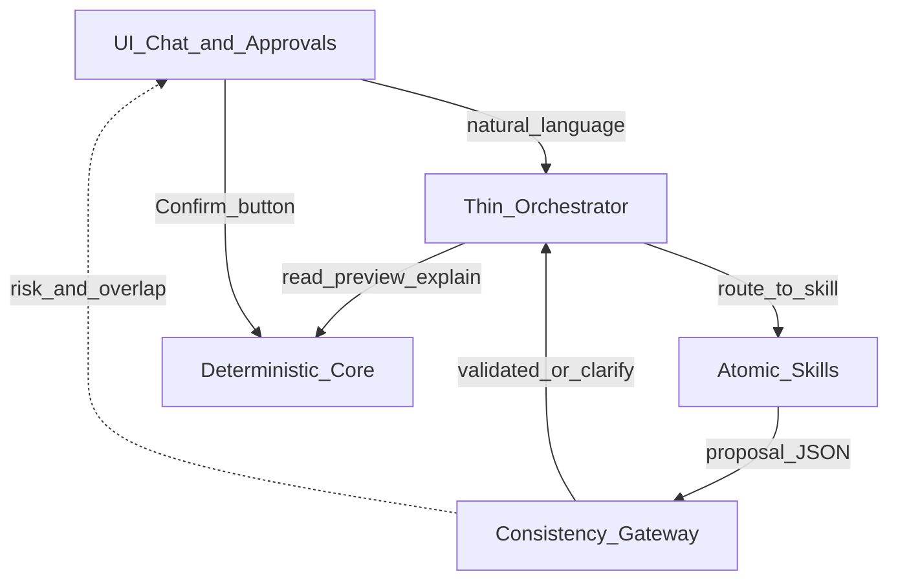

# Atomic Skills Architecture

**Date:** 2026-07-15  
**Status:** target design (incremental; does not rewrite the scoring engine)  
**Canonical design doc:** [../architecture/agent-skills-framework.md](../architecture/agent-skills-framework.md)  
**Related:** [2026-07-13-christine-orchestration-skill.md](./2026-07-13-christine-orchestration-skill.md), Model B decisions, taxonomy protocol

> Prefer the **architecture** doc for full design (layers, flows, APIs, skill catalogue). This plan file keeps the migration checklist and shorter reference.

## Purpose

Merge two compatible design essays into one CS-tickets-specific architecture:

1. **4-layer modular Agent Skills** — UI → thin orchestrator → atomic skills → deterministic core  
2. **Consistency Gateway** — schema validate, conflict/impact, Plan→Commit (human only)

Replace the **monolithic** Christine skill as the place for business logic. Keep Christine as a **thin router**; put capabilities in **versioned atomic skills** that wrap existing portal APIs.

---

## Locked constraints

| Constraint | Rule |
|------------|------|
| Classify hot path | **No LLM on `/run`** — `classify.py` + live rules only |
| Writes | **Never auto-commit** — lead Confirm only (Model B) |
| Rule shape | Existing **RuleSpec** JSON + allow-list 5-tuples (not a parallel YAML/regex DSL) |
| Orchestrator scope | Routes and stop conditions only — no scoring or taxonomy encyclopaedia |
| Code change style | Prefer wrap/extract over rewrite ([CONTEXT.md](../../CONTEXT.md)) |

**Rejected from generic essays:** `AUTO_APPROVED` commits; LLM `single_classify` writing live categories; Vector DB / semantic cache as prerequisites.

---

## High-level diagram



| Tier | Name | Owns | Must not own |
|------|------|------|----------------|
| **1** | User interface | Review chat, Confirm/revert CTAs, audit filters, preview tables | Scoring logic, live writes without user click |
| **2** | Cognitive orchestration | Intent → skill, short memory, stop conditions | Compile validation, taxonomy dumps, promote |
| **3** | Skills framework | One capability: prompt + I/O schema + tools | Direct live mutate |
| **4** | Deterministic integration | Classify, live rules, allow-list, Drive, session MD | LLM generation |

The **Consistency Gateway** sits between tiers **3 and 4**: every skill output that could affect config must pass schema + conflict/impact checks before the UI offers Confirm.

---

## Tier 1 — UI

**Today:** `/rules/new` orchestration mode (full-page chat), category audit, TBC queue, Confirm + version-guarded revert.

**Target:** Cursor-like **side-panel chat** docked beside audit / TBC / results — workbench stays primary; chat does not take over the viewport ([orchestration Phase E](./2026-07-13-christine-orchestration-skill.md)).

**Responsibilities:**

- Render chat + structured cards (profile, sweep, preview, clarify) in the side panel
- Human-in-the-loop: Enable Confirm only after successful preview on a living `run_id` (when in orch mode)
- Analyst vs lead via `PORTAL_ALLOW_CONFIRM`

---

## Tier 2 — Thin orchestrator

**Cursor:** `.cursor/skills/christine-workflow/` — shrink to intake + route table + stop conditions.  
**Portal:** Review chat intent router (focus vs compile phrase) — same idea in JS.

**Maps intents → skills**

| User intent (examples) | Skill |
|------------------------|-------|
| “review B2C”, profile this run | `profile-run` |
| “map invoice delay to …” | `propose-rule` |
| “what would this rule change?” | `preview-rule` |
| “why is ticket 170002 System Report?” | `explain-ticket` |
| “filter cancellations this week” | `filter-tickets` |
| “Confirm / promote” (explicit lead) | `confirm-rule` |

**Stop conditions (unchanged product rules):** `ZERO_MATCHES` / clarify; ANALYST cannot Confirm; `PREVIEW_STALE`; refuse auto-Confirm.

---

## Tier 3 — Atomic skills

Each skill is an isolated module: Cursor `SKILL.md` (+ optional `reference.md`) documenting **strict I/O** and the portal/Python entrypoints. Skills are **read/propose** unless named `confirm-rule`.

| Skill | Responsibility | Tools / APIs | Output contract |
|-------|----------------|--------------|-----------------|
| `profile-run` | Focus → slice counts + sweeps | `build_session_profile`, `POST /run/{id}/review_chat/turn` | Profile + cards; terminal clarify when `no_op` |
| `propose-rule` | NL → RuleSpec draft | `POST /rules/compile` | `{ ok, rule?, rationale, warnings, clarify_message, attempts }` — **proposal only** |
| `preview-rule` | Dry-run impact / shield overlap | `POST /rules/preview` | Summary + rows (`shield_overlap`, description/tags, …) |
| `explain-ticket` | Decision trace in plain language | existing explain endpoints | Evidence; **read-only** |
| `filter-tickets` | NL → structured filter | `*_parse_focus`, audit/TBC filter models | Filter JSON matching portal query params |
| `confirm-rule` | Promote draft to live | `POST /rules/confirm`, soft-fail reclassify | Lead-only; requires gateway-fresh preview |

**Out of scope as skills:** LLM category assignment into the scoring hot path; package JSON editor; Vector RAG.

### Skill versioning

- Frontmatter / `reference.md` notes a `skill_version` integer.
- Changing I/O or prompt semantics → bump version; update orchestrator route notes if needed.
- Cache (if added later) keys on `(skill_name, skill_version, input_hash)`.

---

## Consistency Gateway

**Target module:** `src/cs_tickets/consistency_gateway.py` (extract from existing compile/preview paths; behavior-preserving first).

| Step | Behavior |
|------|----------|
| Schema validate | RuleSpec fields + allow-list tier; repair ≤2 then clarify |
| Soft conflict | Shared blobs with shields, same-path overrides, near-duplicate matchers, low shield weight |
| Hard impact | Successful preview on living run when `run_id` present |
| Risk grade | `ok` \| `warn_shield` \| `warn_churn` \| `warn_duplicate` \| `block_schema` |
| Commit enforcer | Skills emit **Proposal**; only Confirm writes live; **no AUTO_APPROVED** |

### Conflict policy (product answer)

> How do we handle a new chat-drafted rule that overlaps or contradicts live rules?

1. **Compile** — Gateway soft-warns (and may clarify on schema failure).  
2. **Preview** — Deterministic dry-run on the run shows tier delta + `shield_overlap` (e.g. Stefan).  
3. **Risk card** — UI/orchestrator surfaces grade; Confirm stays lead-gated.  
4. **Confirm** — Lead decides; version logged for guarded revert.  
5. **Later (P2)** — Targeted soft-delete of one rule; richer near-dupe index.

There is **no** separate LLM “conflict judge.” Evidence comes from the scoring engine + preview.

---

## Tier 4 — Deterministic core

Unchanged contract:

- **Scoring engine** — rules + weights + overrides; LLM output never bypasses allow-list / promote path  
- **Rule base** — versioned live config (`config_version`, backups)  
- **Data** — in-memory run today; Drive sync for live artifacts  
- **Audit** — session MD + runner execution log  

Skills/Gateway call this tier the same way the portal already does (HTTP or in-process functions).

---

## Mapping prior essays → this design

| Essay concept | This design |
|---------------|-------------|
| Intent router | Thin Christine + Review chat router |
| Rule Gen / Ticket Filter / Anomaly skills | `propose-rule` / `filter-tickets` / (`explain-ticket` + future `triage-tbc`) |
| Structured I/O | Existing API JSON + future explicit skill schemas in `reference.md` |
| Plan→Commit | Preview gate + Confirm; never auto |
| Conflict detector | Gateway warnings + preview overlap |
| Immutable core | Tier 4 untouched by skill prompts |

---

## Repo layout (target)

```text
.cursor/skills/
  christine-workflow/     # thin router only
  profile-run/
  propose-rule/
  preview-rule/
  explain-ticket/
  filter-tickets/
  confirm-rule/
src/cs_tickets/
  consistency_gateway.py  # incremental extract
docs/plans/
  2026-07-15-atomic-skills-architecture.md  # this file
```

Portal remains the **execution substrate**; Cursor skills document how agents use it. Review chat continues to call the same APIs without requiring Cursor.

---

## Migration plan

| Phase | Work | Done when |
|-------|------|-----------|
| **M0** | Publish this doc + notes | Done 2026-07-15 |
| **M1** | Slim `christine-workflow`; add empty/atomic skill stubs with I/O tables | Done — thin router + six skills |
| **M2** | Fill atomic skills from existing APIs/scripts | Done (skills document portal/CLI entrypoints) |
| **M3** | Extract `consistency_gateway`; optional `risk` on compile/preview JSON | Done — `risk` on compile + preview summary |
| **M4** | Review chat shows risk grade on cards | Partial — assistant text + preview meta |
| **Later** | Near-dupe matcher index; session-scoped rule revert; optional TBC triage skill | As Model B concurrency grows |

---

## Success criteria

- Changing compile prompt does not require editing filter or explain skills.  
- Compile / preview / confirm stay separately testable.  
- No path to live rules without Confirm.  
- Shield overlap visible before Confirm.  
- Canonical design lives in [../architecture/agent-skills-framework.md](../architecture/agent-skills-framework.md).
