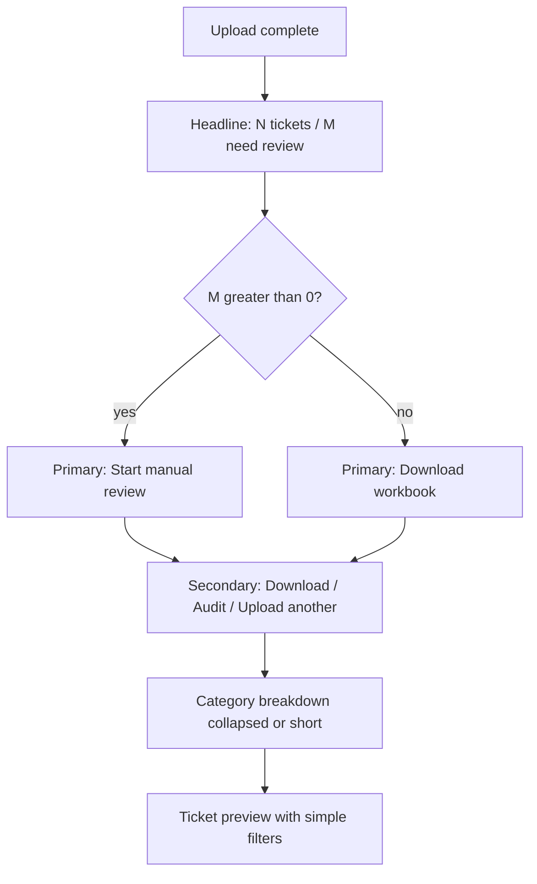
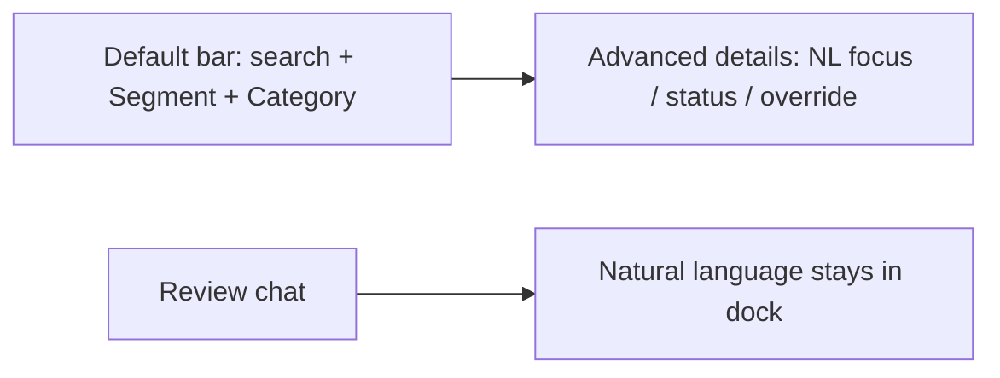

# Portal UX Declutter — Implementation Plan

> **For implementer:** When you execute this plan, document steps and design decisions in `docs/plans/2026-07-15-portal-ux-declutter-notes.md`. This plan describes *what* to build; that notes file describes *what you did*.

**Date:** 2026-07-15  
**Status:** ready to implement (presentation-layer only)  
**Goal:** Reduce clutter and decision fatigue on the classify workbench so a CS analyst can answer, in order: *What happened? What should I do next? How do I focus?* — without fighting overlapping filters, jargon, or competing chrome.

**Architecture:** HTML/CSS/JS and copy changes only. No classifier, live-config, or confirm semantics changes. Prefer wrapping/simplifying existing builders (`portal_ticket_preview`, `portal_category_audit`, `portal_tbc_queue`, `portal_rules`, `portal_stats`, `portal_trends`, `portal_review_dock`).

**Depends on / related:**

- [2026-06-10-portal-ux-improvement.md](./2026-06-10-portal-ux-improvement.md) — plain language, progressive disclosure
- [2026-06-17-learn-preview-beginner-ux.md](./2026-06-17-learn-preview-beginner-ux.md) — Learn flow (out of scope here except copy consistency)
- [2026-07-07-category-audit-workflow.md](./2026-07-07-category-audit-workflow.md) — audit page intent
- [2026-07-13-christine-orchestration-skill.md](./2026-07-13-christine-orchestration-skill.md) — review chat dock

**Users:**

| Persona | Need after declutter |
|---------|----------------------|
| CS analyst | One clear next action after upload; simple filters |
| Team lead | Same + Confirm still findable without drowning the page |
| Maintainer | Power filters / ops metadata remain behind disclosure |

---

## Locked principles

1. **One primary CTA per surface** — secondary actions are secondary visually.
2. **One filter system per page** — NL *or* structured as the main path; the other is progressive disclosure or dock-only.
3. **Analyst labels in the chrome; jargon in Advanced** — TBC/tier/COUNTA stay in data/exports if needed, not as filter labels.
4. **Same shell for the same page** — POST `/run` and GET `/results` must share layout (dock, width, scripts).
5. **No behavior change to Confirm / live writes** — Model B unchanged.

---

## Pain map (from live UI review)

| ID | Area | Problem | Why it hurts |
|----|------|---------|--------------|
| P1 | Results after upload | 5 equal-weight buttons + summary + reasons + pivot + filters | No clear “what next” |
| P2 | Ticket preview | 7 overlapping filters (NL + category + segment + contains + category focus + subject + tag) | Paralysis; duplicate semantics |
| P3 | Rules / audit / preview | Dual Apply: NL “Apply focus” + structured “Apply” | Two half-UIs |
| P4 | Copy | Tier1/Tier4, TBC, Chunk, COUNTA of id, Override | Analysts don’t know these terms |
| P5 | Layout | POST `/run` lacks dock + wide; GET `/results` has both | Same task, different chrome |
| P6 | Review dock | Always open on workbench; competes with review tables | Shrinks main task on narrow screens |
| P7 | Rules list | Unpaginated dense table of all rules | Hard to scan |
| P8 | Entry points | Queue / audit / preview / tier Audit links / dock | Same jobs reachable five ways without hierarchy |
| P9 | Dashboard | DB path, env var names, classifier hash above fold | Feels like a debug page |
| P10 | Category audit | Sweeps JS targets missing DOM; filter bar heavy | Incomplete + crowded |
| P11 | Top nav | Five button-styled links incl. external Drive | Equal weight; external unclear |

---

## Target flows

### After categorize (results)

### Filters (shared pattern)

---

## Phased delivery

| Phase | Scope | Est. | Outcome |
|-------|--------|------|---------|
| **A** | Results hierarchy + layout parity | 0.5–1 d | One primary CTA; POST=/GET shell |
| **B** | Filter consolidation (preview + audit + rules) | 1–1.5 d | ≤3 default filters; one Apply |
| **C** | Label / jargon pass | 0.5 d | Analyst words in chrome |
| **D** | Dock + nav polish | 0.5 d | Dock collapsed by default on results; nav clarity |
| **E** | Rules list + dashboard hygiene + audit sweeps fix | 1 d | Scannable rules; quiet dashboard; sweeps wired or removed |

Do **A → B → C** first; **D/E** can parallel after B.

---

## Phase A — Results hierarchy + layout parity

### A1. Primary CTA rules

In `_classify_run_actions_html` / `_run_results_body_html`:

| Condition | Primary button | Secondary |
|-----------|----------------|-----------|
| `tbc_pending > 0` | **Start manual review** (`/tbc`) with count | Download workbook, Category audit, Upload another |
| `tbc_pending == 0` | **Download workbook** | Category audit, Upload another |

- **Run History** — remove from the results action bar (already in top nav). Do not duplicate Drive folder here.
- Rename copy: `TBC_QUEUE_BUTTON` → something like `Start manual review` (keep TBC in `title` or meta if needed).

### A2. Above-the-fold order

Keep this order only:

1. Status banner (reclassify / trends snapshot) if any  
2. Run summary (`classify_run_summary_html`)  
3. TBC reason summary (keep; already useful)  
4. **Action bar** (primary + secondary)  
5. Drive save line (one short meta)  
6. Category breakdown  
7. Ticket preview  
8. Technical details (collapsed)

Move workbook sheet hint (`Run metadata` / `Tickets` / `Tier breakdown`) into **Technical details** or a single line under Download.

### A3. Layout parity

Make POST `/run` success use the same shell as GET `/results`:

- `_with_review_dock(run_id, body)`
- `wide=True`
- `_workbench_page_scripts(...)`

So refresh / bookmark / post-upload look identical.

### A4. Tests

Update `tests/test_portal.py` assertions for:

- Primary CTA class when TBC present vs absent  
- No duplicate “Run History” in `.run-actions`  
- Review dock present on POST `/run` success HTML  

---

## Phase B — Filter consolidation

### B1. Ticket preview default bar

**Keep visible by default:**

| Control | Label | Behavior |
|---------|-------|----------|
| Search | **Search tickets** | Matches subject + description + tags (merge current Contains + Subject + Tag) |
| Segment | **Segment** | All / B2C / B2B |
| Category | **Category** | Existing tier4 dropdown |

**Move behind `
` (closed):**

- Review focus (natural language) + Apply focus  
- Category keywords (former “Category focus”)  
- Show ticket details / Show manual review only (toggles can stay outside if already compact)

**Remove as separate fields:** Subject contains, Tag contains (covered by Search).

Wire `ticket_preview.js` so one search input drives the former three string filters (OR within fields is fine; document in notes).

### B2. Category audit toolbar

**Default:** Search + Segment + Category (tier4) + Apply.  

**Advanced (collapsed):** Category keywords, Include manual review (TBC), NL “Review focus”.  

Single **Apply** for structured form; NL apply only inside Advanced (or prefer dock for NL — pick one in notes; preference: keep NL on audit Advanced for offline filter-without-dock use).

### B3. Rules filter bar

**Default:** Search + Status + Apply / Clear.  

**Advanced:** Segment (Tier1), Category (Tier4), Override, NL “Search focus”.  

Expose Tier2/Tier3 only if product still needs them; otherwise drop hidden inputs or document why kept.

### B4. TBC queue

Leave chunk review mechanics for Phase E polish. For Phase B only:

- Rename filter labels to match B1 (Search / Segment / Category focus → Category keywords in Advanced).  
- Do not remove batch rule tools yet — put “Draft rule for filter” / batch compile in a collapsed **Review tools** section.

### B5. Tests

- Preview HTML has at most one NL row outside Advanced by default (count `"Review focus"` in default controls = 0 or only in details).  
- Existing filter behavior covered by unit/JS-adjacent tests still pass with merged search.

---

## Phase C — Label / jargon pass

Centralize in `portal_copy.py` (and rules/trends copy where needed):

| Current | Replace with |
|---------|----------------|
| `Category (tier4)` | **Category** |
| `Tier1` (filter label) | **Segment** |
| `COUNTA of id` (HTML table only) | **Tickets** (keep COUNTA in Excel export if analysts rely on it — note in notes) |
| `(TBC)` in every headline | Keep once in summary; prefer **manual review** elsewhere |
| `Chunk size` | **Page size** (or **Tickets per page**) |
| `Skip chunk — no rule needed` | **Skip these — no new rule** |
| `Re-classify run` | **Re-run with current rules** |
| Rules **Override** column | **Force category** or tooltip “Wins over scored rules” |

Do **not** rename schema columns, rule IDs, or Excel sheet headers without a product call — UI headers only unless export consumers confirm.

---

## Phase D — Dock + nav polish

### D1. Review dock default

| Page | Default dock |
|------|----------------|
| `/results` | **Collapsed** (FAB to open) |
| `/tbc` | Collapsed |
| `/category_audit` | Collapsed |
| User preference | `localStorage` key `review-dock-collapsed` if easy |

Rationale: dock is orchestration/power tool; table review is primary.

### D2. Top nav

- Style **Run History** as text link / external (icon or “(Drive)” suffix), not equal to section tabs.  
- Optional: shorten active section emphasis only (already `nav-active`).

### D3. Tests

- Dock HTML present but `data-dock-collapsed="true"` (or FAB visible, dock hidden) on first paint of results.

---

## Phase E — Rules, dashboard, audit sweeps

### E1. Rules list

- Cap initial render (e.g. 25) with **Show more** / client filter already applied server-side.  
- Truncate match column with `title=` full text.  
- Optional: default Status=Active so disabled rules don’t clutter.

### E2. Dashboard

Above fold: headline + weekly table only.  

Move to `
` **Report details**:

- DB path  
- `TBC_TRENDS_ENABLED` note  
- Classifier version hash  
- Exports table / events list  

### E3. Category audit sweeps

Choose one:

1. **Wire it:** Render `#category-audit-sweeps-panel` + heading/meta from copy, call existing `loadSweeps()`, or  
2. **Remove dead path:** Delete unused copy, CSS, and JS sweeps loader until product wants it.

Preference: wire if checks are valuable; else remove to avoid half-features.

### E4. Entry-point hierarchy

Keep links but demote:

- Tier table **Audit** → subtle text link (not competing with primary CTA).  
- Preview “Open audit view…” stays contextual after a category filter is set only.

---

## Out of scope

- Learn wizard redesign (covered by 2026-06-17 plan)  
- Classifier / confirm / Drive semantics  
- Atomic skills / orchestration architecture  
- Drag-and-drop upload (nice follow-up; not required for declutter)

---

## File touch list (expected)

| Area | Files |
|------|--------|
| Copy | `portal_copy.py` |
| Results / parity | `portal_app.py` |
| Preview filters | `portal_ticket_preview.py`, `static/ticket_preview.js` |
| Audit | `portal_category_audit.py`, `static/category_audit.js` |
| TBC labels | `portal_tbc_queue.py`, `static/tbc_queue.js` |
| Rules | `portal_rules.py`, `static/rules.js` |
| Dock | `portal_review_dock.py`, `static/review_dock.js` |
| Trends | `portal_trends.py` |
| CSS | `static/cs_tickets_theme.css` (+ cache `?v=` bump) |
| Tests | `tests/test_portal.py`, `test_portal_ticket_preview.py`, `test_portal_category_audit.py`, `test_portal_rules.py`, `test_portal_layout.py` as needed |

---

## Acceptance checklist

- [ ] With TBC tickets, results show one primary **Start manual review**; Download is secondary.  
- [ ] Without TBC, Download is primary.  
- [ ] POST `/run` and GET `/results` share dock + wide layout.  
- [ ] Ticket preview default bar has ≤3 filters; Advanced holds NL/keywords.  
- [ ] No “Run History” button in results action bar.  
- [ ] Filter labels say Segment/Category/Search — not Tier1/Tier4 in chrome.  
- [ ] Dashboard ops metadata not above the fold.  
- [ ] Sweeps either visible and working, or fully removed.  
- [ ] Existing portal tests green; Confirm/live still lead-gated.

---

## Suggested first slice (if short on time)

Implement **Phase A + B1 only** (results CTA + preview filter merge). Highest analyst impact for smallest diff.
