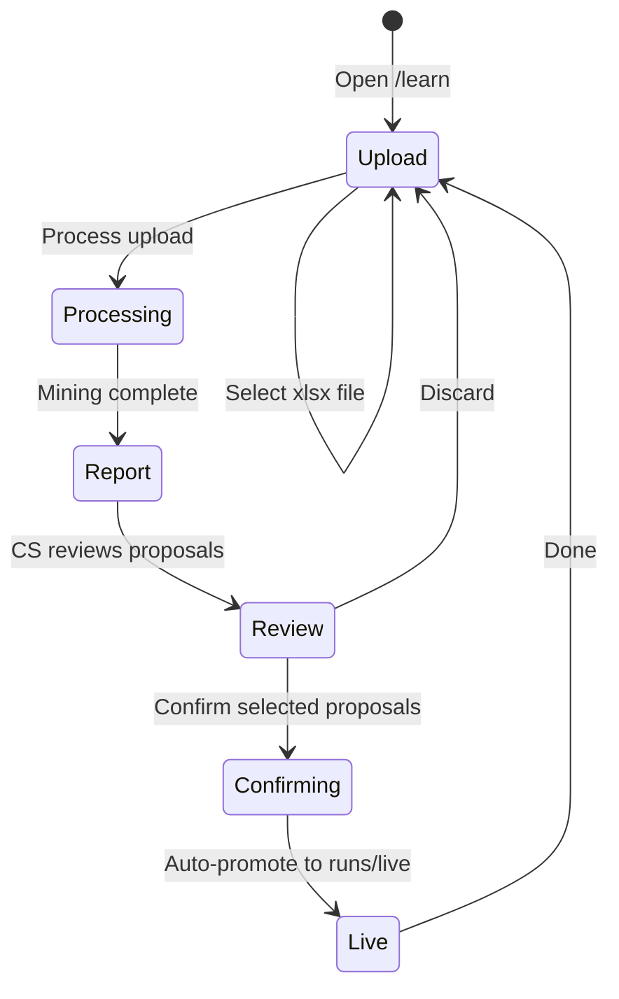

# PRD — Phase 2: Learning Feedback Loop & Dynamic Taxonomy

**Product:** CS Ticket Automation (`cs-tickets`)  
**Document type:** Phase 2 PRD / implementation plan  
**Owner:** SCMP Customer Support (domain) + ITBS (engineering)  
**Status:** Draft for review  
**Last updated:** 2026-05-31  
**Parent:** [prd.md](./prd.md) · [design.md](./design.md)

---

## 1. Executive summary

CS maintains **master categorized workbooks** (same format as `doc/CS_ticket_new_categorizations.xlsx` — e.g. `references/20260528_-_CS_ticket_new_categorizations.xlsx`) with final tier labels, tags, and ticket text. Today those files only feed the allow-list when engineers copy them into `doc/`; **new labels and patterns do not become classifier rules** without manual rule authoring.

Phase 2 introduces a **closed feedback loop** centered on a new portal page — **Learn from categorizations** (`/learn`, UI label may read **Learn New**):

1. **CS uploads** a categorized `.xlsx` (sheet `SCMP_Tickets_Master_Categorized`) via the portal.
2. **System extracts** rule and taxonomy **proposals** by clustering ticket signals against CS tier labels.
3. **CS reviews** proposals (Process does not change production config).
4. **CS confirms** accepted proposals → **auto-promote** merges them into Google Drive **`runs/live/`** (runtime config).
5. **Next pipeline run** loads taxonomy + rules from `runs/live/` (no image redeploy, no engineer PR required).

**Design principle:** *Never apply rules or taxonomy without CS confirmation.* **Confirm is the human gate** — it replaces a separate engineer approval step. Git/repo sync and image-baked `doc/` remain optional fallbacks for disaster recovery and offline CLI.

**Process vs Confirm:**

| Action | Effect |
|--------|--------|
| **Process** | Parse upload, show proposals — **no live change** |
| **Confirm** | Merge accepted proposals into `runs/live/` — **live on next classify** |

---

## 2. Problem statement

| Pain today | Impact |
|------------|--------|
| CS produces categorized master workbooks outside the pipeline | Labels do not become classifier rules |
| New tier combinations appear in CS workbooks | `load_allowlist()` only updates when engineers copy files into `doc/` |
| Rule tuning is engineer-led from TBC audits | Slow; disconnected from CS’s categorized examples |
| Taxonomy updates are manual git edits | Drift between CS workbooks, CSV, and deployed image |

**Outcome we want:** CS categorized uploads become the **authoritative training signal** for rule and taxonomy proposals, with traceability from each proposed rule back to example ticket ids in the workbook.

---

## 3. Goals and non-goals

### Goals

| ID | Goal |
|----|------|
| G-01 | Accept **CS categorized master workbooks** (`.xlsx`, sheet `SCMP_Tickets_Master_Categorized`) via portal upload. |
| G-02 | Parse rows with stable keys (`id`) plus signals (`tags`, `subject`, `description`) and CS tier columns. |
| G-03 | Mine **rule proposals** by clustering signals → CS tier tuples (no CS-managed original/revised diff). |
| G-04 | Detect **new 5-tuples** in the upload vs current allow-list and produce taxonomy merge proposals. |
| G-05 | Reduce TBC and misclassification on the **next** `/run` after CS confirms (live config updated). |
| G-06 | Preserve **explainability** — every promoted rule links to supporting labeled-row ticket ids. |

### Non-goals (Phase 2)

| ID | Non-goal |
|----|----------|
| NG-01 | Unsupervised ML / LLM classifier in production without rule structure. |
| NG-02 | Apply rules/taxonomy on **Process** without CS **Confirm** (proposals only until confirmed). |
| NG-03 | Real-time per-ticket learning during a single portal upload. |
| NG-04 | Replacing Zendesk or Google Sheets as systems of record. |
| NG-05 | Auto-editing `classify.py` computed logic without engineer review. |

---

## 4. Users and stories

| Persona | Story |
|---------|--------|
| **CS analyst** | I upload our latest categorized workbook on **Learn New** / `/learn`, review proposals, and confirm the ones that should go live. |
| **CS team lead** | I confirm rule and taxonomy proposals; the portal applies them to Drive live config immediately — no engineer handoff for routine updates. |
| **Classifier maintainer** | (Optional) I sync `runs/live/` back to git, run regression audits, or roll back a bad promote. |
| **Taxonomy owner** | I review new Tier1 paths in the proposal UI before confirm (blocked or extra warning by default). |
| **Engineer** | (Optional) I maintain runtime-config loader, guardrails, and periodic git mirror of Drive live files. |

---

## 5. Current system (baseline)

```mermaid
flowchart LR
  NDJSON[Zendesk NDJSON] --> PIPE[pipeline + classify]
  TAX[doc/Taxonomy.csv] --> ALLOW[load_allowlist]
  WB[doc/CS_ticket_new_categorizations.xlsx] --> ALLOW
  FB[PIPELINE_FALLBACK_TIER_TUPLES] --> ALLOW
  RULES[classifier_rules.json + classify.py] --> PIPE
  ALLOW --> PIPE
  PIPE --> OUT[CSV / xlsx / Drive]
  OUT -.->|CS also maintains| CS[CS categorized xlsx]
  CS -.x|no learning path| RULES
```

**Reference input example:** `references/20260528_-_CS_ticket_new_categorizations.xlsx` — sheet `SCMP_Tickets_Master_Categorized`, columns include `tags`, tier columns, and ticket text (may include extra columns such as `via`; ignored if not in `MASTER_COLUMNS`).

**Key code touchpoints:**

| Component | Role |
|-----------|------|
| `taxonomy.load_allowlist()` | Union of workbook + CSV + fallbacks — **hard boundary** for valid tiers |
| `classify.py` + `classifier_rules.json` | Weighted rules; only allow-listed tuples scored |
| `portal_workbook.py` | Export: Run metadata, Tickets, Tier breakdown |
| `drive_upload.py` | Persists runs to Google Drive folder |
| `tools/audit_classifier.py` | TBC rate / cluster audit on NDJSON |

**Gap:** No portal path to upload CS categorized workbooks and turn labeled rows into rule/taxonomy proposals.

---

## 6. Target system (Phase 2)

```mermaid
flowchart TB
  CS[CS categorized xlsx] --> UPLOAD[portal /learn]
  UPLOAD --> PARSE[Process: parse + mine]
  PARSE --> REPORT[proposal report]
  REPORT --> CONFIRM[Confirm: human gate]
  CONFIRM --> ARCHIVE[runs/proposals/id]
  CONFIRM --> MERGE[merge into runs/live]
  MERGE --> VER[config_version++]
  VER --> LOAD[/run loads live config]
  LOAD --> PIPE[classify tickets]
```

### 6.1 Drive layout — runtime config (`runs/live/`)

Production taxonomy and rules are read from Drive at classify time (with in-pod cache keyed on `config_version.json`). Image-baked `doc/` + package `classifier_rules.json` are **bootstrap fallbacks** when Drive is unreachable.

```
runs/
  live/                                    ← runtime source of truth
    Taxonomy.csv                             ← pivot template: Tier1–4 only (no counts)
    classifier_rules.json
    CS_ticket_new_categorizations.xlsx     ← optional; union into allow-list
    config_version.json                    ← { "version", "updated_at", "proposal_id" }
    backup/                                ← optional pre-merge snapshots
      {version}/
  proposals/                               ← immutable audit per confirm
    {proposal_id}/
      manifest.json
      taxonomy.patch.csv
      rules.json
      REPORT.md
  learning/                                ← optional CS upload archives
  …                                        ← existing pipeline run workbooks
```

**On Confirm (auto-promote):**

1. Validate accepted proposals (schema, conflicts, guardrails — §8.5).
2. Write audit bundle to `runs/proposals/{proposal_id}/`.
3. Download current `runs/live/*`; backup to `runs/live/backup/{version}/`.
4. Merge taxonomy patch into `Taxonomy.csv` (tier columns only; see §11.5); append rules to `classifier_rules.json`; optionally merge workbook tuples.
5. Upload updated live files; increment `config_version.json`.
6. Invalidate config cache on all portal pods (poll version or push invalidation).
7. UI status → **`live`**; show new config version and Drive links.

**Next `/run`** uses updated allow-list and rules without redeploy.

---

## 7. Feedback input contract

### 7.1 Supported formats

| Format | Source | Notes |
|--------|--------|-------|
| `.xlsx` | **Portal upload on `/learn`** (primary) | Sheet `SCMP_Tickets_Master_Categorized` |
| `.xlsx` | Local path / CLI | Same contract for engineer offline runs |
| Google Sheet | Export to xlsx first | Same sheet name and columns |

**Example file:** `references/20260528_-_CS_ticket_new_categorizations.xlsx`

### 7.2 Required columns (minimum)

Required tier and signal columns (subset of `schema.MASTER_COLUMNS`):

| Column group | Columns | Purpose |
|--------------|---------|---------|
| Join key | `id` (required), `url` (recommended) | Row identity, evidence links |
| Signals | `tags`, `subject`, `raw_subject`, `description` | Rule mining |
| CS labels | `Tier1_Segment` … `Granular_Tech_UI_Type` | Target tuples |

Extra columns (e.g. `via` in CS exports) are **ignored**. Missing optional signal columns reduce mining quality but do not block ingest if `tags` or `subject` is present.

### 7.3 Recommended CS file naming

Not required for processing, but helps audit history:

| Pattern | Example |
|---------|---------|
| `{YYYYMMDD}_-_CS_ticket_new_categorizations.xlsx` | `20260528_-_CS_ticket_new_categorizations.xlsx` |

### 7.4 Row eligibility for rule mining

| Include | Exclude (default policy) |
|---------|--------------------------|
| Rows with non-empty tier columns and at least one signal field | Empty tier rows |
| Rows with CS-assigned concrete tiers | Rows labeled TBC (Manual Review) — configurable |
| Duplicate `id` in same upload | Keep last row; warn in report |

### 7.5 Optional internal gap filter (not shown to CS)

After mining clusters from CS labels, the engine **may** re-run the **current** classifier on each row and **deprioritize or omit** proposals where the classifier already returns the same tier tuple. This avoids proposing redundant rules; CS never uploads or pairs an “original” pipeline file.

---

## 8. Functional requirements

### 8.1 Workbook ingestion (FR-FB)

| ID | Requirement |
|----|-------------|
| FR-FB-01 | Accept categorized `.xlsx` upload on `/learn` (multipart form, same pattern as NDJSON upload on `/`). |
| FR-FB-02 | Read sheet `SCMP_Tickets_Master_Categorized`; reject if missing or empty. |
| FR-FB-03 | Validate required columns: `id`, tier columns, and at least one of `tags` / `subject`. |
| FR-FB-04 | Normalize tier 5-tuples (trim, consistent empty → policy documented). |
| FR-FB-05 | Persist upload metadata: `{upload_id, filename, row_count, ingested_at, status}`. |
| FR-FB-06 | Optional: store upload blob on Drive `runs/learning/` or local temp for re-process. |

### 8.2 Rule extraction (FR-MINE)

| ID | Requirement |
|----|-------------|
| FR-MINE-01 | Cluster rows by shared signals → CS tier tuple (see §10). |
| FR-MINE-02 | Propose rules when cluster support ≥ N and purity ≥ threshold (defaults in §10.3). |
| FR-MINE-03 | Report per-upload stats: rows parsed, rows mined, clusters found, proposals emitted. |
| FR-MINE-04 | Exclude TBC-labeled rows from mining by default (configurable). |
| FR-MINE-05 | Optional internal filter: omit proposals already satisfied by current classifier on same rows. |
| FR-MINE-06 | Flag rows where CS tuple ∉ allow-list → feed taxonomy proposal (§8.4). |

### 8.2b Correction diff — out of scope for CS workflow

Original-vs-revised or pipeline-run diff is **not** required. Engineers may still run offline diff tools for audits; the portal does not expose pairing UI.

### 8.3 Rule proposal (FR-RULE)

| ID | Requirement |
|----|-------------|
| FR-RULE-01 | Mine **tag-only** rules when ≥ N rows share tag + CS target tuple (configurable N, default 5). |
| FR-RULE-02 | Mine **phrase rules** from subject/description when ≥ N rows share phrase + CS target tuple. |
| FR-RULE-03 | Propose `RuleSpec`-compatible JSON with suggested `weight` from confidence (support count, purity). |
| FR-RULE-04 | Flag **conflicts** with existing rules (same signals, different tier). |
| FR-RULE-05 | Flag **overlaps** with computed logic in `classify.py` (proposal = “needs engineer”). |
| FR-RULE-06 | Attach **evidence**: up to K example ticket ids per proposal. |
| FR-RULE-07 | On **Process**: emit proposals only. On **Confirm**: append accepted rules to `runs/live/classifier_rules.json` (never mutate package default in place). |

### 8.4 Taxonomy proposal (FR-TAX)

| ID | Requirement |
|----|-------------|
| FR-TAX-01 | Detect 5-tuples in CS labels **not** in current `load_allowlist()`. |
| FR-TAX-02 | Group by Tier1→Tier4 path; count frequency and list examples. |
| FR-TAX-03 | Validate structural rules (e.g. Junk path, required parent tiers) before proposal. |
| FR-TAX-04 | On **Process**: emit taxonomy patch artifact. On **Confirm**: merge patch into `runs/live/Taxonomy.csv` (pivot carry semantics preserved). |
| FR-TAX-05 | After taxonomy promotion, re-run allow-list build and confirm tuples reachable by at least one rule or marked `manual_only`. |
| FR-TAX-06 | Version taxonomy: `taxonomy_version` in metadata; audit trail of who approved merge. |
| FR-TAX-07 | Taxonomy merge appends **tier columns only** per §11.5; never write count values into `runs/live/Taxonomy.csv`. |

### 8.5 Auto-promote on Confirm (FR-REL)

| ID | Requirement |
|----|-------------|
| FR-REL-01 | **Confirm** triggers auto-promote: merge only **CS-accepted** proposals into `runs/live/`. |
| FR-REL-02 | Before merge, run validation: schema, rule conflicts, allow-list coherence, optional sample re-classify on upload subset. |
| FR-REL-03 | Block confirm (or require extra dialog) for **new Tier1** taxonomy paths unless `ALLOW_TIER1_PROMOTE=true`. |
| FR-REL-04 | Archive immutable bundle to `runs/proposals/{proposal_id}/` before mutating live files. |
| FR-REL-05 | Pre-merge backup of live config to `runs/live/backup/{version}/`. |
| FR-REL-06 | Bump `config_version.json`; all pods reload within agreed TTL (default: immediate cache bust on handling pod + ≤60s poll on peers). |
| FR-REL-07 | Audit log: `{proposal_id, upload_id, confirmed_by, confirmed_at, accepted_ids, config_version_after}`. |
| FR-REL-08 | Rejected proposals never merged; successful Confirm sets upload status **`live`**. |
| FR-REL-09 | **Rollback** (maintainer/CS lead): restore prior backup version to `runs/live/` + bump version (portal action or CLI). |
| FR-REL-10 | **Git sync optional:** periodic or manual mirror of `runs/live/` → `doc/` in repo; not on critical path for CS. |

### 8.5b Runtime config loader (FR-CFG)

| ID | Requirement |
|----|-------------|
| FR-CFG-01 | `/run` and `/learn` miners load allow-list + rules from `runs/live/` when `RUNTIME_CONFIG_DRIVE_ENABLED=true`. |
| FR-CFG-02 | Fall back to image `doc/` + package `classifier_rules.json` if Drive unavailable (log warning). |
| FR-CFG-03 | Cache config in memory keyed by `config_version`; refresh when version increases. |
| FR-CFG-04 | Env: `GOOGLE_DRIVE_LIVE_FOLDER_ID` (or subfolder under existing runs folder). |

### 8.6 Portal UX (FR-UI)

| ID | Requirement |
|----|-------------|
| FR-UI-01 | Home page link to **`/learn`** — **Learn from categorizations**. |
| FR-UI-02 | `/learn` upload form: accept `.xlsx`, show example filename hint (`YYYYMMDD_-_CS_ticket_new_categorizations.xlsx`). |
| FR-UI-03 | **Process** button runs ingest + miners on uploaded file (or selected past upload). |
| FR-UI-04 | Upload history: status `uploaded` → `processed` → **`live`** (or `failed`). No separate “confirmed” status — Confirm transitions directly to `live`. |
| FR-UI-05 | After processing, show summary: **R rows parsed**, **M rule proposals**, **K new taxonomy paths**. |
| FR-UI-06 | Drill-down: tier distribution, proposal table with evidence ticket ids, taxonomy novelty list. |
| FR-UI-07 | **Confirm changes** is the sole human gate; dialog states changes apply to **next categorisation run**. |
| FR-UI-08 | Post-confirm: show **Live — config version N**, links to `runs/proposals/{id}/` and `runs/live/`. |
| FR-UI-09 | Optional: archive source upload to `runs/learning/`. |

### 8.7 Portal UX flow — Learn from categorizations (`/learn`)

#### Navigation

| Location | Control | Destination |
|----------|---------|-------------|
| Home (`/`) | **Learn New** / Learn from categorizations | `/learn` |
| Run result | **Run History** (existing) | Drive `runs/` folder (pipeline outputs only) |

Pipeline run results and learning uploads are **separate workflows** — CS does not need to run the pipeline before uploading a categorized workbook.

#### Page states



#### Step-by-step user journey

**Step 1 — CS prepares workbook (offline)**

1. CS maintains or exports a master categorized sheet, e.g. `20260528_-_CS_ticket_new_categorizations.xlsx`.
2. Sheet name: **`SCMP_Tickets_Master_Categorized`**.
3. Rows include `id`, `tags`, subject/description, and filled tier columns.

**Step 2 — Upload + Process**

1. CS opens **Learn New** / **Learn from categorizations** (`/learn`).
2. Chooses `.xlsx` → **Process** (no live config change).

**Step 3 — Review report**

Summary banner (before confirm):

> **12,450 rows parsed** · **14 rule proposals** · **3 new taxonomy paths**  
> Nothing is live until you click **Confirm changes**.

**Step 4 — Confirm = auto-promote (human gate)**

1. CS reviews each rule and taxonomy proposal; accept/reject per row.
2. **Confirm changes** → confirmation dialog:

   > You are activating **6 rules** and **2 taxonomy paths**.  
   > The **next categorisation run** will use these immediately (config version will increment).

3. Portal: validate → archive to `runs/proposals/{proposal_id}/` → merge into `runs/live/` → bump `config_version.json`.
4. UI: **Live — config version 13** + Drive links. Failed merge rolls back from backup; CS sees error, live unchanged.

**Step 5 — Verify (optional)**

1. CS runs a normal **New Upload** NDJSON job; new rules/tiers apply without redeploy.
2. Maintainer may optionally sync `runs/live/` to git for backup (not required for CS).

#### Wireframe (logical layout)

```
┌─────────────────────────────────────────────────────────────┐
│  CS Tickets Categorisation                                  │
│  [ New Upload ]  [ Learn from categorizations ]  [ History ]│
├─────────────────────────────────────────────────────────────┤
│  Learn from categorizations                                 │
│  Upload CS master workbook (.xlsx)                          │
│  Sheet: SCMP_Tickets_Master_Categorized                     │
│  [ Choose file ]  [ Process ]                               │
├─────────────────────────────────────────────────────────────┤
│  Recent uploads                                             │
│  20260528_-_CS_ticket_new_categorizations.xlsx  processed   │
│  20260514_-_CS_ticket_new_categorizations.xlsx  live (v12)  │
├─────────────────────────────────────────────────────────────┤
│  (after confirm)                                            │
│  Live — config version 13 · 6 rules · 2 taxonomy paths      │
│  [ View on Drive: proposals / live ]                        │
└─────────────────────────────────────────────────────────────┘
```

#### UX copy guidelines

| Avoid | Prefer |
|-------|--------|
| “Process corrections” / original-vs-revised | **Learn from categorizations** |
| “Compare to pipeline run” | **Upload your categorized workbook** |
| “Pending engineer promotion” | **Live — config version N** |
| Silent success | **Confirm applies to next run** |
| Process = go live | **Only Confirm changes live config** |

---

## 9. Automation policy

| Action | When | Automation |
|--------|------|------------|
| Parse upload, mine proposals | **Process** | Automatic |
| CS accept/reject in UI | Before confirm | **Manual (required human gate)** |
| Merge into `runs/live/` | **Confirm** | **Automatic** |
| Archive to `runs/proposals/` | **Confirm** | Automatic |
| Backup prior live config | **Confirm** | Automatic |
| Next `/run` picks up config | After version bump | Automatic (cached reload) |
| Git mirror `doc/` | Optional cadence | Manual or scheduled job |
| Rollback live config | Incident | Manual (portal or CLI) |

**Why Confirm is sufficient:** CS explicitly approves each proposal. Process never writes live config.

**Guardrails on Confirm (automatic checks, not a second human):** validation failures block merge; new Tier1 blocked or double-confirmed; max rules per confirm configurable.

---

## 10. Rule mining algorithm (spec outline)

### 10.1 Inputs per labeled row

- Tags (JSON list), subject, description, url  
- `cs_tuple` — CS tier columns from upload (`Tier1_Segment` … `Granular_Tech_UI_Type`)

### 10.2 Candidate generators (priority order)

1. **Exact tag set** → `all_tags` rule targeting `cs_tuple`  
2. **Single tag** → `any_tags` rule (if purity ≥ 90% within cluster)  
3. **Subject prefix** (first 40 chars normalized) → `any_subject`  
4. **Blob phrase** (2–4 word n-grams from description, min support N) → `any_blob`  
5. **Tag + phrase combo** → higher weight, lower proposal threshold

### 10.2b Optional redundancy filter

Re-classify each row in the upload with the **current** production rules. If the winning tuple equals `cs_tuple`, do not propose a new rule for that cluster (existing coverage). Report count of “already classified correctly” rows for transparency.

### 10.3 Acceptance criteria for proposals (Process) and merge (Confirm)

| Check | When | Threshold (default) |
|-------|------|---------------------|
| Support count | Process | ≥ 5 labeled rows |
| Purity (same cs_tuple) | Process | ≥ 85% |
| No rule conflict | Confirm | block or warn |
| Target in allow-list or accepted taxonomy proposal | Confirm | required |
| Merge does not break pivot CSV parse | Confirm | required |
| Optional TBC regression on holdout NDJSON | Confirm | warn if regression > threshold |

### 10.4 Weight suggestion

```
weight = base(10) + log2(support) + purity_bonus + (tag_only ? 1 : 0)
Cap at 14 unless engineer overrides (align with HIGH_CONFIDENCE_SCORE=12)
```

---

## 11. Taxonomy merge algorithm (spec outline)

### 11.1 Detect new tuples

```python
new_tuples = upload_cs_tuples - allowlist.tuples
```

### 11.2 Classify novelty type

| Type | Action |
|------|--------|
| New Tier4 under existing Tier1–3 | Append row to Taxonomy.csv pivot |
| New Tier3 branch | Append with parent carry rows |
| New Tier1 segment | **Escalate** — taxonomy owner mandatory |
| New Granular_Tech_UI_Type only | Append to workbook column; often `N/A` in CSV |

### 11.3 CSV merge into `runs/live/Taxonomy.csv`

- Build patch from accepted taxonomy proposals  
- Merge preserving pivot **carry** semantics (`iter_taxonomy_pivot_rows`)  
- Upload merged file to Drive; validate by re-parsing allow-list before bumping version  

### 11.4 Workbook sync

- Optionally append distinct 5-tuples to `runs/live/CS_ticket_new_categorizations.xlsx` when granular tiers matter  
- Git `doc/` mirror is optional backup, not runtime path  

### 11.5 Taxonomy.csv template format (no counts)

`runs/live/Taxonomy.csv` and repo **`references/Taxonomy.csv`** use a **structure-only** pivot template. Ticket counts belong in run workbooks (Tier breakdown), not in taxonomy.

| Rule | Detail |
|------|--------|
| **Columns** | `Tier1_Segment`, `Tier2_Stream`, `Tier3_Cat`, `Tier4_Type` only (4 columns) |
| **No count column** | Do not include `COUNTA of id` or export volumes — parser ignores column E but counts confuse CS and stale quickly |
| **No Grand Total row** | Omit; parser treats Grand Total as end marker only |
| **Pivot carry** | Blank cells in Tier1–3 repeat parent values (same as today’s pivot export) |
| **New rows on Confirm** | Append tier path with empty trailing fields only — never copy counts from CS upload |

**Canonical repo template:** `references/Taxonomy.csv` (cleaned 4-column file).

**Bootstrap:** First deploy copies `references/Taxonomy.csv` (+ package `classifier_rules.json` + optional reference workbook) into Drive `runs/live/`. Image `doc/Taxonomy.csv` remains fallback when Drive is unavailable.

**Parser note:** `iter_taxonomy_pivot_rows()` accepts optional column 5 but allow-list uses Tier1–4 only; granular is always `N/A` for CSV-derived tuples.

---

## 12. Data storage

### Runtime and audit (Phase 2)

| Store | Content |
|-------|---------|
| **Drive `runs/live/`** | **Runtime source of truth** — Taxonomy.csv, classifier_rules.json, config_version.json |
| **Drive `runs/proposals/{id}/`** | Immutable audit bundle per Confirm |
| **Drive `runs/live/backup/{version}/`** | Pre-merge snapshots for rollback |
| Portal index | Upload metadata, status, last config version (optional SQLite; may list Drive) |
| Git `doc/` | Bootstrap + optional mirror; not required for CS go-live |

**Upload record:**

```
learning_uploads(
  upload_id, filename, row_count,
  status,           -- uploaded | processed | live | failed
  proposal_id, config_version_after,
  confirmed_by, confirmed_at, accepted_proposal_ids
)
```

**manifest.json (per proposal_id):**

```
{
  "proposal_id": "20260530-a3f8",
  "upload_id": "...",
  "confirmed_by": "...",
  "confirmed_at": "ISO8601",
  "config_version_before": 12,
  "config_version_after": 13,
  "accepted_rule_ids": ["..."],
  "accepted_taxonomy_ids": ["..."]
}
```

---

## 13. Security and compliance

| Topic | Requirement |
|-------|-------------|
| PII | Ticket description/subject in feedback store — same retention as Zendesk exports; restrict Drive folder access |
| Auth | Portal SA read/write on `runs/live/`, `runs/proposals/`, and pipeline `runs/` |
| Audit | Every Confirm writes `manifest.json` + proposal bundle |
| Rollback | Restore `runs/live/backup/{version}/`; bump config_version; no image redeploy |

---

## 14. Success metrics

| Metric | Baseline | Target (3 months post Phase 2) |
|--------|----------|--------------------------------|
| **Correction rate** | N/A (no diff workflow) | Track **classifier gap rate** on sample uploads (optional internal metric) |
| **TBC rate** on golden export | ~9–15% | ↓ 2–5 pp after 2 promotion cycles |
| **Time from Confirm → live on next /run** | Days (engineer PR) | **< 2 minutes** |
| **Time from upload → proposals** | Days | < 1 hour (Process) |
| **Bad rule rollback incidents** | — | 0 per quarter (goal) |
| **New taxonomy tuples / month** | Manual | 100% tracked via proposals |

---

## 15. Implementation phases

### Phase 2a — Learn page + runtime config loader (4–6 weeks)

| Deliverable | Details |
|-------------|---------|
| `/learn` | Upload, Process, Confirm UI |
| `runs/live/` bootstrap | Seed from **`references/Taxonomy.csv`** (4-col template) + package rules + reference workbook |
| `src/cs_tickets/runtime_config.py` | Load taxonomy + rules from Drive; cache by version |
| `src/cs_tickets/feedback/*` | Parse, mine rules, mine taxonomy |
| Wire `/run` | Use runtime config when enabled |

**Exit criteria:** Process shows proposals; Confirm updates `runs/live/`; next `/run` reflects new rule.

### Phase 2b — Auto-promote hardening (3–4 weeks)

| Deliverable | Details |
|-------------|---------|
| Confirm merge pipeline | Backup, merge, validate, version bump, rollback on failure |
| Guardrails | Tier1 block, conflict detection, max rules per confirm |
| Multi-replica | Config poll / shared version invalidation |
| `tools/sync_live_to_git.py` | Optional mirror for backup |

**Exit criteria:** CS confirm end-to-end without engineer; rollback tested.

### Phase 2c — Quality + observability (optional)

| Deliverable | Details |
|-------------|---------|
| Holdout NDJSON warn on confirm | Regression visibility |
| Upload history + Drive links in UI | Audit for CS lead |
| Scheduled git mirror | DR only |

---

## 16. Open questions for CS / taxonomy owner

1. ~~**Input format**~~ **Resolved:** upload categorized `.xlsx` on `/learn`.  
2. ~~**Promotion path**~~ **Resolved:** **Confirm = auto-promote to `runs/live/`**; no engineer on critical path.  
3. **Learn from TBC rows?** Include in mining or exclude?  
4. **Who clicks Confirm?** CS lead only, or any analyst?  
5. **New Tier1 on confirm:** Hard block vs extra confirmation dialog?  
6. ~~**Git mirror cadence**~~ **Deferred:** optional weekly `runs/live/` → `doc/` for DR (FR-REL-10).  
7. **Minimum support N** — 3 vs 5 vs 10?  
8. **Max rules per Confirm** — cap blast radius (e.g. 20)?  
9. ~~**Taxonomy.csv format**~~ **Resolved:** 4 columns, no counts; canonical `references/Taxonomy.csv`.  

---

## 17. Risks and mitigations

| Risk | Mitigation |
|------|------------|
| Bad rule after Confirm | Backup rollback; optional holdout warn before merge |
| Concurrent Confirm on two pods | Single-flight merge lock (Drive file etag / distributed lock) |
| Drive unavailable at /run | Fall back to image `doc/`; log alert |
| Broken allow-list after merge | Validate parse before version bump; auto-rollback on failure |

---

## 18. Acceptance criteria (Phase 2 complete)

- [ ] **Process** does not mutate `runs/live/`.  
- [ ] **Confirm** merges accepted proposals into `runs/live/` and bumps `config_version.json`.  
- [ ] Next `/run` after Confirm uses new rules/taxonomy without image redeploy.  
- [ ] Audit bundle exists at `runs/proposals/{proposal_id}/`.  
- [ ] Rollback restores prior live config version.  
- [ ] CS uploads reference workbook format; proposals and confirm flow complete.  
- [ ] `runs/live/Taxonomy.csv` and `references/Taxonomy.csv` use **4-column** template (no counts, no Grand Total).  
- [ ] Git sync remains optional; pipeline works with Drive-only runtime config.

---

## 19. Relationship to existing docs

| Document | Update when Phase 2 starts |
|----------|----------------------------|
| [prd.md](./prd.md) | Move Phase 2 items from “Could have” to shipped scope; link this doc |
| [design.md](./design.md) | Phase 2 runtime config + `/learn` (§15) — **updated** |
| [plans/2026-05-14-tier-classifier-improvements.md](./plans/2026-05-14-tier-classifier-improvements.md) | Log promotion batches from feedback |

---

## 20. Summary recommendation

1. **Process** — upload categorized xlsx, mine proposals only.  
2. **Confirm** — CS human gate; **auto-promote** to Drive **`runs/live/`**.  
3. **Runtime config** — `/run` loads taxonomy + rules from `runs/live/` (cached by version).  
4. **Audit** — immutable `runs/proposals/{proposal_id}/` + live backups.  
5. **Git / engineer** — optional mirror and incident rollback; not on CS critical path.

**First milestone:** Seed `runs/live/` from **`references/Taxonomy.csv`**, implement Confirm merge for one taxonomy row + one rule, verify next `/run` picks it up.
